<!-- ----------------------------------------------------------------------- -->
<!-- The following block should be uncomment outside of github -->

<!-- 

<script type="text/javascript"
  src="https://cdnjs.cloudflare.com/ajax/libs/mathjax/2.7.0/MathJax.js?config=TeX-AMS_CHTML">
</script>

<script type="text/x-mathjax-config">
  MathJax.Hub.Config({
    tex2jax: {
      inlineMath: [['$','$'], ['\\(','\\)']],
      processEscapes: true},
      jax: ["input/TeX","input/MathML","input/AsciiMath","output/CommonHTML"],
      extensions: ["tex2jax.js","mml2jax.js","asciimath2jax.js","MathMenu.js","MathZoom.js","AssistiveMML.js", "[Contrib]/a11y/accessibility-menu.js"],
      TeX: {
        extensions: ["AMSmath.js","AMSsymbols.js","noErrors.js","noUndefined.js"],
        equationNumbers: {
        autoNumber: "AMS"
      }
    }
  });
</script>

<link href="https://fonts.googleapis.com/css2?family=Merriweather:wght@400;700&display=swap" rel="stylesheet">

<style>
  body, p {
    font-family: 'Merriweather', 'Domine', Palatino Linotype, Book Antiqua, Palatino, serif;
    line-height: 1.5em;
    text-align: justify;
  }

  blockquote p {
    font-family: 'Times New Roman', Times, serif;
  }

  h2, h3, h4, h5 {
    padding-top: 0.5em;
    padding-bottom: 0.35em;
  }
</style>

-->

<!-- ----------------------------------------------------------------------- -->

# Real-Time Rendering - 4th Edition

__Online chapter__: *Real-Time Ray Tracing* \[[pdf](https://www.realtimerendering.com/Real-Time_Rendering_4th-Real-Time_Ray_Tracing.pdf)\]

__version 1.4__; __November 5, 2018__

- Tomas Akenine-Möller
- Eric Haines
- Naty Hoffman
- Angelo Pesce
- Michal Iwanicki
- Sébastien Hillaire

## Contents

- [Real-Time Ray Tracing](#26-real-time-ray-tracing)
    - [Ray Tracing Fundamentals](#261-ray-tracing-fundamentals)
    - [Shaders for Ray Tracing](#262-shaders-for-ray-tracing)
    - [Top and Bottom Level Acceleration Structures](#263-top-and-bottom-level-acceleration-structures)
    - [Coherency](#264-coherency)
        - [Scene Coherency](#2641-scene-coherency)
        - [Ray and Shading Coherency](#2642-ray-and-shading-coherency)
    - [Denoising](#265-denoising)
    - [Texture Filtering](#266-texture-filtering)
    - [Speculations](#267-speculations)
- [Bibliography](#bibliography)
- [Index](#index) 


---


## 26. Real-Time Ray Tracing

> *I wanted change and excitement and to shoot off in all directions myself,* <br/>
> *like the colored arrows from a Fourth of July rocket.*
>
> ---Sylvia Plath

Compared to rasterization-based techniques, which is the topic of large parts of this book, *ray tracing* is a method that is more directly inspired by the physics of light. As such, it can generate substantially more realistic images. In the first edition of *Real-Time Rendering*, from 1999, we dreamed about reaching 12 frames per second for rendering an average frame of *A Bug’s Life* (ABL) between 2007 and 2024. In some sense we were right. ABL used ray tracing for only a few shots where it was truly needed, e.g., reflection and refraction in a water droplet. However, recent advances in GPUs have made it possible to render game-like scenes with ray tracing in real time. For example, the cover of this book shows a scene rendered at about 20 frames per second using global illumination with something that starts to resemble feature-film image quality. Ray tracing will revolutionize real-time rendering.

In its simplest form, visibility determination for both <a id="index_rasterization_1"></a>rasterization and ray tracing can be described with double for-loops. Rasterization is:

```javascript
for(T in triangles)
  for(P in pixels)
    determine if P is inside T
```

Ray tracing can, on the other hand, be described by:

```javascript
for(P in pixels)
  for(T in triangles)
    determine if ray through P hits T
```

So in a sense, these are both simple algorithms. However, to make either of these fast, you need much more code and hardware than can fit on a business card[¹](#note_26_1)<a id="note_26_1_back"></a>. One important feature of a ray tracer using a <a id="index_spatial_data_structure_1"></a>spatial data structure, such as a <a id="index_bounding_volume_hierarchy_1"></a>bounding volume hierarchy (<a id="index_bvh_1"></a>BVH), is that the running time for tracing a ray is $\mathcal{O}(\log{n})$, where $n$ is the number of triangles in the scene. While this is an attractive feature of ray tracing, it is clear that <a id="index_rasterization_2"></a>rasterization is also better than $\mathcal{O}(n)$, since GPUs have occlusion culling hardware and rendering engines use frustum culling, <a id="index_deferred_shading_1"></a>deferred shading, and many other techniques that avoid fully processing every primitive. So, it is a complex matter to estimate the running time for <a id="index_rasterization_3"></a>rasterization in $\mathcal{O}()$ notation. In addition, the texture units and the triangle traversal units of a GPU are incredibly fast and have been optimized for <a id="index_rasterization_4"></a>rasterization over a span of decades.

The important difference is that ray tracing can shoot rays in any direction, not just from a single point, such as from the eye or a light source. As we will see in [Section 26.1](#261-ray-tracing-fundamentals), this flexibility makes it possible to recursively render <a id="index_reflections_1"></a>reflections and refractions \[[89](#ref_89)\], and to fully evaluate the <a id="index_rendering_equation_1"></a>rendering equation (Equation 11.2). Doing so makes the images just look better. This property of ray tracing simplifies content creation as well, since less artist intervention is needed \[[20](#ref_20)\]. When using <a id="index_rasterization_5"></a>rasterization, artists often need to adjust their creations to work well with the rendering techniques being used. However, with ray tracing, <a id="index_noise_1"></a>noise may become apparent in the images. This can happen when area lights are sampled, when surfaces are glossy, when an environment map is integrated over, and when <a id="index_path_tracing_1"></a>path tracing is used, for example.

That said, to make real-time ray tracing be the only rendering algorithm used for real-time applications, it is likely that several techniques, e.g., <a id="index_denoising_1"></a>denoising, will be needed to make the images look good enough. Denoising attempts to remove the <a id="index_noise_2"></a>noise based on intelligent image averaging ([Section 26.5](#265-denoising)). In the short-term, clever combinations of <a id="index_rasterization_6"></a>rasterization and ray tracing are expected—<a id="index_rasterization_7"></a>rasterization is not going away any time soon. In the longer-term, ray tracing scales well as processors become more powerful, i.e., the more compute and bandwidth that are provided, the better images we can generate with ray tracing by increasing the number of samples per pixel and the recursive <a id="index_ray_depth_1"></a>ray depth. For example, due to the difficult indirect lighting involved, the image in [Figure 26.1](#figure_26_1) was generated using 256 samples per pixel. Another image with high-quality <a id="index_path_tracing_2"></a>path tracing is shown in [Figure 26.6](#figure_26_6), where the number of samples per pixel range from 1 to 65,536.

Before diving into algorithms used in ray tracing, we refer you to several relevant chapters and sections. Chapter 11 on global illumination provides the theory surrounding the <a id="index_rendering_equation_2"></a>rendering equation (Equation 11.2), as well as a basic explanation of ray and <a id="index_path_tracing_3"></a>path tracing in Section 11.2.2. Chapter 22 describes intersection methods, where ray against object tests are essential for ray tracing. Spatial data structures, which are used to speed up the visibility queries in ray tracing, are described in Section 19.1.1 and in Chapter 25, about collision detection.

<a id="note_26_1"></a>
> [1.](#note_26_1_back) 
> The back of Paul Heckbert’s business card from the 1990s had code for a simple, recursive ray tracer \[[34](#ref_34)\].


### 26.1 Ray Tracing Fundamentals

Recall from Equation 22.1 that a ray is defined as

$$
\mathbf{q}(t) = \mathbf{o} + t\mathbf{d}
$$

where $\mathbf{o}$ is the ray origin and $\mathbf{d}$ is the normalized ray direction, with $t$ then being the distance along the ray. Note that we use $\mathbf{q}$ here instead of $\mathbf{r}$ to distinguish it from the right vector $r$, used below. Ray tracing can be described by two functions called <a id="index_$trace()$_1"></a>$trace()$ and <a id="index_$shade()$_1"></a>$shade()$. The core geometrical algorithm lies in <a id="index_$trace()$_2"></a>$trace()$, which is responsible for finding the closest intersection between the ray and the primitives in the scene and returning the color of the ray by calling <a id="index_$shade()$_2"></a>$shade()$. For most cases, we want to find an intersection with $t > 0$. For constructive solid geometry, we often want negative distance intersections (those behind the ray) as well.

<br/>

<a id="figure_26_1"></a>


> [Figure 26.1.](#figure_26_1)
> A difficult scene with a large amount of indirect lighting rendered with 256 samples per pixel, with 15 as <a id="index_ray_depth_2"></a>ray depth, and a million triangles. Still, when zooming it, it is possible to see <a id="index_noise_3"></a>noise in this image. There are objects consisting of transparent plastic materials, glass, and several glossy metallic surfaces as well, all of which are hard to render using <a id="index_rasterization_8"></a>rasterization. (*Model by Boyd Meeji, rendered using Keyshot.*)

<br/>

To find the color of a pixel, we shoot rays through a pixel and compute the pixel color as some weighted average of their results. These rays are called *eye rays* or *camera rays*. The camera setup is illustrated in [Figure 26.2](#figure_26_2). Given an integer pixel coordinate, $(x, y)$ with $x$ going right in the image and $y$ going down, a camera position $\mathbf{c}$, and a coordinate frame, ${\mathbf{r}, \mathbf{u}, \mathbf{v}}$ (right, up, and view), for the camera, and screen resolution of $w × h$, the <a id="index_eye_ray_1"></a>eye ray $\mathbf{q}(t) = \mathbf{o} + t\mathbf{d}$ is computed as

<a id="equation_26_2"></a>
[(26.2)](#equation_26_2)

$$
\mathbf{o} = \mathbf{c},
$$

$$
\mathbf{s}(x,y) = af(\frac{2(x+0.5)}{w} - 1)\mathbf{r} - f(\frac{2(y+0.5)}{h} - 1)\mathbf{u} + \mathbf{v},
$$

$$
\mathbf{d}(x,y) = \frac{\mathbf{s}(s,y)}{||\mathbf{s}(s,y)||}
$$

<br/>

where the normalized ray direction $\mathbf{d}$ is affected by $f = tan(\phi/2)$, with $\phi$ being the camera’s vertical field of view, and $a = w/h$ is the aspect ratio. Note that the camera coordinate frame is left-handed, i.e., $\mathbf{r}$ points to the right, $\mathbf{u}$ is the up-vector, and $\mathbf{v}$ points away from the camera toward the image plane, i.e., a similar setup to the one shown in Figure 4.5. Note that $\mathbf{s}$ is a temporary vector used in order to normalize $\mathbf{d}$. The $0.5$ added to the integer $(x, y)$ position selects the center of each pixel, since $(0.5, 0.5)$ is the floating-point center \[[33](#ref_33)\]. If we want to shoot rays anywhere in a pixel, we would instead represent the pixel location using floating point values and the $0.5$ offsets are then not added in.

<br/>

<a id="figure_26_2"></a> 

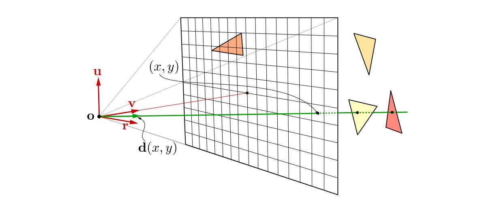
> [Figure 26.2.](#figure_26_2)
> A ray is defined by an origin $\mathbf{o}$ and a direction $\mathbf{d}$. The ray tracing setup consists of constructing and shooting one (or more) rays from the viewpoint through each pixel. The ray shown in this figure hits two triangles, but if the triangles are opaque, only the first hit is of interest. Note that the vectors $\mathbf{r}$ (right), $\mathbf{u}$ (up), and $\mathbf{v}$ (view) are used to construct a direction vector $\mathbf{d}(x, y)$ of a sample position $(x, y)$.

<br/>

In the naivest implementation, <a id="index_$trace()$_3"></a>$trace()$ would loop over all the $n$ primitives in the scene and intersect the ray with each of them, keeping the closest intersection with $t>0$. Doing so yields $\mathcal{O}(n)$ performance, which is unacceptably slow except with a few primitives. To get to $\mathcal{O}(n\log{}n)$ per ray, we use a spatial acceleration data structure, e.g., a <a id="index_bvh_2"></a>BVH or a <a id="index_$k$-d_tree_1"></a>$k$-d tree. See Chapter 19.1 for descriptions on how to intersection test a ray using a <a id="index_bvh_3"></a>BVH.

Using <a id="index_$trace()$_4"></a>$trace()$ and <a id="index_$shade()$_3"></a>$shade()$ to describe a ray tracer is simple. [Equation 26.2](#equation_26_2) is used to create an <a id="index_eye_ray_2"></a>eye ray from the camera position through a location inside a pixel.

This ray is fed to <a id="index_$trace()$_5"></a>$trace()$, whose task is to find the color or radiance Chapter 8 that is returned along that ray. This is done by first finding the closest intersection along the ray and then computing the shading at that point using <a id="index_$shade()$_4"></a>$shade()$. We illustrate this process in [Figure 26.3](#figure_26_3). The power of this concept is that <a id="index_$shade()$_5"></a>$shade()$, which should evaluate radiance, can do that by making new calls to <a id="index_$trace()$_6"></a>$trace()$. These new rays that are shot from <a id="index_$shade()$_6"></a>$shade()$ using <a id="index_$trace()$_7"></a>$trace()$ can, for example, be used to evaluate shadows, recursive <a id="index_reflections_2"></a>reflections and refractions, and diffuse ray evaluation. The term <a id="index_ray_depth_3"></a>ray depth is used to indicate the number of rays that have been shot recursively along a ray path. The <a id="index_eye_ray_3"></a>eye ray has a <a id="index_ray_depth_4"></a>ray depth of 1, while the second <a id="index_$trace()$_8"></a>$trace()$ where the ray hits the circle in [Figure 26.3](#figure_26_3) has <a id="index_ray_depth_5"></a>ray depth 2.

<br/>

<a id="figure_26_3"></a>

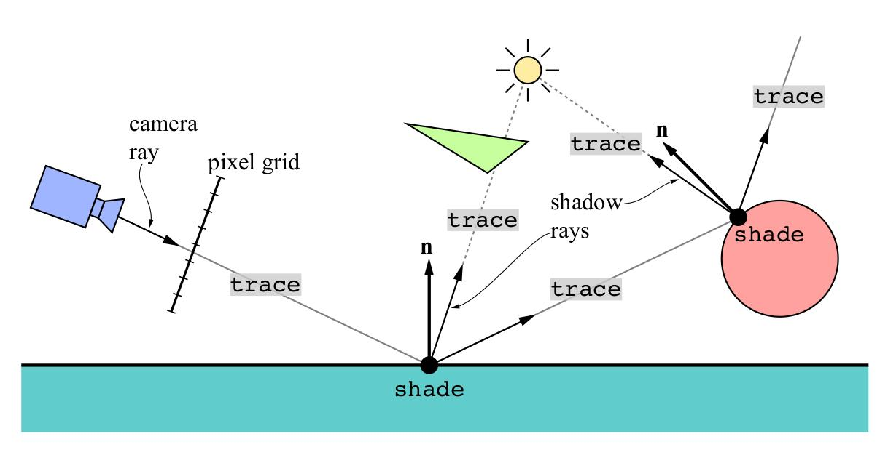 
> [Figure 26.3.](#figure_26_3)
> A camera ray is created through a pixel and a first call to <a id="index_$trace()$_9"></a>$trace()$ starts the ray tracing process in that pixel. This ray hits the ground plane with a normal $n$. Then <a id="index_$shade()$_7"></a>$shade()$ is called at this first hit point, since the goal of <a id="index_$trace()$_10"></a>$trace()$ is to find the ray’s color. The power of ray tracing comes from the fact that <a id="index_$shade()$_8"></a>$shade()$ can call <a id="index_$trace()$_11"></a>$trace()$ as a help when evaluating the BRDF at that point. Here, this is done by shooting a <a id="index_shadow_ray_1"></a>shadow ray to the light source, which in this case is blocked by a triangle. In addition, assuming the surface is specular, a reflection ray is also shot and this ray hits a circle. At this second hit point, $shade()$ is called again to evaluate the shading. Again, a shadow and a reflection ray are shot from this new hit point.

<br/>

One use of these new rays is to determine if the current point being shaded is in shadow with respect to a light source. Doing so generates shadows. We can also take the <a id="index_eye_ray_4"></a>eye ray and the normal, $n$, at the intersection to compute the reflection vector. Shooting a ray in this direction generates a reflection on the surface, and can be done recursively. The same process can be used to generate refractive rays. Perfectly specular <a id="index_reflections_3"></a>reflections and refractions along with sharp shadows is often referred to as <a id="index_whitted_ray_tracing_1"></a>Whitted ray tracing \[[89](#ref_89)\]. See Sections 11.5 and 14.5.2 for information on how to compute the reflection and refraction rays. Note that when an object has a different index of refraction than the medium in which the ray travels, the ray may be both reflected and refracted. See [Figure 26.4](#figure_26_4). This type of recursion is something that rasterization-based methods struggle to solve by using various approximations to achieve only a subset of the effects that can be obtained with ray tracing. Ray casting, the idea of testing visibility between two points or in a direction, can be used for other graphical (and non-graphical) algorithms. For example, we could shoot a number of <a id="index_ambient_occlusion_1"></a>ambient occlusion rays from an intersection point to get an accurate estimate of that effect.

<br/>

<a id="figure_26_4"></a>

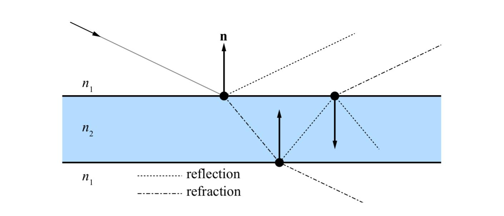 
> [Figure 26.4.](#figure_26_4)
> An incoming ray in the top left corner hits a surface whose index of refraction, $n_2$, is larger than the index of refraction, $n_1$, in which the ray travels, i.e., $n_2>n_1$. Both a reflection ray and a refraction ray is generated at each hit point (circles).

<br/>

The functions <a id="index_$trace()$_12"></a>$trace()$, <a id="index_$shade()$_9"></a>$shade()$, and <a id="index_$raytraceimage()$_1"></a>$rayTraceImage()$, where the latter is a function that creates eye rays through each pixel, are used in the pseudocode that follows. These short pieces of code shows the overall structure of a Whitted ray tracer, which can be used as a basis for many rendering variants, e.g., <a id="index_path_tracing_4"></a>path tracing.

```javascript
rayTraceImage()
{
  for(p in pixels)
    color of p = trace(eye ray through p);
}

trace(ray)
{
  pt = find closest intersection;
  return shade(pt);
}

shade(point)
{
  color = 0;
  for(L in light sources)
  {
    trace(shadow ray to L);
    color += evaluate BRDF;
  }
  color += trace(reflection ray);
  color += trace(refraction ray);
  return color;
}
```

<a id="index_whitted_ray_tracing_2"></a>Whitted ray tracing does not provide a full solution to global illumination. Light reflected from any direction other than a mirror reflection is ignored, and direct lights are only represented by points. To fully evaluate the <a id="index_rendering_equation_3"></a>rendering equation, shown in Equation 11.2, Kajiya \[[41](#ref_41)\] proposed a method called *<a id="index_path_tracing_5"></a>path tracing*, which is a correct solution and thus generates images with global illumination. One possible approach is to compute the first intersection point of an <a id="index_eye_ray_5"></a>eye ray, and then evaluate shading there by shooting many rays in different directions. For example, if a diffuse surface is hit, then one could shoot rays all over the hemisphere at the intersection point. However, if this process is repeated at the hit points for each of these rays as well, there is an explosion in rays to evaluate. Kajiya realized that one could instead just follow a single ray using Monte Carlo based methods to generate its path through the environment, and average several such path-rays over a pixel. This is how the <a id="index_path_tracing_6"></a>path tracing method works. See [Figure 26.5](#figure_26_5).

<a id="figure_26_5"></a>

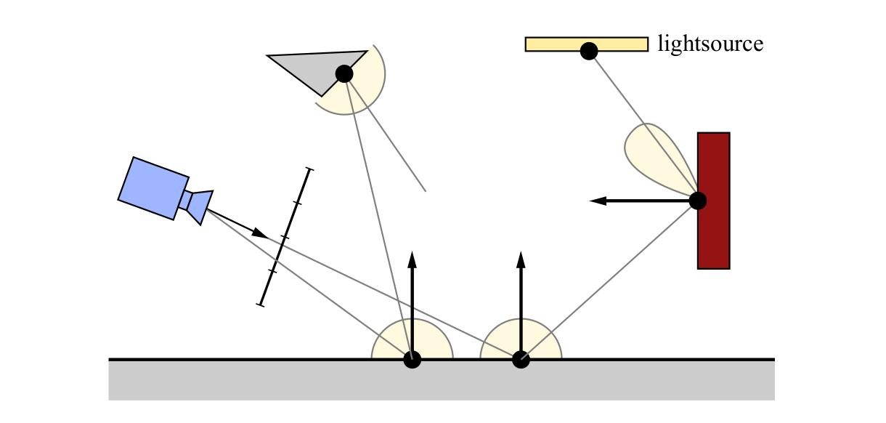 
> [Figure 26.5.](#figure_26_5)
> Illustration of <a id="index_path_tracing_7"></a>path tracing with two rays being shot through a single pixel. All light gray surfaces are assumed to be diffuse and the darker red rectangle to the right has a glossy BRDF. At each diffuse hit, a random ray over the hemisphere around the normal is generated and traced further. Since the pixel color is the average of the two rays’ radiances, the diffuse surface is evaluated in two directions—one that hits the triangle and one which hits the rectangle. As more rays are added, the evaluation of the <a id="index_rendering_equation_4"></a>rendering equation becomes better and better.

<br/>

One disadvantage of <a id="index_path_tracing_8"></a>path tracing is that many rays are required for the image to converge. To halve the <a id="index_variance_1"></a>variance, one need to shoot four times as many rays. See [Figure 26.6](#figure_26_6).

<a id="figure_26_6"></a>

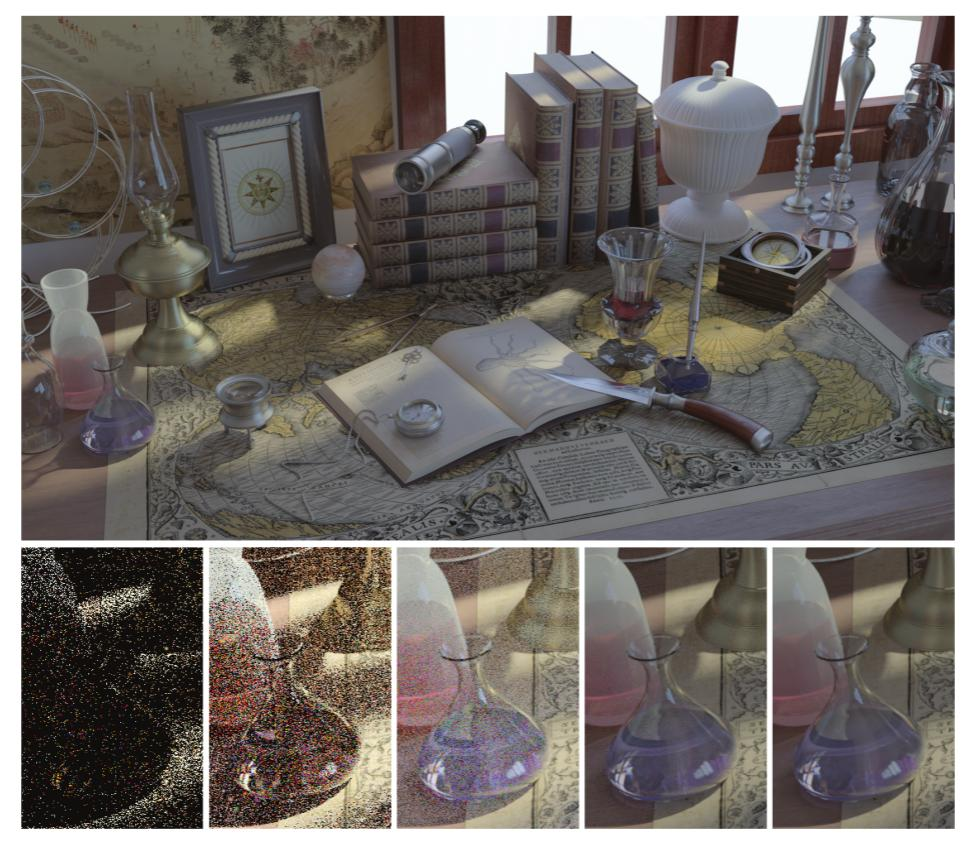 
> [Figure 26.6.](#figure_26_6)
> Top: full image rendered using 65,536 samples per pixel using <a id="index_path_tracing_9"></a>path tracing: Bottom from left to right: zoom ins on the same scene rendered using 1, 16, 256, 4,096, and 65,536 samples per pixel. Notice that there is <a id="index_noise_4"></a>noise even in the image with 4,096 samples per pixel. (*Model by Alexia Rupod, image courtesy of NVIDIA Corporation.*)

The <a id="index_$shade()$_10"></a>$shade()$ function is always implemented by the user, so any type of shading can be used, much like vertex and pixel shading are implemented in a rasterization-based pipeline. The traversal and intersection testing that takes place in <a id="index_$trace()$_13"></a>$trace()$ can be implemented on the CPU, using compute shaders on the GPU, or using DirectX or OpenGL. Alternatively, one can use a ray tracing API, e.g., <a id="index_dxr_1"></a>DXR. This is the topic of the next section.

### 26.2 Shaders for Ray Tracing

Ray tracing is now tightly integrated into real-time rendering APIs, such as DirectX \[[59](#ref_59), [91](#ref_91), [92](#ref_92)\] and Vulkan. In this section we will describe the different types of ray tracing shaders that have been added to these APIs and can thus be used together with <a id="index_rasterization_9"></a>rasterization. As an example of such a combination, we could first generate a G-buffer (Chapter 20) using <a id="index_rasterization_10"></a>rasterization and then shoot rays from these hit points in order to generate <a id="index_reflections_4"></a>reflections and shadows \[[11](#ref_11), [76](#ref_76)\]. We call this *<a id="index_deferred_ray_tracing_1"></a>deferred ray tracing*.

Ray tracing shaders are dispatched to the GPU similar to compute shaders (Section 3.10), i.e., over a grid (of pixels). In this section, we follow the naming convention of <a id="index_dxr_2"></a>DXR \[[59](#ref_59)\], the ray tracing addition to DirectX 12. There are five types of ray tracing shaders \[[59](#ref_59), [78](#ref_78)\]:

1. <a id="index_ray_generation_shader_1"></a><a id="index_ray_generation_shader_1"></a>ray generation shader
2. <a id="index_closest_hit_shader_1"></a>closest hit shader
3. <a id="index_miss_shader_1"></a>miss shader
4. <a id="index_any_hit_shader_1"></a>any hit shader
5. <a id="index_intersection_shader_1"></a>intersection shader

A ray is defined using [Equation 26.1](#equation_26_1) in addition to an interval $[t_{min} , t_{max}]$. The interval defines the part of the ray where intersections are accepted. See [Figure 26.7](#figure_26_7). The programmer can add a *<a id="index_payload_1"></a>payload* to the ray. This is a data structure that is used to send data between different ray tracing shaders. An example ray <a id="index_payload_2"></a>payload could contain a float4 for the radiance and a float for the distance to the hit point, but the user can add anything that is needed. However, keeping the ray <a id="index_payload_3"></a>payload small is better for performance, since a larger <a id="index_payload_4"></a>payload may use more registers.

<a id="figure_26_7"></a>

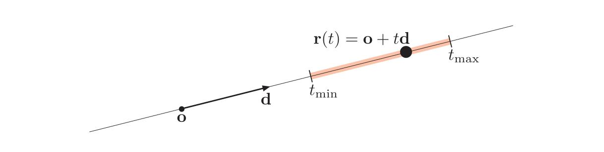
> [Figure 26.7.](#figure_26_7)
> A ray defined by an origin $o$, a direction $d$, and an interval $[t_{min}, t_{max}]$. Only intersections inside the interval will be found.

<br/>

The *<a id="index_ray_generation_shader_2"></a><a id="index_ray_generation_shader_2"></a>ray generation shader* is the starting point for ray tracing. It can be programmed just like compute shaders and is able to call a new function <a id="index_$traceray()$_1"></a>$TraceRay()$, which is similar to the $trace()$ function described in [Section 26.1](#261-ray-tracing-fundamentals). Typically, the <a id="index_ray_generation_shader_3"></a><a id="index_ray_generation_shader_3"></a>ray generation shader is executed for all the pixels of the screen. The implementation of fast traversal of a spatial acceleration structure inside <a id="index_$traceray()$_2"></a>$TraceRay()$ is provided by the driver through the API. It is possible to define a ray type that is connected to different shaders. For example, it is common to use a certain set of shaders for *standard rays*, while simpler shaders can be used for *shadow rays*. For shadows, rays can be traced more efficiently since we usually can stop as soon as any intersection has been found in the ray’s interval, the range from the hit point to the light source.

For standard rays, the first positive intersection point is required. Such rays are shot by the ray generation shaders. When the closest hit has been found, a *<a id="index_closest_hit_shader_2"></a>closest hit shader* is executed. Here, the user can implement <a id="index_$shade()$_11"></a>$shade()$ from [Section 26.1](#261-ray-tracing-fundamentals), e.g., <a id="index_shadow_ray_2"></a>shadow ray testing, <a id="index_reflections_5"></a>reflections, refractions, and <a id="index_path_tracing_10"></a>path tracing. If nothing is hit by the ray, a *<a id="index_miss_shader_2"></a>miss shader* is executed. This is useful to generate a radiance value and send back via the ray <a id="index_payload_5"></a>payload. This can be a static background color, a sky color, or generated using a lookup in an environment map.

The *<a id="index_any_hit_shader_2"></a>any hit shader* is an optional shader that can be used when a scene contains transparent objects or alpha tested texturing. This shader is executed whenever there is a hit in the ray’s interval. The shader code can, for example, perform a lookup in the texture. If the sample is fully transparent, then traversal should continue, else it can be stopped. There is no guarantee of the order of execution for these tests, so the shader code may need to perform some local sorting in order to get correct blending, for example. The <a id="index_any_hit_shader_3"></a>any hit shader can be implemented both for standard rays and for shadow rays. As with <a id="index_rasterization_11"></a>rasterization, using a tighter polygon around the cutout texture’s bounds (Section 13.6.2) can help reduce the number of times this shader is invoked.

The *<a id="index_intersection_shader_2"></a>intersection shader* is executed when a ray hits a certain bounding box in the spatial acceleration structure. It can thus be used to implement custom intersection test code, e.g., against fractal landscapes, subdivision surfaces, and analytical surfaces, such as spheres and cones.

In addition to ray generation shaders, both miss shaders and closest hit shaders can generate new rays with <a id="index_$traceray()$_3"></a>$TraceRay()$. All shaders except intersection shaders can modify the ray <a id="index_payload_6"></a>payload. All ray tracing shaders may also output data to UAVs. For example, the <a id="index_ray_generation_shader_4"></a><a id="index_ray_generation_shader_4"></a>ray generation shader can output the color of the ray that it has sent to the corresponding pixel.

There is much innovation and research to be done in the field of combining <a id="index_rasterization_12"></a>rasterization and ray tracing, but also in how to exploit the new additions to the real-time graphics APIs. Andersson and Barré-Brisebois \[[9](#ref_9)\] present a hybrid rendering pipeline where these two rendering paradigms are combined. First, a G-buffer is rendered using <a id="index_rasterization_13"></a>rasterization. Direct lighting and post-processing is done using compute shaders. Direct shadows and <a id="index_ambient_occlusion_2"></a>ambient occlusion can be done either using compute shaders or using ray tracing. Global illumination, <a id="index_reflections_6"></a>reflections, and transparency & translucency are done using pure ray tracing. As GPUs evolve, bottlenecks will move around, but a general piece of advice is:

<p align="center" style="text-align: center;"><em><strong>Use raster when faster, else rays to amaze.</strong></em></p>

As always, remember to measure where your bottleneck is located (Chapter 18). Note also that <a id="index_$traceray()$_4"></a>$TraceRay()$ can be used as a work generation mechanism, i.e., a shader can use <a id="index_$traceray()$_5"></a>$TraceRay()$ to spawn several jobs in order to compute a combined result. For example, this feature can be used for adaptive ray tracing, where more ray are sent through pixel regions with high <a id="index_variance_2"></a>variance, with the goal being to improve image quality at a relatively low cost. However, <a id="index_$traceray()$_6"></a>$TraceRay()$ is likely to have many uses that were not conceived of during the API design.

### 26.3 Top and Bottom Level Acceleration Structures

The acceleration structure for <a id="index_dxr_3"></a>DXR is mostly opaque to the user, but there are two levels of the hierarchy that are visible. These are called the *top level acceleration structure* (<a id="index_tlas_1"></a>TLAS) and the *<a id="index_bottom_level_acceleration_structure_1"></a>bottom level acceleration structure* (<a id="index_blas_1"></a>BLAS) \[[59](#ref_59)\]. A <a id="index_blas_2"></a>BLAS contain a set of geometries that can be considered as components of the scene. The <a id="index_tlas_2"></a>TLAS contain a set of instances that each point to a <a id="index_blas_3"></a>BLAS. This is illustrated in [Figure 26.8](#figure_26_8).

A <a id="index_blas_4"></a>BLAS can either contain geometries of the type *triangles* or *procedural*. The former contains sets of triangles and the latter is associated with an <a id="index_intersection_shader_3"></a>intersection shader that can implement a custom intersection test. This can be an analytical ray versus sphere or torus test or some procedurally generated geometry, for example.

In [Figure 26.8](#figure_26_8) all matrices, $\mathbf{M}$ and $\mathbf{N}$, are of size $3×4$, i.e., arbitrary $3×3$ matrices plus a translation (Chapter 4). The $\mathbf{N}$ matrices are used to apply a one-time transform that is performed in the beginning of the build process for the underlying acceleration data structure (e.g., <a id="index_bvh_4"></a>BVH or *k*-d tree) of the corresponding geometry. The $\mathbf{M}$ matrices, on the other hand, can be updated each frame and can therefore be used for lightweight animation.

<a id="figure_26_8"></a>

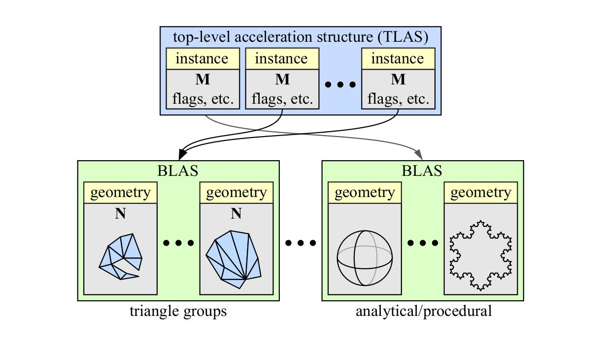
> [Figure 26.8.](#figure_26_8)
> Illustration of how the <a id="index_top_level_acceleration_structure_1"></a>top level acceleration structure (<a id="index_tlas_3"></a>TLAS) is connected to a set of bottom-level acceleration structures (<a id="index_blas_5"></a>BLAS). Each <a id="index_blas_6"></a>BLAS can contain several sets of primitives, each containing only triangles or procedural geometry. Every geometry and instance can be transformed by a $3×4$ matrix $\mathbf{N}$ or $\mathbf{M}$. Note that each matrix is unique to the corresponding instance or geometry.  The <a id="index_tlas_4"></a>TLAS contain a set of instances, which can point to a <a id="index_blas_7"></a>BLAS.

For arbitrarily animated geometry, where triangles may be added or removed, one has to rebuild the <a id="index_blas_8"></a>BLAS each frame. In these cases, even the $N$ matrices can be updated. If only vertex positions are updated, then a faster update of the data structure can be requested in, e.g., the <a id="index_dxr_4"></a>DXR API. Such an update will usually reduce performance a bit, but can work well in situations where the geometry has moved only a little. A reasonable approach may be to use these less expensive updates when possible, and perform a rebuild from scratch every n frames in order to amortize this cost over several frames.

Note that grouping of geometry should often be done differently when ray tracing is used compared to <a id="index_rasterization_14"></a>rasterization. As seen in Chapter 18, for <a id="index_rasterization_15"></a>rasterization geometry is often grouped by material parameters to exploit shader coherence during pixel shading. Acceleration data structures for ray tracing performs better when grouping is done using spatial locality. See [Figure 26.11](#figure_26_9). Performance can suffer substantially if for ray tracing geometry is grouped according to material instead of spatial locality.

<a id="figure_26_9"></a>

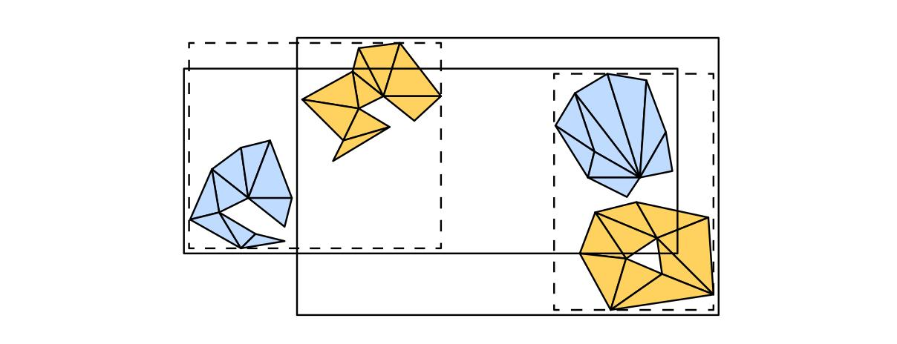
> [Figure 26.9.](#figure_26_9)
> For optimized rendering using <a id="index_rasterization_16"></a>rasterization, we often group geometry per material, here indicated by the colors of the triangle meshes. These boxes are drawn using solid lines. For ray tracing, it is better to group geometry that is spatially close, and the corresponding boxes are dashed.

### 26.4 Coherency

One of the most important ideas in both software and hardware performance optimization is to exploit coherency during execution. We can save effort by reusing results among different parts of a given computation. In today’s hardware, the most expensive operations, in both time and energy use, are memory accesses, which are orders of magnitude slower than simple mathematical operations. A good way to evaluate the cost of a hardware operation is to think of the physical distance that bits have to travel inside circuitry in order to accomplish it. Most of the time, performance optimization focuses on exploiting memory coherency (caches) and scheduling computation around memory latency. The GPU itself can be seen as a processor that explicitly constrains the execution model of the programs it runs (data parallel, independent computations threads) in order to better exploit memory coherency (Section 23.1).

In the introduction to this chapter, we discussed how ray tracing and <a id="index_rasterization_17"></a>rasterization for “first hit” visibility of screen pixels (camera rays) can be seen as different traversal orders of the scene geometry. While the ordering does not matter much in terms of algorithmic complexity, each has practical consequences. With both <a id="index_rasterization_18"></a>rasterization and ray tracing we have a double for-loop. The innermost loop, unless it happens to be quite small, is where most computation lies. As iterations happen next to each other back-to-back in inner loops, they are the best candidates for reducing computation by reusing data between iterations and exploiting memory access locality (cache optimization).

A rasterizer’s inner loop is over the pixels of a given object surface. It is likely that points over a surface exhibit high degrees of coherent computation: They may be shaded using the same material, use the same textures, and even access these textures (memory) in nearby locations. If we have to compute visibility for a large number of camera pixels, we can easily walk these locations in a spatially coherent order, for example, in small square tiles on the screen. Doing so ensures a high degree of coherent work in the inner loop (Section 23.1). Note that coherency extends past the problem of visibility. Rendering typically starts after we know what surfaces are visible—a large amount of work lies in computing material properties and their interaction with scene lighting. A rasterizer is particularly fast not only because it can compute what objects cover which pixels in an efficient way, but because the subsequent shading work is naturally ordered in a way that exploits coherency.

In contrast, a naive ray tracer, for a given ray in the outer loop, iterates over all scene primitives in the inner one. Regardless of how we might avoid the overall expense of an $\mathcal{O}(mn)$ double loop from $m$ pixels and $n$ objects, there is little coherency to be exploited when traversing a single list of rendering primitives along a single ray.

Most of the performance optimization in a modern ray tracer thus deals with how to “find” coherency in the ray visibility queries and subsequent shading computations. We could say that <a id="index_rasterization_19"></a>rasterization is coherent by default, but constrained to a specific visibility query, the camera frustum. Most of the effort when using <a id="index_rasterization_20"></a>rasterization techniques involves how to stretch this query function in order to simulate a variety of effects. Ray tracing, in contrast, is flexible by default. We can query visibility from any point in any direction. However, doing so naively results in incoherent computation that is not efficient on modern hardware architectures, and thus most of the engineering effort is spent trying to organize the visibility queries in a coherent manner.

With the increased flexibility of ray queries, we can render effects that are impossible for a rasterizer, while still retaining high performance by exploiting coherency. Shadows are a good example. Tracing rays for shadows allows us to more accurately simulate the effect of area lights \[[35](#ref_35)\]. Shadow rays need only to intersect geometry, and in most cases do not need to evaluate materials. These attributes reduce the cost of hitting different objects. Compared to shading rays, all we need to evaluate is whether a ray hits any object between the intersection point and the light source. We can thus avoid computing normals at the intersection points, avoid texturing for solid objects, and can stop tracing after the first solid hit has been found. In addition, shadow rays typically are highly coherent. For nearby pixels on the screen they have similar origins and can be directed to the same light. Lastly, shadow maps (Section 7.4) cannot sample light visibility at the exact frequency of screen pixels, resulting in under- or oversampling. In the latter case, the increased flexibility of shadow rays can even result in better performance. Rays are generally more expensive, but, by avoiding oversampling, we can perform fewer visibility queries. That is also why shadow maps were among the first graphical applications of ray tracing in games \[[90](#ref_90)\].

#### 26.4.1 Scene Coherency

Primitives in a three-dimensional scene fall into natural spatial relations when we consider the distances among them. These relationships do not necessarily guarantee coherency of computation when we think of the shading work that rendering entails. For example, an object might be close to another but use entirely different materials, textures, and—ultimately—shading algorithms. Most algorithms and data structures used for acceleration of object traversal in a ray tracer can be adapted to work in a rasterizer as well, as discussed in Section 19.1. However, these data structures are more important to tune in a ray tracer than a rasterizer. Object traversal is part of the inner loop when tracing rays.

Most ray tracers and ray tracing APIs use some form of spatial acceleration data structure to speed up ray visibility queries. In many cases, including the current version of <a id="index_dxr_5"></a>DXR, these techniques are opaque to the user, implemented under the hood and provided as black box functionality. For this reason, the rest of this section on coherency can be skipped if you are focused on understanding basic <a id="index_dxr_6"></a>DXR functionality and related techniques. However, this section is important if you want to get a grasp on performance, particularly for larger scenes. If you know your system relies on a particular spatial structure, learning the advantages and costs related to that scheme can help you improve the efficiency of your rendering engine.

Creating data structures to exploit scene coherency in visibility calculations is particularly challenging for real-time rendering, as in most cases the scene changes frame to frame under animation. In fact, though we previously noted how the raytracer’s outer loop allows for more flexibility in visibility queries, the rasterizer’s outer loop can more naturally handle animated scenes, as well as procedurally generated and out-of-core (too large to fit in memory all at once) geometry. Rasterization’s loop structure is another reason why these spatial data structures are typically present in relatively simplified form in raster-based rendering solutions.

<a id="figure_26_10"></a>

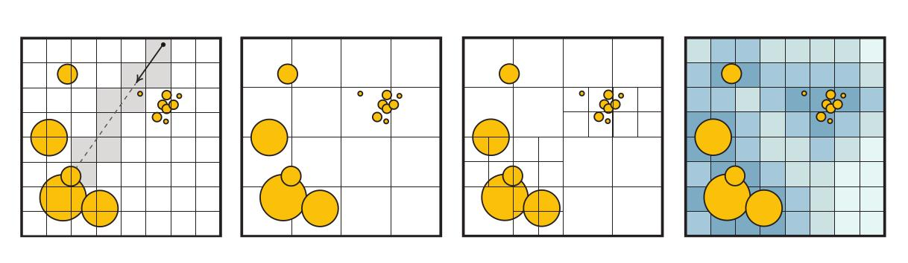
> [Figure 26.10](#figure_26_10)
> From left to right: a fine uniform grid and cells traversed by a ray until intersection, a coarser uniform grid, a two-level grid and a uniform grid with embedded proximity cloud information, where dark means that the closest object to that grid cell is near and light means that it is far away.

The idea behind a <a id="index_spatial_data_structure_2"></a>spatial data structure is that we can organize geometry inside partitions of the space in ways that group objects that are near each other in scene in the same volume. A simple way to achieve this partitioning is to subdivide the entire scene in a regular grid, and store in each cube (voxel) a list of the primitives that intersect it. Then, ray traversal can be accomplished by visiting each cell in a line given by the ray direction, starting at the ray origin. Traversal is the same algorithm as conservative line <a id="index_rasterization_21"></a>rasterization, only in three dimensions. The basic idea is to find the distance to the next voxel in the $x$, $y$, and $z$ directions, take the smallest of these, and move along the ray to that voxel. The leftmost illustration in [Figure 26.10](#figure_26_10) shows how a ray might visit cells in a uniform grid. These three values are then updated and the new smallest value is used to move to the next voxel. Every time we find a non-empty cell during the traversal, we need to test the ray against all the primitives contained in the cell. As soon as we find a hit in the cell, the traversal in the grid does not need to continue. For shadow rays (any hit), we can simply stop, but for standard rays, we need to test all the primitives in the cell and choose the closest. Havran’s thesis \[[31](#ref_31)\] provides a great overview.

Since a scene might have small, detailed objects with many tiny primitives in some regions and large, coarse ones in others, a fixed grid size might not work everywhere. This scenario is referred to as the “teapot in a stadium” problem \[[27](#ref_27)\], where a complex teapot, the focus of attention, falls into a single cell and so receives no benefit from the efficiency structure. Even though they are rapid to construct and simple to traverse, naive uniform grids are currently rarely used for most ray tracing. Variants exist that improve grid efficiency and are thus more practical. Grids can be nested in a hierarchical fashion, with higher-level large cells containing finer grids as needed. Two-level nested grids are particularly fast to construct in parallel on GPUs \[[42](#ref_42)\], and have been successfully employed in early animated GPU real-time ray tracing demos \[[80](#ref_80)\].

Hash tables can be employed to create an infinite virtual grid, where only the occupied cells store data in memory (Section 25.1.2). Another strategy is to store, in empty cells, the distance in grid units to the closest non-empty cell. This system is called <a id="index_proximity_clouds_1"></a>*proximity clouds* \[[14](#ref_14)\]. During the traversal, these distances allow us to safely skip many cells in the line marching routine that are guaranteed to be empty. Recently, <a id="index_irregular_grids_1"></a>*irregular grids* \[[64](#ref_64)\] elaborate on the idea of skipping empty space efficiently. These have been shown to be competitive with the state-of-the-art in spatial acceleration for ray tracing of animated scenes. [Figure 26.10](#figure_26_10) shows a few of these grid variants.

If we develop the idea of a hierarchical grid to its limit, we can imagine having the lowest resolution grid possible, made of two cells on each axis, as the top-level data structure, and recursively split each non-empty cell into another $2 × 2 × 2$. This structure is an <a id="index_octree_1"></a>*octree* and is discussed in Section 19.1.3. Going even further, we can imagine using a plane to split a single cell in two at each level of our hierarchical data structure. This yields the binary <a id="index_bsp_tree_1"></a>*BSP tree* if the plane choice is arbitrary, or a <a id="index_$k$-d_tree_2"></a>$k$*-d tree* if the planes are constrained to be axis-aligned (Section 19.1.2). If instead of using a single axis-aligned plane we use a pair at each level of the data structure, we obtain a *bounded interval hierarchy* (BIH) tree \[[84](#ref_84)\], which has fast construction algorithms associated with it.

Today the most popular acceleration structures for ray tracing is the bounding volume hierarchy (<a id="index_bvh_5"></a>BVH) and is described in Section 19.1.1. See [Figure 26.11](#figure_26_11). For example, hierarchical bounding volume structures are used in Intel’s *Embree* kernels \[[88](#ref_88)\], in AMD’s *Radeon-Rays* library \[[8](#ref_8)\], and in NVIDIA’s *RT Cores* hardware \[[58](#ref_58)\] and *OptiX* system \[[62](#ref_62)\].

<a id="figure_26_11"></a>

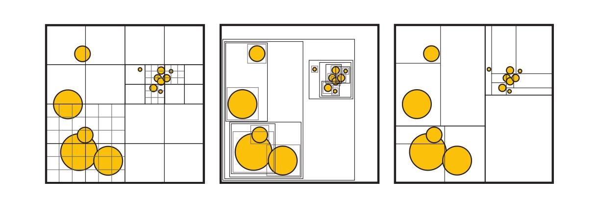
> [Figure 26.11](#figure_26_11)
> Some popular spatial subdivision data structures. From left to right: a hierarchical grid, a <a id="index_bvh_6"></a>BVH of axis-aligned bounding rectangles, and a <a id="index_$k$-d_tree_3"></a>$k$-d tree.

<br/>

##### Properties of Spatial Data Structures

The design landscape of <a id="index_spatial_data_structure_3"></a>spatial data structure is large. We can have deep hierarchies
that take more indirections to traverse but adapt to the scene geometry better, versus
shallower data structures that are less flexible but can be more compact in memory.
We can have rigid subdivision schemes that are easy to build and require little memory
per node, versus more expressive schemes with many degrees of freedom on how to
carve space. For example, <a id="index_bvh_7"></a>BVH schemes can potentially have known memory costs in
advance of their creation, require fewer subdivisions, and be better at skipping empty
space. However, they are more complex to build and may require more storage to
encode each node.

In general, the trade-offs of a <a id="index_spatial_data_structure_4"></a>spatial data structure are:

- Construction quality.
- Speed of construction.
- Speed to update, for animated scenes.
- Run-time traversal efficiency.

Construction quality roughly translates to how many primitives and how many
cells must be traversed to find a ray intersection. Speed of construction and traversal
are often specific to a given hardware. To complicate matters further, all these data
structures allow for multiple traversal and construction algorithms and for different
encoding of the nodes (compression and memory layout). Moreover, any degree of
freedom in the way space is subdivided also implies the existence of different heuristics
to guide these choices.

It is misleading to talk about data structure performance without specifying all
these parameters. In practice, the state of the art data structures are different for
static versus dynamic scenes, where construction algorithms have to operate under
strict time constraints not to take more time than is saved in the ray tracing portion
of the rendering. On the hardware side, marked differences exist between CPU and
GPU (highly parallel) algorithms. Best practices for the latter are still evolving, as
GPU architectures are more recent and have seen more changes over time \[[46](#ref_46)\].

Finally, the specifics of the rays we need to trace also matter, with certain 
structures performing best at coherent rays (e.g., camera rays, shadows, or mirror 
<a id="index_reflections_7"></a>reflections) and other being more tolerant of incoherent, randomly scattered rays
(typically for diffuse global illumination or <a id="index_ambient_occlusion_3"></a>ambient occlusion methods).

With all this in mind, it is worth noting that state-of-the-art ray tracing performance 
has historically been achieved through some variant of a <a id="index_$k$-d_tree_4"></a>$k$-d tree or bounding
volume hierarchy (<a id="index_bvh_8"></a>BVH) made of axis-aligned boxes (AABBs) \[[83](#ref_83)\]. The main difference
between the two, theoretically, is that a <a id="index_$k$-d_tree_5"></a>$k$-d tree partitions the space in disjoint
cells, while the nodes in a <a id="index_bvh_9"></a>BVH typically overlap. This means that <a id="index_bvh_10"></a>BVH traversal
can only stop when an intersection is found and no other unexamined bounding volume 
left in the tree can be in front of it. A <a id="index_$k$-d_tree_6"></a>$k$-d tree, however, can stop immediately
when a primitive intersection is found as it is possible to enforce a strict front-to-back
traversal order. This theoretical advantage of a <a id="index_$k$-d_tree_7"></a>$k$-d tree is not always realized.
For example, a <a id="index_bvh_11"></a>BVH might be more efficient at skipping empty space and bounding
primitives tightly, thus compensating for the inability of stopping early by reaching
an intersection faster \[[83](#ref_83)\].

In practice, surveying a number of renderers used for film production \[[21](#ref_21), [67](#ref_67)\] and
for interactive rendering \[[8](#ref_8), [58](#ref_58), [62](#ref_62), [88](#ref_88)\], we could not find
any that currently use $k$-d trees. All present-day systems examined rely on BVHs in some
form for general ray tracing[²](#note_26_2)<a id="note_26_2_back"></a>. Other structures are more
efficient for particular classes of primitives or algorithms. For example, point clouds
and photon mapping use three-dimensional $k$-d trees to store samples. Octree and grid
structures find use for voxel data.

BVHs can often fit scenes well, have fast and high-quality construction algorithms,
and can easily handle animated scenes, especially if they exhibit good temporal coherency. 
Moreover it is possible, as we will see in the next section, to construct compact, 
shallow bounding volume trees that use less memory and less bandwidth to
achieve good scene partitioning, which is a key property for high performance traversal
of the data structure.

<a id="note_26_2"></a>
> [2.](#note_26_2_back) By default, the Brazil renderer circa 2012 used three-dimensional and
four-dimensional (for motion blur) $k$-d trees for scenes \[[28](#ref_28)\].

##### Construction Schemes

It is outside the scope of this chapter to present all algorithmic variants and 
permutations in spatial data structures used for ray tracing, but we can present a few of the
key ideas. See also Section 19.1 and Chapter 25 for more information on these topics.

Construction algorithms can be divided into *object partitioning* and *space partitioning*
schemes. Object partitioning considers objects or primitives (e.g., individual triangles)
that are near each other in space and clusters them in the nodes of the data structure.
It is a process that can be performed “top-down,” at each step deciding how to split
the scene objects into subgroups, or “bottom-up” (Chapter 25), by iteratively clustering objects.
In contrast, spatial partitioning makes decisions on how to carve space in different
regions, distributing the objects and primitives into the resulting nodes of the data
structure. These constructions are typically “top-down.” Spatial partitions are usually
much slower to construct, and hard to employ for real-time rendering, but they can be
more efficient for casting rays.

Spatial partitioning is the most obvious way of constructing a <a id="index_$k$-d_tree_8"></a>$k$-d tree, but the
same principles can be applied to BVHs as well. For example, the *split <a id="index_bvh_12"></a>BVH* scheme
by Stich et al. \[[62](#ref_62), [77](#ref_77)\] considers both object and spatial splits, allowing a given object
to be referenced by more than one <a id="index_bvh_13"></a>BVH leaf. Doing so results in significant savings in
ray shooting costs compared to a regular <a id="index_bvh_14"></a>BVH, while still being faster than building
a purely spatial partitioning structure. See [Figure 26.12](#figure_26_12).

<a id="figure_26_12"></a>

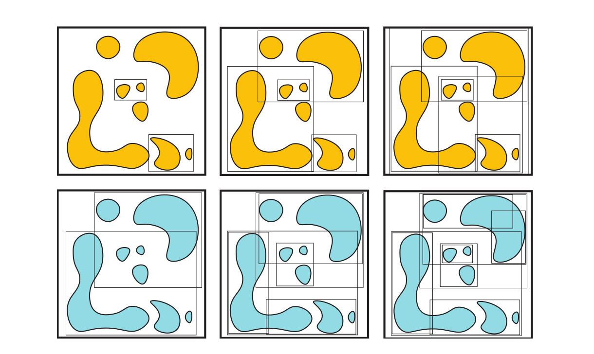
> [Figure 26.12.](#figure_26_12)
> Top row: stages of a bottom-up object partitioning <a id="index_bvh_15"></a>BVH build. Bottom row: stages
of a top-down <a id="index_bvh_16"></a>BVH construction allowing for spatial splits.

<br/>

Regardless of which scheme is used, choices have to be made at each step of the
construction. For bottom up, we have to decide which primitives to aggregate, and
for top down, where to put the spatial splits used to subdivide the scene. See [Figure 26.13](#figure_26_13).

<a id="figure_26_13"></a>

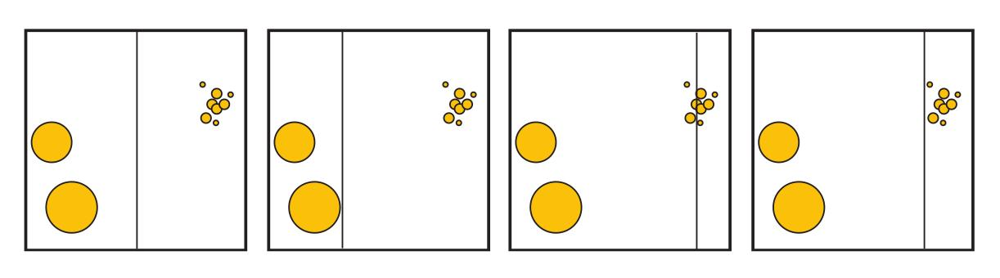
> [Figure 26.13.](#figure_26_13)
> Different choices for a vertical splitting plane. From left to right: half-way cut, a cut
isolating big primitives, a median cut resulting in two nodes with an equal amount of primitives, an
SAH-optimized cut which minimizes the area of the node where most primitives will land, and thus
the probability of hitting the node with most expensive data in it.

The optimal choices are the ones that minimize total ray tracing time,
which in turn depends on the details of the traversal algorithm and the set of rays
over which visibility is to be determined. In practice, exactly evaluating how these
choices influence ray tracing is impossible, and thus heuristics must be employed.
The most common approximation for build quality is the *<a id="index_surface_area_heuristic_1"></a>surface area heuristic*
(<a id="index_sah_1"></a>SAH) \[[53](#ref_53)\] (Section 22.4). It defines the following cost function:

$$
\frac{1}{A_{root}}(C_{node}\sum_{x \in I}{A_x} + C_{prim}\sum_{x \in L}P_xA_x),
$$

where $A_x$ is the surface area for a node $x$, $P_x$ is the number of primitives in a given
node, $I$ and $L$ are the sets of inner and leaf (non-empty) nodes in the tree, and
$C_{node}$ , $C_{prim}$ are the average cost estimates (i.e., time) to intersect a node and a
primitive (see also Section 25.2.1). The <a id="index_sah_2"></a>SAH, which is the surface area of the bounding
volume, cell, or other volume, is proportional to the probability of a random ray
striking it. This equation sums up the weighted probability cost of a hierarchy of
primitives. The cost computed is a reasonable estimate of the efficiency of the structure
formed.

When tuned in its constants, <a id="index_sah_3"></a>SAH correlates well with the actual cost of tracing
random, long rays and performs well in practice. See [Figure 26.14](#figure_26_14). These assumptions
do not always hold and sometimes better heuristics are possible, especially if we know
in advance or can sample the particular distribution of rays we are going to trace in
a scene \[[5](#ref_5), [26](#ref_26)\]. <a id="index_sah_4"></a>SAH provides an estimate of the ray tracing cost given a fully built
<a id="index_spatial_data_structure_5"></a>spatial data structure, and can be used to inform choices during construction. <a id="index_sah_5"></a>SAH
optimized constructions reward among the set of possible choices those that yield small
nodes with many primitives. See [Figure 26.13](#figure_26_13).

<a id="figure_26_14"></a>

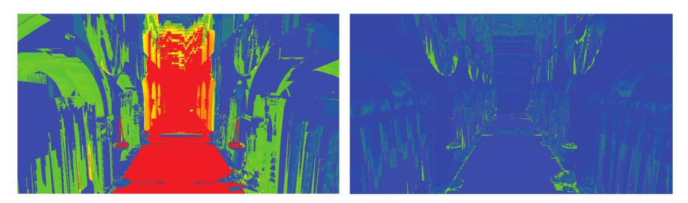
> [Figure 26.14.](#figure_26_14)
> Heat maps representing the number of <a id="index_bvh_17"></a>BVH node traversals, per pixel, of first-hit
camera rays in the Sponza atrium scene. Red areas required more than 500 traversal steps. The
left image is generated using a <a id="index_bvh_18"></a>BVH constructed with the median-cut heuristic and the right image
shows an SAH-optimized <a id="index_bvh_19"></a>BVH builder. (*Images courtesy of Kostas Anagnostou.*)

In practice algorithms that build <a id="index_sah_6"></a>SAH optimal structures can be slow, and thus
further approximations are employed. For $k$-d trees, one approximate <a id="index_sah_7"></a>SAH strategy is
to evaluate the heuristic cost for a small, fixed number of splitting planes and picking
at each level the one that gives the most efficient value. This strategy, called *<a id="index_binning_1"></a>binning*,
can also be used for rapidly building <a id="index_bvh_20"></a>BVH structures top-down \[[86](#ref_86)\].

For animated scenes, the time constraints on construction algorithms are strict, so
tree quality might be traded for faster builds. For spatial subdivision, median cuts
might be used \[[84](#ref_84)\], where the space is split in the middle along the scene’s longest
axis, or in a rotating $x$, $y$, $z$ sequence.

Object partitioning can be even faster. Lauterbach et al. \[[47](#ref_47)\] introduced *linear
<a id="index_bounding_volume_hierarchy_2"></a>bounding volume hierarchy* (LBVH) construction, in which scene primitives are sorted
by using space-filling curves. These are explained in Section 25.2.1 and shown in
Figure 25.7. Such curves have the property of defining an ordering of locations in space,
where adjacent points in the curve’s sorted order are likely to be near each other in the
three-dimensional scene. Object sorting can be computed efficiently, even on highly
parallel processors such as GPUs, and is used to cluster neighboring bounding volumes,
building the hierarchy bottom-up. In 2010, Pantaleoni and Luebke \[[23](#ref_23), [63](#ref_63)\] proposed
an improvement called *hierarchical linear <a id="index_bounding_volume_hierarchy_3"></a>bounding volume hierarchy* (<a id="index_hlbvh_1"></a>HLBVH) that
results in better construction speed and quality. In their scheme the top levels of the
<a id="index_bvh_21"></a>BVH are built in an SAH-optimized fashion, while the bottom levels are built similarly
to the original LBVH method.

One advantage of using BVHs is that the maximum memory needed for the structure is known in 
advance, as the number of cluster nodes needed has a limit \[[86](#ref_86)\]. Yet,
building spatial structures from scratch still has, at best, a linear cost in the number of
primitives. Per-frame rebuilds can end up being a significant bottleneck for rendering
performance, especially if not many rays are traced in a given frame. An alternative is
to avoid rebuilds and “refit” the <a id="index_spatial_data_structure_6"></a>spatial data structure to the moved objects. Refitting
is particularly easy in the case of a <a id="index_bvh_22"></a>BVH. First the leaf node’s bounding volume is
recomputed for the leaf node containing the animated primitive, using this object’s
current geometry. The parent of this leaf node is then examined. If it no longer can
contain the leaf node, it is expanded and its parent is tested, on up the chain. This
process continues until the parent needs no modification, or the root node is reached.
Another option when examining the parent leaf is to always minimize its bounding
volume based on its children’s bounding volumes. This will provide a better tree, but
will take a bit more time.

The refitting approach is fast but results in a degradation of the spatial data
structure quality under large displacements during animation, as bounding volumes
expand over time due to objects that were clustered together in the hierarchy but are
no longer near each other. To address this shortcoming, iterative algorithms exist to
perform tree rotations and incrementally improve the quality of a <a id="index_bvh_23"></a>BVH \[[40](#ref_40), [44](#ref_44), [94](#ref_94)\].

Currently, the state of the art for parallel, GPU <a id="index_bvh_24"></a>BVH builders is represented by
the *<a id="index_treelets_1"></a>treelets* method \[[40](#ref_40)\], which works by starting from a fast but low-quality <a id="index_bvh_25"></a>BVH
and optimizing its topology. It can construct high-quality trees, comparable to a split
<a id="index_bvh_26"></a>BVH, but at a rate of tens of millions of primitives per second on modern hardware,
only slightly slower than <a id="index_hlbvh_2"></a>HLBVH.

Two-level hierarchies, as used in <a id="index_dxr_7"></a>DXR, are also common for animated scenes. As
we have seen in [Section 26.3](#263-top-and-bottom-level-acceleration-structures), these hierarchies allow for fast rebuilds if objects move
rigidly, by animated matrix transforms. In this case, only the top-level hierarchy
needs to be rebuilt, while the expensive bottom-level per-object hierarchies do not
need to be updated. Moreover, if objects animate non-rigidly, but without significant
displacement (for example, the leaves of a tree swaying in the wind), refitting can still
be used in the <a id="index_blas_9"></a>BLAS to avoid full rebuilds (Section 25.7). However, a problem of two-level
hierarchies is that their quality is generally not as good as spatial data structures
that are built for an entire scene at once. Imagine, for example, having many objects
near each other, each with its own <a id="index_blas_10"></a>BLAS but with overlapping bounding volumes in
the <a id="index_tlas_5"></a>TLAS. A ray passing through a region of space where multiple <a id="index_blas_11"></a>BLAS overlap must
traverse each of them, while a single, unified <a id="index_spatial_data_structure_7"></a>spatial data structure built for the entire
scene would not have suffered from the same problem. In order to ameliorate this issue,
Benthin et al. \[[10](#ref_10)\] proposed the idea of “re-braiding” two-level hierarchies, allowing
the trees of different objects to merge in order to improve ray traversal performance.

##### Traversal Schemes

Similar to construction of spatial data structures, a substantial amount of research
has been done on ray traversal algorithms.

Intersecting a ray with a hierarchical data structure is a form of tree traversal.
Starting at the root, a ray is tested against the structure representation that divides
the scene into subspaces. A ray might intersect with more than a single subspace, and
thus need to visit multiple branches of the tree. For example, in the case of a binary
<a id="index_bvh_27"></a>BVH, for a given tree node a ray might intersect zero, one, or two bounding volumes
corresponding to the children of the node. In a <a id="index_$k$-d_tree_9"></a>$k$-d tree, each node is associated with a
plane that divides the space in two. If a ray intersects this plane, and the intersection
is within the node’s bounds, the ray will need to visit both subspaces. Thus, in general,
each time more than one subspace has to be considered for ray intersection, we must
decide which to traverse first. When an intersection is not found, or if we need more
than one intersection, we also need a way to backtrack and visit the other subspaces
not yet tested.

Typically we sort the child subspaces of a node front to back, relative to the ray
direction, traverse the closest subspace, and push the other children nodes on to a
stack in sorted order. If backtracking is needed, a node is popped from the stack and
traversal resumes from there. The cost of managing a stack is insignificant if we trace
a single ray at a time. However, on GPUs we typically traverse thousands of rays in
parallel at the same time, each requiring its own stack. Doing so creates a significant
memory traffic overhead.

For $k$-d trees and other spatial data structures that always partition the scene in
disjoint subspaces, it is simple to implement *stackless* ray tracing \[[22](#ref_22), [37](#ref_37)\] if we are
willing to pay the cost of restarting the traversal from the root after reaching a leaf.
If we always traverse the nearest subspace and we reach a leaf but not manage to find
a ray intersection, we can simply move the ray origin past the farthest intersection
with the bounds of leaf then trace the ray again as if it was an entirely new one. See
[Figure 26.15](#figure_26_15).

<a id="figure_26_15"></a>

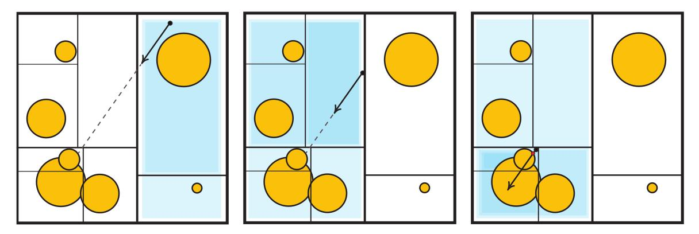
> [Figure 26.15.](#figure_26_15)
> From left to right, different restarts in a stackless <a id="index_$k$-d_tree_10"></a>$k$-d tree traversal scheme. Each time
a leaf is reached and no intersection is found, the ray gets “shortened,” moving its origin past the
leaf’s boundary.

This strategy, also known as *<a id="index_ray_shortening_1"></a>ray shortening*, is not applicable to BVHs, since
nodes may overlap. Advancing the ray past a node in a subtree might entirely miss a
bounding volume in the hierarchy that should have been traversed. Laine \[[45](#ref_45)\] proposes
to keep only one bit per tree level instead of a full stack, encoding a trail that separate
a binary tree into nodes that have been processed and nodes that are still candidates
for intersection. This method allows for restarts to work in a <a id="index_bvh_28"></a>BVH, if we can compute
a consistent node traversal order for a ray each time we descend the tree.

It is possible to avoid restarts altogether if we allow for storage of extra information
in the tree, pointing at which nodes to traverse next if the ray misses a given one. These
pointers are called *<a id="index_ropes_1"></a>ropes* and are applicable both to <a id="index_bvh_29"></a>BVH and k-d trees, but can be
expensive to store and impose a fixed ray traversal order for all rays, thus not allowing
front to back visits. Hapala et al. \[[30](#ref_30)\], and subsequently Áfra and Szirmay-Kalos \[[2](#ref_2)\]
developed algorithms using both pointers stored in the tree and a small per-ray data
structure to allow stackless traversal of binary BVHs, preserving the same order as a
stack-based solution, with backtracking instead requiring full restarts.

In practice, these stackless schemes might not always be faster, even on GPUs \[[4](#ref_4)\],
than stack-based approaches, due to the extra work they require to restart or backtrack,
the increased size of the <a id="index_spatial_data_structure_8"></a>spatial data structure, and in some cases by having a
worse traversal order. Binder and Keller \[[11](#ref_11)\] devised a constant-time stackless
backtracking algorithm that was the first shown to outperform stack-based traversal on
modern GPUs. Recently, Ylitie et al. \[[93](#ref_93)\] proposed to exploit compression schemes
to perform GPU stack-based traversal, largely avoiding the memory traffic overheads
of GPU per-ray stack bookkeeping. The traversal is performed on a wide <a id="index_bvh_30"></a>BVH, with
more than two children per node. The authors implement an efficient approximate
sorting scheme to determine a front-to-back traversal order. Furthermore, the node
bounding volumes themselves are stored in a compressed form, another way to exploit
scene coherency.

#### 26.4.2 Ray and Shading Coherency

Even if ray tracing makes it possible to compute visibility for a set of arbitrary rays,
in practice most rendering algorithms will generate sets of rays that exhibit varying
degrees of coherency. The simplest case are rays used to determine which parts of
the scene are visible from a pinhole camera through each of the screen’s pixels. These
will all have the same origin, the camera position, and span only a limited solid angle
of all possible directions. Similarly coherent are rays used to compute shadows from
infinitesimal light sources. Even when we consider rays that bounce off surfaces, such
as reflection rays, some coherency is retained. For example, imagine two rays emitted
from a camera, corresponding to two neighboring pixels, which hit a surface and
bounce off it in the direction of perfect mirror reflection. Often it will happen that
the two rays hit the same object in the scene, meaning the two hit points will be near
each other in space and likely have similar surface normals. The two reflected rays
will then have similar origins and directions. See [Figure 26.16](#figure_26_16).

<a id="figure_26_16"></a>

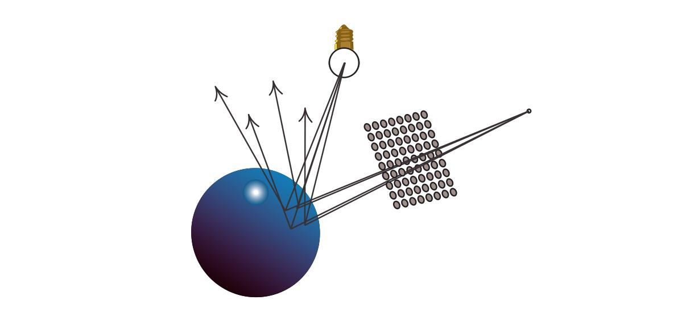 
> [Figure 26.16.](#figure_26_16)
> Rays traveling from the camera and hitting a surface spawn more rays for shadows and
<a id="index_reflections_8"></a>reflections. Note how all these new sets rays are still fairly coherent, similar to each other.

Incoherent rays are generated when we need to randomly sample the hemisphere of outgoing directions from a given surface point. For example, this happens if we want to compute <a id="index_ambient_occlusion_4"></a>ambient occlusion and diffuse global illumination. For glossy reflection rays, the rays are more coherent. In general, we can assume that ray tracing does exhibit some amount of coherency in the set of rays we need to trace and in the hit points for which we need to calculate shading. This ray coherency is something that we can try to leverage in order to accelerate our rendering algorithms.

One of the earliest ideas for exploiting ray coherency was to cluster rays together.
For example, instead of single rays, we could intersect scene primitives with groups
of parallel rays, called *ray bundles*. Bundles intersection with scene primitives can be
performed by exploiting the GPU rasterizer, using orthographic projection to store
the positions and normals of each object into offscreen buffers. Each pixel in these
buffers captures the intersection data for a single ray \[[81](#ref_81)\]. Another early idea is to
group into cones \[[7](#ref_7)\], or small frusta (beams) \[[32](#ref_32)\], representing an infinite number of
rays with the same origin and spanning a limited set of directions. This idea of *beam
tracing* was further explored and generalized by Shinya et al. \[[71](#ref_71)\] in a system they
called *<a id="index_pencil_tracing_1"></a>pencil tracing*. In this scheme, a “pencil” is defined by including variability for
a ray’s origin and direction. As an example, if a ray’s direction is allowed to vary by
up to a certain angle, the set of rays so defined forms a solid cone \[[7](#ref_7)\].

Such schemes assume large areas of continuity. When object edges or areas of large
curvature are found, the pencils devolve into a set of tighter pencils or individual rays
to capture these features. Computing material and lighting integrals over solid angles
is also usually difficult. Because of these limitations, pencil-related methods have
seen little general use. A notable exception is <a id="index_cone_tracing_1"></a>cone tracing of voxelized geometry,
a technique that recently has been used on GPUs to approximate indirect global
illumination (Section 11.5.7).

A more flexible way of exploiting ray coherence is to organize rays in small arrays
called *packets*, which are then traced together. Similar to pencils, these collections
of rays sometimes need to be split, e.g., if they need to follow different branches of a
<a id="index_bvh_31"></a>BVH. See [Figure 26.17](#figure_26_17). However, as a packet is just a data structure, not a geometric
primitive, splitting is much easier, as we only need to create more packets, each with
a subset of the original rays. Packet tracing \[[85](#ref_85)\] allows us to traverse spatial data
structures and to compute object intersections for small groups of rays in parallel,
and it is thus well suited for SIMD computation. Practical implementations \[[88](#ref_88)\] use
packets of a fixed size, tuned to the width of the processor’s SIMD instructions. If
some of the rays are not present in a packet, such as after a split, flags are used to
mask off the corresponding computations.

<a id="figure_26_17"></a>

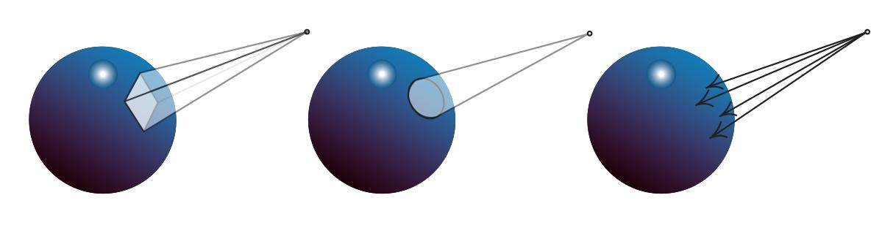 
> [Figure 26.17.](#figure_26_17)
> From left to right, a sphere is intersected with: a beam, a cone and a four ray packet.

While <a id="index_packet_tracing_1"></a>packet tracing can be efficient, and has even been recently adapted to work in
demanding VR applications \[[38](#ref_38)\], it still imposes limitations on how rays are generated.
Moreover, its performance can suffer if rays diverge and too many packets need to be
split. Ideally we want ways to leverage modern data-parallel architectures even for
incoherent ray tracing.

The idea of <a id="index_packet_tracing_2"></a>packet tracing is to use SIMD instructions to intersect multiple rays
with a single primitive, in parallel. However, we could use the same instructions
to intersect a single ray with multiple primitives, thus not needing to keep packets of
rays. If our spatial hierarchies are constructed using shallow trees with high branching
factors, instead of deep binary ones, we can parallelize traversal by testing a single
ray with multiple children nodes at the same time. These data structures can be
built by partially flattening binary ones. For example, if we collapse every other level
of a binary <a id="index_bvh_32"></a>BVH, a 4-wide <a id="index_bvh_33"></a>BVH that encodes the same nodes can be constructed.
The resulting data structure is called a *<a id="index_multi-bounding_volume_hierarchy_1"></a>multi-bounding volume hierarchy* (<a id="index_mbvh_1"></a>MBVH),
sometimes also referred to as a *shallow <a id="index_bvh_34"></a>BVH* or *wide <a id="index_bvh_35"></a>BVH* \[[15](#ref_15), [19](#ref_19), [87](#ref_87)\].

Some applications of ray tracing, such as <a id="index_path_tracing_11"></a>path tracing and its variants, work on
single rays and cannot easily generate coherent packets. This limitation does not
mean that if we look at all the rays traced to generate an image, we would not find
some degrees of ray coherency. Many rays in a scene might travel from similar origins
in similar directions, even if we are not able to explicitly trace them together. In
these cases, we might be able to dynamically sort the rays over which we want to
compute visibility in order to create groups of rays that can be processed coherently.
These ideas were pioneered by Pharr et al. \[[65](#ref_65)\], in what they call “memory-coherent
ray tracing,” a system that uses the nodes of a spatial subdivision structure to store
batches of rays. Instead of traversing each ray through the spatial structure until an
intersection is found, rays in each node are tested against the primitives contained in
the node, if any, and those rays that did not result in hits are propagated to their
immediate neighbors. The spatial subdivision hierarchy is thus visited in breadth-first
order.

It is also possible to avoid explicitly storing rays in the scene’s <a id="index_spatial_data_structure_9"></a>spatial data structure
by instead using quantized ray directions and origins to compute a hash value. We
can then keep a queue of rays that still need processing and sort them by their hash
key. This queue is equivalent to creating a virtual grid over the five-dimensional space
of positions and directions, then grouping rays into the cells of this grid. The idea of
keeping queues of rays and dynamically sorting them is called *<a id="index_ray_stream_tracing_1"></a>ray stream tracing* or
*<a id="index_ray_reordering_1"></a>ray reordering*, and have been successfully adopted both on CPUs and GPUs \[[46](#ref_46), [82](#ref_82)\].

Lastly, it is important to note that many rendering applications are dominated by
shading operations, not by visibility. This is certainly the case today for raster-based
real-time rendering. While tracing coherent ray also helps shading coherency, it does
not guarantee it. Two rays might hit points that are close to each other in the scene,
but correspond to separate objects which need to use different shaders and textures.
This is particularly challenging for GPUs that rely on wide SIMD units and execute
the same instructions in lockstep over large vectors, called wavefronts (Section 23.2).
If rays in a given GPU wavefront might need to use different shading logic, dynamic
branching must be employed, leading to wavefront divergence and larger shaders that
typically use more registers and result in low occupancy.

Sorting can be extended to address shading coherency. Instead of using queuing
and reordering rays only for intersection purposes, rays can also be stored in queues
after they hit objects. These queues can then be sorted again based on the materials
that are associated with the hit points, and then shaders can be evaluated in coherent
batches. The idea of separating material evaluation from visibility is called *deferred
shading*. The same term is used both in ray tracing systems and in raster-based
systems (Section 20.1), which achieve such decoupling via screen-space g-buffers.

Deferred shading has been successfully applied to offline, production path tracers
for movies \[[18](#ref_18), [48](#ref_48)\], sorting millions of rays, even out-of-core, and to smaller queues
both for CPU and GPU ray tracing \[[3](#ref_3), [46](#ref_46)\]. However, for real-time rendering, we
have to keep in mind that, even in systems that are able to reorder work to exploit
coherency, sorting can add significant overhead. Moreover, if too few rays are in flight
at the same time, there may be no useful coherency among them. In addition, as rays
hit scene primitives, evaluated material shaders can generate new rays, which might
in turn trigger the execution of other shaders, recursively. Shader evaluation might
thus need to be suspended until results from the newly spawned rays are computed.
This behavior imposes constraints on the ordering of shader execution, reducing the
opportunities to dynamically recover coherency.

In practice, we have to be mindful of employing rendering algorithms that are aware
of ray and shading coherency. Even when we need to use incoherent rays, there are still
ways for an application to minimize divergence. For example, <a id="index_ambient_occlusion_5"></a>ambient occlusion and
other global illumination effects need to sample the hemisphere of outgoing directions
for each pixel on screen. As this process can be expensive, a common technique is to
shoot only a few samples per pixel and then reconstruct the final result using bilateral
filtering. This usually results in sampling directions that are different pixel to pixel,
and thus, incoherent. An optimized implementation might instead make sure that
directions repeat at regular intervals over small numbers of pixels and order the tracing
so all the pixels with similar directions are processed at the same time \[[43](#ref_43), [50](#ref_50), [68](#ref_68)\].

Shading can be a major source of divergence, even more than ray tracing, as we
might need completely different programs based on what objects we hit. Ideally, we
would like to avoid interleaving complex shading and ray tracing. For example, we
could precompute shading and retrieve cached results on ray hits. Some of these
strategies are already used in offline, production <a id="index_path_tracing_12"></a>path tracing \[[21](#ref_21)\] and in interactive
ray tracing \[[61](#ref_61)\], but more research is needed to advance the state of the art of real-time
ray tracing. In general there is a trade-off for any ray tracing application to consider.
If all rays were equal, we can often shoot few of them, sparsely, and leverage <a id="index_denoising_2"></a>denoising
techniques to generate the final image. However, sparse, incoherent rays are slower to
process and thus sometimes shooting more rays with higher coherence can be faster
overall.

### 26.5 Denoising

<a id="figure_26_18"></a>

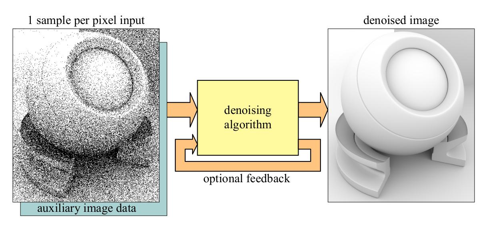
> [Figure 26.18.](#figure_26_18)
> To the left, an image using ray traced <a id="index_ambient_occlusion_6"></a>ambient occlusion with one occlusion ray per
pixel. A <a id="index_denoising_3"></a>denoising algorithm uses this image together with optional auxiliary image data to produce
a denoised image, on the right. Examples of auxiliary image data include the depth component per
pixel, normals, motion vectors, and the minimum distance to the occluders at the shading point.
Note that the <a id="index_denoising_4"></a>denoising algorithm may feed some of its output back into the next frame’s <a id="index_denoising_5"></a>denoising
process. (*Noisy and denoised images courtesy of NVIDIA Corporation.*)

Rendering with Monte Carlo <a id="index_path_tracing_13"></a>path tracing produces images with undesired <a id="index_noise_5"></a>noise, as
we have seen in [Figure 26.6](#figure_26_6). The goal of a _denoising_ algorithm is to take a noisy
image, and optionally auxiliary image data, and produce a new image that resembles
the ground truth as much as possible. In this section, we use the word “resemble”
in an informal way, since a slightly blurred image region may be preferable over a
noisy one. Denoising is particularly important for real-time ray tracing, since we
usually can afford only a few rays per pixel, which means that the rendered image
may be noisy. As an example, the PICA PICA image in [Figure 26.22](#figure_26_22) was rendered
using ≈ 2.25 rays per pixel \[[76](#ref_76)\]. The <a id="index_denoising_6"></a>denoising concept is illustrated in [Figure 26.18](#figure_26_18).
Since one can add a feedback loop to a denoiser, as shown in the figure, temporal
antialiasing (Section 5.4.2) can be considered a basic <a id="index_denoising_7"></a>denoising algorithm. Most (if
not all) <a id="index_denoising_8"></a>denoising techniques can be expressed in a simple manner as a weighted
average of the colors around the current pixel, which we enumerate as a scalar value
$p$. The weighted average is then \[[12](#ref_12)\]:

<a id="equation_26_3"></a>
[(26.3)](#equation_26_3)

$$
\mathbf{d}\_p = \frac{1}{n}\sum_{q \in N}\mathbf{c}\_qw(p, q),
$$

where $\mathbf{d}\_p$ is the denoised color value of pixel $p$, and $\mathbf{c}\_q$ are the noisy color values
around the current pixel (including $p$), and $w(p, q)$ is a weighting function. There are
$n$ pixels in the neighborhood, called $N$, around $p$ that are used in this formula, and this
footprint is usually square. One can also extend the weighting function so that it uses
information from the previous frame, e.g., $w(p, p−1, q, q−1)$, where the subscript $-1$
indicates information from that frame. The weighting function may access a normal
$\mathbf{n}\_q$ if needed and the previous color value $\mathbf{c}\_{p−1}$, for example.
See Figures 24.2, 24.3, [26.19](#figure_26_19), [26.20](#figure_26_20), and [26.21](#figure_26_21) for examples of <a id="index_denoising_9"></a>denoising.

<a id="figure_26_19"></a>

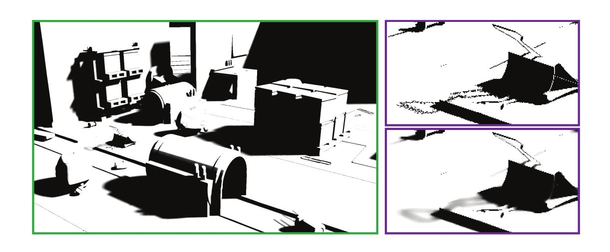
> [Figure 26.19.](#figure_26_19)
> Left: the shadow term after filtering. Top right: zoom-in on the shadow term using
a single sample for an area light source. Bottom left: after <a id="index_denoising_10"></a>denoising the top right image. The
shadows are smoother where expected, and contact shadows are harder. (*Images courtesy of SEED—
Electronic Arts.*)

<br/>

The field of <a id="index_denoising_11"></a>denoising has emerged as an important topic for realistic real-time rendering using ray tracing-based algorithms. In this section, we will provide a short overview of some important work and introduce some key concepts that can be useful. We refer to the survey by Zwicker et al. \[[97](#ref_97)\] as an excellent starting point to learn more. Next, we focus on algorithms and tricks that work well with low sample counts, that is, just one or a few samples per pixel.

It is common to render a G-buffer (Chapter 20) in order to create a noise-free set of render targets that can be used as auxiliary image data for <a id="index_denoising_12"></a>denoising \[[13](#ref_13), [69](#ref_69), [76](#ref_76)\]. Ray tracing can then be used to generate noisy shadows, glossy <a id="index_reflections_9"></a>reflections, and indirect illumination, for example. Another trick that some methods use is to divide direct and indirect illumination and denoise them separately, as they have different properties—the indirect illumination is generally quite smooth, for example. To increase the number of samples used during <a id="index_denoising_13"></a>denoising, it is also common to include some kind of temporal accumulation or temporal antialiasing (Section 5.4.2). Another nice approximation is to filter what is sometimes called <a id="index_untextured_illumination_1"></a>*untextured illumination* or separation of lighting and texture \[[96](#ref_96)\]. To explain how this works, recall that the <a id="index_rendering_equation_5"></a>rendering equation (11.2) is

<a id="equation_26_4"></a>
[(26.4)](#equation_26_4)

$$
L_o(\mathbf{p}, \mathbf{v}) = \int_{1 \in \Omega}f(\mathbf{l},\mathbf{v})L_o(r(\mathbf{p}, \mathbf{l}), -\mathbf{l})(\mathbf{n} \cdot \mathbf{l})^{\+}d\mathbf{l},
$$

where the emissive term $L_e$ has been omitted for simplicity. We handle only the diffuse term, though a similar procedure can be applied to other terms as well. Next, a reflectance term, $R$, is computed, which is essentially just a diffuse shading term times texturing (in the case where the surface is textured):

<a id="equation_26_5"></a>
[(26.5)](#equation_26_5)

$$
R \approx \int_{1 \in \Omega}f(\mathbf{l},\mathbf{v})(\mathbf{n} \cdot \mathbf{l})^{\+}d\mathbf{l},
$$

The <a id="index_untextured_illumination_2"></a>untextured illumination U is then

<a id="equation_26_6"></a>
[(26.6)](#equation_26_6)

$$
U = \frac{L_o}{R},
$$

i.e., the textured term has been divided away and so $U$ should contain mostly just lighting. So, the renderer can compute $L_o$ using the <a id="index_rendering_equation_6"></a>rendering equation and perform a texture lookup plus diffuse shading to obtain $R$, which gives us the untextured illumination. This term can then be denoised into, say, $D$, and the final shading is then $\approx DR$. This avoids having to deal with textures in the <a id="index_denoising_14"></a>denoising algorithm, which is advantageous, since textures often contain high-frequency content, e.g., edges. The <a id="index_untextured_illumination_3"></a>untextured illumination trick is also similar to what Heitz et al. \[[35](#ref_35)\] do when they split up the final image into a noisy shadow term and analytical shading for area light, perform <a id="index_denoising_15"></a>denoising on the shadow term, and finally recombine the images. This type of split is often called a <a id="index_ratio_estimator_1"></a>*ratio estimator*.

Soft shadow <a id="index_denoising_16"></a>denoising can be done using spatio-temporal variance-guided filtering (SVGF) \[[69](#ref_69)\], which is used by SEED \[[76](#ref_76)\], for example. See Figure 26.19. SVGF was originally developed for <a id="index_denoising_17"></a>denoising one-sample-per-pixel images with <a id="index_path_tracing_14"></a>path tracing, i.e., using a G-buffer for primary visibility and then shooting a single secondary ray with shadow rays at both the first and second hits. The general idea is to use temporal accumulation (Section 5.4.2) to increase the effective sample count, and a spatial multi-pass blur \[[16](#ref_16), [29](#ref_29)\] where the blur kernel size is determined by an estimate of the <a id="index_variance_3"></a>variance of the noisy data.

Variance can be computed incrementally as more samples, $x_i$, are added using the following techniques. First, the sum of the squared differences is computed as

<a id="equation_26_7"></a>
[(26.7)](#equation_26_7)

$$
s_n = \sum\_{i=1}^n(x_i - \overline{x}\_n)^2,
$$

where $\overline{x}\_n$ is the average of the first $n$ numbers. The <a id="index_variance_4"></a>variance is then

<a id="equation_26_8"></a>
[(26.8)](#equation_26_8)

$$
\sigma\_{n}^2 = \frac{s_n}{n},
$$

Now, assume that we have already computed sn using $x1,...,xn$, and we get one more sample $x\_{n+1}$ that we want to include in the <a id="index_variance_5"></a>variance computation. The sum is then first updated using

<a id="equation_26_9"></a>
[(26.9)](#equation_26_9)

$$
s\_{n+1} = s_n + (x\_{n+1} - \overline{x}\_n)(x\_{n+1} - \overline{x}\_{n+1}),
$$

and after than $s\_{n+1}$ can be used to compute $\sigma\_{n+1}$ using [Equation 26.8](#equation_26_8). In SVGF, a
method like this is used to estimate the <a id="index_variance_6"></a>variance over time, but it switches to using a
spatial estimation if, for example, a disocclusion is detected, which makes the temporal
<a id="index_variance_7"></a>variance non-reliable. For <a id="index_soft_shadows_1"></a>soft shadows, Llamas and Liu \[[51](#ref_51), [52](#ref_52)\] use a 
separable cross-bilateral filter (Section 12.1.1) where both filter weights and radius are variable.

Stachowiak presents an entire pipeline for <a id="index_denoising_18"></a>denoising <a id="index_reflections_10"></a>reflections \[[76](#ref_76)\]. Some examples
are shown in [Figure 26.20](#figure_26_20). A G-buffer is first rendered and the rays are shot from
there. To reduce the number of rays traced, only one reflection ray and one shadow
ray at the reflection hit per $2 × 2$ pixels are shot. However, reconstruction of the
image is still done at full resolution. The reflection rays are stochastic and importance
sampled. “Stochastic” means that, as more randomly-generated rays are added, the
solution converges to the correct result. “Importance sampled” means that rays are
sent in the directions where they are expected to be more useful for the final result,
e.g., toward the peak of the BRDF. The image is then filtered using a method similar
to one used in screen-space <a id="index_reflections_11"></a>reflections \[[75](#ref_75)\] (Section 11.6.5) and upsampled to full image
resolution at the same time. This filter is also a <a id="index_ratio_estimator_2"></a>ratio estimator \[[35](#ref_35)\]. This technique
is combined with temporal accumulation, a bilateral cleanup pass, and finally, TAA.
Llamas and Liu \[[51](#ref_51), [52](#ref_52)\] present a different reflection solution based on anisotropic
filter kernels.

<a id="figure_26_20"></a>

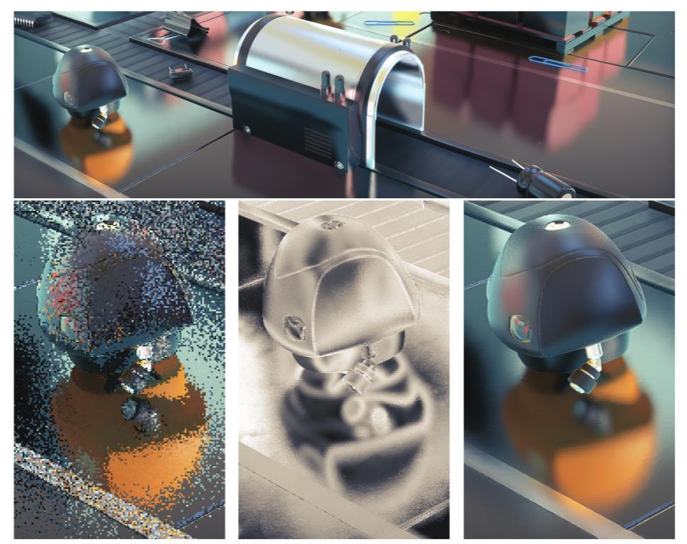
> [Figure 26.20.](#figure_26_20)
> Top: a slice of an image showing only the reflection term after <a id="index_denoising_19"></a>denoising. Bottom
left: before <a id="index_denoising_20"></a>denoising using 1 reflection ray per $2 × 2$ pixels. Bottom middle: the <a id="index_variance_8"></a>variance term. The
brighter the pixel, the higher the <a id="index_variance_9"></a>variance, which leads to a larger blur kernel. Bottom right: the
denoised reflection image at full resolution. (*Images courtesy of SEED—Electronic Arts.*)

<br/>

Metha et al. \[[54](#ref_54), [55](#ref_55), [56](#ref_56)\] take on a more theoretical approach based on Fourier
analysis for light transport \[[17](#ref_17)\] in order to develop filtering methods and adaptive
sampling techniques. They develop axis-aligned filters that are faster to evaluate than
the more accurate sheared filters. Doing so leads to higher performance. For more
information, consult Metha’s PhD thesis \[[57](#ref_57)\].

For <a id="index_ambient_occlusion_7"></a>ambient occlusion (AO), Llamas and Liu \[[51](#ref_51), [52](#ref_52)\] use a technique with 
an axis-aligned kernel \[[54](#ref_54)\] implemented using a separable, cross-bilateral filter (Section 12.1.1)
for efficiency. The kernel size is determined by the minimum distance to an object
found during tracing of AO rays. The filter size is small when an occluder is close,
larger when farther away. This relationship gives a more pronounced shadow for close
occluders and a smoother, blurrier effect when the occluders are farther away. See
[Figure 26.21](#figure_26_21).

<a id="figure_26_21"></a>

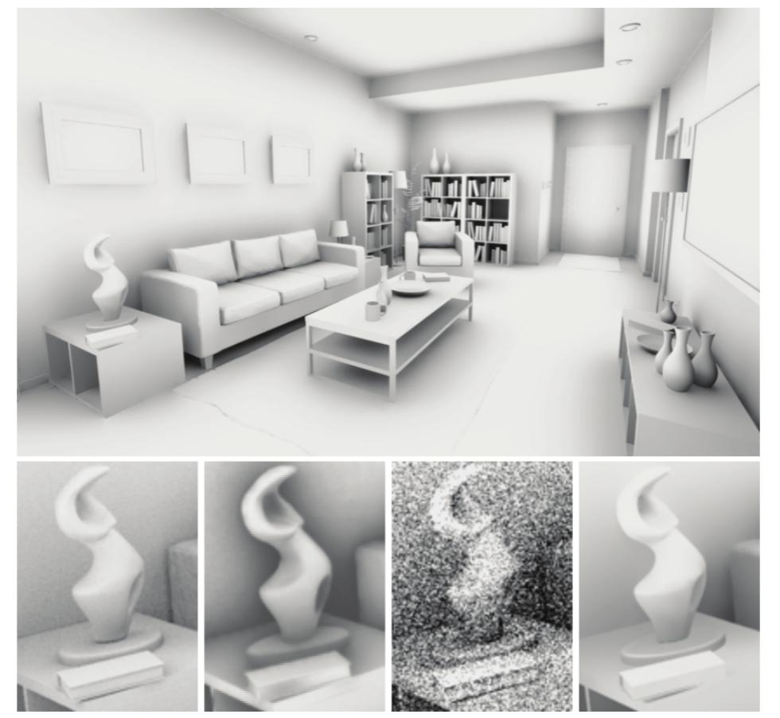
> [Figure 26.21.](#figure_26_21)
> The <a id="index_ambient_occlusion_8"></a>ambient occlusion in the top image was ray traced using one ray per pixel, followed
by <a id="index_denoising_21"></a>denoising. The zoomed images show, from left to right: ground truth, screen-space ambient
occlusion, ray traced <a id="index_ambient_occlusion_9"></a>ambient occlusion with one sample per pixel per frame, and denoised from one
sample per pixel. The denoised image does not capture all of the smaller contact shadows, but is still
a closer match than screen-space <a id="index_ambient_occlusion_10"></a>ambient occlusion. (*Images courtesy of NVIDIA Corporation.*)

There are also several methods for <a id="index_denoising_22"></a>denoising global illumination 
\[[13](#ref_13), [51](#ref_51), [55](#ref_55), [69](#ref_69), [70](#ref_70), [76](#ref_76)\]. 
It is also possible to use specialized filters for different types of effects, which is the
approach taken by the researchers at Frostbite and SEED \[[9](#ref_9), [36](#ref_36), [76](#ref_76)\].
See [Figure 26.22](#figure_26_22).

The Frostbite real-time light map preview system \[[36](#ref_36)\] relies on a variance-based
<a id="index_denoising_23"></a>denoising algorithm. Light map texels store the usual accumulated sample contributions
and tracks their <a id="index_variance_10"></a>variance. When new <a id="index_path_tracing_15"></a>path tracing result comes in, the light
map is blurred locally based on each texel <a id="index_variance_11"></a>variance before it is presented to the user.
The variance-based blur is similar to SVGF \[[69](#ref_69)\], but it is not hierarchical in order
to avoid light map elements belonging to different meshes leaking on to each other.
When blurring, only samples from the same light map element are blurred together
using per texel element indices. To not bias the convergence, the original light map is
left untouched.

<a id="figure_26_22"></a>

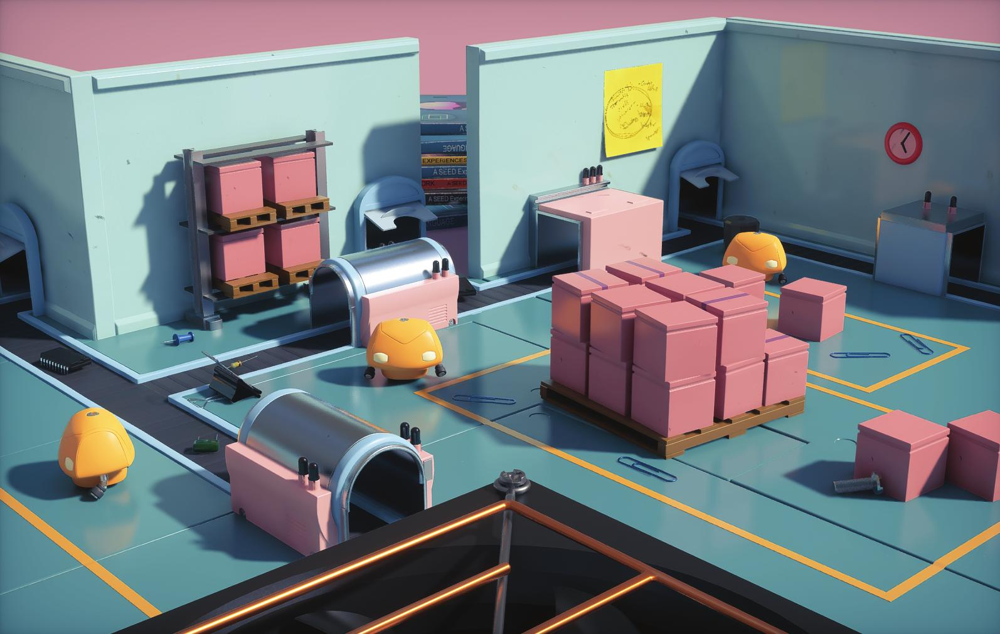
> [Figure 26.22.](#figure_26_22)
> A final image of Project PICA PICA rendered with a combination of <a id="index_rasterization_22"></a>rasterization and
ray tracing, followed by several <a id="index_denoising_24"></a>denoising filters. (*Image courtesy of SEED—Electronic Arts.*)

Another alternative is to perform <a id="index_denoising_25"></a>denoising in texture space \[[61](#ref_61)\]. It requires all
surface locations to have unique uv-space values. Shading is then done at the texel of
the hit point at a surface. Denoising in texture space can be as simple as averaging the
shading from texels with similar normals in, for example, a $13 × 13$ region. Munkberg
et al. include texels if $\cos{\theta} > 0.9$, where $\theta$ is the angle between the normal at the texel
being denoised and another normal at a texel being considered for inclusion. Some
other advantages are that temporal averaging is straightforward in texture space, that
shading costs can be reduced by computing the shading at a coarser level, and that
shading can be amortized over several frames.

Up until now, we have assumed that objects are still and that the camera is a single
point. However, if motion is included and images are rendered with depth of field,
then depths and normals can be noisy as well. For such use cases, Moon et al. \[[60](#ref_60)\] have
developed an anisotropic filter that computes a covariance matrix of world position
samples per pixel. This is used to estimate optimal filtering parameters at each pixel.

With <a id="index_deep_learning_1"></a>deep learning algorithms \[[24](#ref_24), [25](#ref_25)\], it is possible to exploit the massive amount
of data that can be generated by a game engine or other rendering engine and use that
to produce a neural network to generate a denoised image as well. The idea is to first
set up a convolutional neural network and then train the network using both noisy
and noise-free images. If done well, the network will learn a large set of weights that
it can use later in an inference step to denoise a noisy image without knowledge of any
additional noise-free images. Chaitanya et al. \[[13](#ref_13)\] use a convolutional neural network
with a feedback loops in all steps of the encoding pipeline. These were added in order to
increase the temporal stability and thus reduce flicker during animations. It is possible
to train a denoiser, even without access to clean references, using (uncorrelated) noisy
image pairs \[[49](#ref_49)\]. Doing so can make training simpler, since no ground truth images
need to be generated.

It is clear that <a id="index_denoising_26"></a>denoising is and will continue to be an important topic for realistic
real-time rendering, and that more research will continue in this area.

### 26.6 Texture Filtering

As described in Sections 3.8 and 23.8, <a id="index_rasterization_23"></a>rasterization shades pixels in $2 × 2$ groups called
*quads*. This is done so that an estimate of the texture footprint can be computed and
used by the mipmapping texturing hardware units. For ray tracing, the situation
is different. Here, rays are often shot independent of each other. One can imagine
a system where each <a id="index_eye_ray_6"></a>eye ray intersects the triangle plane with two additional rays,
with the first being offset by one pixel horizontally and the second being offset by one
pixel vertically. In many cases, such a technique could generate accurate texture filter
footprints, but only for eye rays. However, what happens if the camera is looking at a
reflective surface, and the reflection ray hits a textured surface? In that case, it would
be ideal to perform a filtered texture lookup that also takes into account the nature
of the reflection and the amount of distance that the rays travel. The same holds for
refractive surfaces.

Igehy \[[39](#ref_39)\] has provided a sophisticated solution to this problem using a technique
called *<a id="index_ray_differentials_1"></a>ray differentials*. Together with each ray, one needs to store

<a id="equation_26_10"></a>
[(26.10)](#equation_26_10) 

$$
\begin{Bmatrix}
\frac{\partial \mathbf{o}}{\partial x}, \frac{\partial \mathbf{o}}{\partial y}, \frac{\partial \mathbf{d}}{\partial x}, \frac{\partial \mathbf{d}}{\partial y},
\end{Bmatrix}
$$

as additional data together with the ray. Recall that $\mathbf{o}$ is the ray origin and $\mathbf{d}$ is the ray
direction (Equation 26.1). Since both $\mathbf{o}$ and $\mathbf{d}$ have three elements, the ray differential
above needs $4 × 3 = 12$ additional numbers to store these. When shooting an <a id="index_eye_ray_7"></a>eye ray,
${\partial \mathbf{o}} / {\partial x} = {\partial \mathbf{o}} / {\partial y} = (0, 0, 0)$, 
since the ray starts from a single point. However, ${\partial \mathbf{d}} / {\partial x}$ 
and ${\partial \mathbf{d}} / {\partial y}$ will model how much each ray spreads 
when passing through a pixel. Ray differentials need to be updated when being transferred from one point to another.
In addition, Igehy derives formulae not only for how ray differential change when a
ray differential is reflected and refracted, but also for how to evaluate the differential
normals for triangles with interpolated normals.

Another simpler method is based on tracing cones, first presented by Amanatides in
1984 \[[7](#ref_7)\]. In this work the focus is mostly on antialiasing geometry, but it briefly 
mentions that *<a id="index_ray_cones_1"></a>ray cones* can also be used for texture filtering when ray tracing. 
Akenine-Möller et al. \[[6](#ref_6)\] present one way to implement <a id="index_ray_cones_2"></a>ray cones together with a G-buffer
where the curvature at the first hit is also taken into account. The filter footprint
is dependent on the distance to the hit, the spread of the ray, the normal at the hit
point, and curvature. However, as curvature is provided only at the first hit, aliasing
can occur for deep <a id="index_reflections_12"></a>reflections. They also present variants of <a id="index_ray_differentials_2"></a>ray differentials that are
combined with G-buffer rendering, and a comparison of these methods is provided.

Four different methods for texture filtering are shown in [Figure 26.23](#ref_figure_26_23). Using mip
level 0 (i.e., no mipmapping) causes severe aliasing. Ray cones provide a slightly
sharper result for this scene, while <a id="index_ray_differentials_3"></a>ray differentials give a result closer to ground
truth. Ray differentials usually provides a better estimate of the texture footprint,
but can sometimes also be overblurry. Ray cones can be both overblurred and under-blurred,
in their experience. Akenine-Möller et al. provide implementations of both ray 
differentials and <a id="index_ray_cones_3"></a>ray cones for texture filtering for ray tracing.

<a id="figure_26_23"></a>

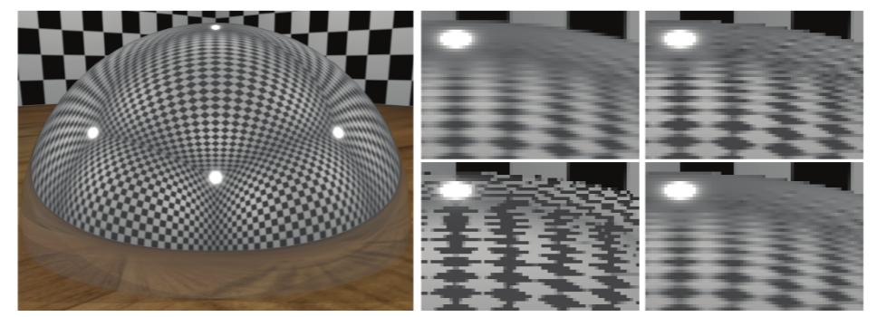 
> [Figure 26.23.](#figure_26_23)
> A reflective hemisphere in a room with a checkerboard pattern on the walls and ceiling,
with a wooden floor. To the right, zoom-ins of one region is shown for several different texture filtering
methods. Middle-top: a ground truth rendering with 1024 samples per pixel using a bilinear texture
lookup in each. Middle-bottom: always accessing mip level 0 with bilinear filtering. Right-top: using
<a id="index_ray_cones_4"></a>ray cones. Right-bottom: using <a id="index_ray_differentials_4"></a>ray differentials. (*Images courtesy of NVIDIA Corporation.*)

### 26.7 Speculations

The new types of shaders proposed by the extended API ([Section 26.2](#262-shaders-for-ray-tracing)) allow for
complex shape intersections and material representations. Having the ability to trace
rays leads to obvious applications related to the rendering of meshes, such as surface
lighting, shadowing, reflection, refraction, and path-traced global illumination.

Thinking outside the box, these capabilities could enable new use cases not considered
during design of the API. It will be exciting to see what developers will come
up with in the near future. Will the <a id="index_ray_generation_shader_5"></a><a id="index_ray_generation_shader_5"></a>ray generation shader become the new compute
shader? This section discusses and explores some possibilities.

With the help of <a id="index_denoising_27"></a>denoising algorithms ([Section 26.5](#265-denoising)), the new ray tracing capabilities 
should make it possible to render more advanced surfaces and more complex
lighting in real time. One such improvement is the evaluation of all <a id="index_reflections_13"></a>reflections using
ray tracing instead of screen-space <a id="index_reflections_14"></a>reflections, such as in the game *Battlefield V*.
Doing so results in better grounded objects as well as improved specular <a id="index_reflections_15"></a>reflections and
occlusion on meshes of any shape. Techniques such as screen-space reflection work in
part because of simplifying assumptions, e.g., that the surface’s reflection is 
symmetric around the principal reflection direction. Ray tracing should give more accurate
results in cases where reflection samples are distributed in a more complex fashion on
the BRDF hemisphere.

Subsurface scattering is another related phenomenon that could be better simulated. 
A first version of <a id="index_subsurface_scattering_1"></a>subsurface scattering has already been achieved using the
new API features by tracing the scattered light within a mesh, temporally accumulating
the samples from many directions in texture space, and applying a <a id="index_denoising_28"></a>denoising
algorithm \[[9](#ref_9)\]. Globally, shadows, indirect lighting and <a id="index_ambient_occlusion_11"></a>ambient occlusion would also
benefit from using ray tracing, resulting in any mesh looking more grounded in a
scene \[[35](#ref_35), [51](#ref_51)\].

The use of participating media (Chapter 14) is becoming more important in real-time 
applications, such as games. How volumetric rendering will evolve and perhaps
diverge from the usual voxel and ray marching based methods is worth keeping a close
eye on. New approaches could emerge that use ray tracing and rely on Woodcock
tracking \[[95](#ref_95)\] for importance sampling, coupled with a <a id="index_denoising_29"></a>denoising process.

Billboard-like rendering (Chapter 13) is commonly used in real-time applications.
Rendering particles for a view is challenging by itself. Sorting is required for a correct
transparency effect, overdraw is an issue for large particles, and lighting performance
and quality trade-off need to be taken into account. Particles are also a challenge to
render in <a id="index_reflections_16"></a>reflections due to their typical camera-facing nature. How should a <a id="index_particle_1"></a>particle
be aligned in a <a id="index_path_tracing_16"></a>path tracing framework when it can be intersected by rays coming from
any direction? Should it have a new representation and leverage intersection shaders
to always align each <a id="index_billboard_1"></a>billboard with the incoming ray? To top it off, due to their
inherent dynamic nature, animated particles will have to update their representation
in the acceleration structure every frame ([Section 26.3](#263-top-and-bottom-level-acceleration-structures)). This update can happen for a
few large particles or many small ones, e.g., smoke plumes or sparks, for which it can
be challenging to optimize the spatial acceleration structure for fast tracing through
the world.

Similar to shadow sampling, casting rays also opens the door to more accurate
intersection and visibility queries. As an example, <a id="index_particle_2"></a>particle collision could be handled
more accurately. The usual screen-space approximations have issues with resolution
dependency, and the evaluation of the front depth layer thickness prevents particles
from falling behind this layer in some cases. Could an entire rigid body physics system
be implemented on the GPU using <a id="index_ray_casting_1"></a>ray casting? Furthermore, ray tracing could also
be used to query visibility between two positions. This ability could be valuable for
audio reverb simulations, gameplay, and AI systems for element-to-element visibility.

A new shader type, not mentioned earlier, added by the ray tracing API is the
*<a id="index_callable_shader_1"></a>callable shader* . It has the ability to spawn shader work from a shader in a 
programmable fashion, something that was only possible in CUDA before \[[1](#ref_1)\]. This type
of shader is not yet available and could be restricted to use only within the ray 
tracing shader set. Depending on how this shader is implemented and its performance,
this functionality could be a valuable new general tool, especially if it would be 
available in other shader stages, such as compute. For instance, a <a id="index_callable_shader_2"></a>callable shader could
remove many shader permutations usually generated in an engine for the sake of 
performance, e.g., each permutation representing an optimized post-process shader for
a set of scene settings. Having optional setting-dependent code being in a callable
shader could reduce the non-negligible memory used by all the permutations, i.e., if
one has to deal with five performance-critical settings then instead of $2^5 = 32$ shaders,
only one shader would be dispatched, with potential calls to 5 sub-shaders. It could
also enable artist-authored shader graphs, not only applied for material definition as
is usually done today, but for every part of the rendering chain in a more modular
fashion: decal volumes application on transparent meshes, light functions, participating
media material, sky, and post-process. Let us take the example of decal volumes
on transparent meshes. Those are usually defined with a shader graph authored by
artists. It is straightforward to apply them on opaque meshes in a deferred context by
modifying the G-buffer content of every pixel intersecting a volume (Section 20.2). In
forward rendering, or during ray tracing, it would require a shader that could evaluate
all the different decal shader graphs authored by artists in a project. These kinds of
huge shaders are impractical. With callable shaders, it would be possible to call the
shader representing each decal volume intersecting a world space position and having
it modify the material considered for shading. Using this feature will depend on
implementation and usage: can a shader be called and return an arbitrary data structure?
Can multiple shaders be called at once? How are the parameters transmitted? Will
they have to be sent through global memory? Can spawned shaders be constrained
to a compute unit to be able to communicate through shared memory? Is it going to
be a fire-and-forget, e.g., without return, call?

Answers to these questions will without a doubt drive further innovations and what
is achievable in the near future. To conclude, one result rendered with <a id="index_dxr_8"></a>DXR is shown
in [Figure 26.24](#figure_26_24), another on the cover of this book. The future looks bright!

<a id="figure_26_24"></a>

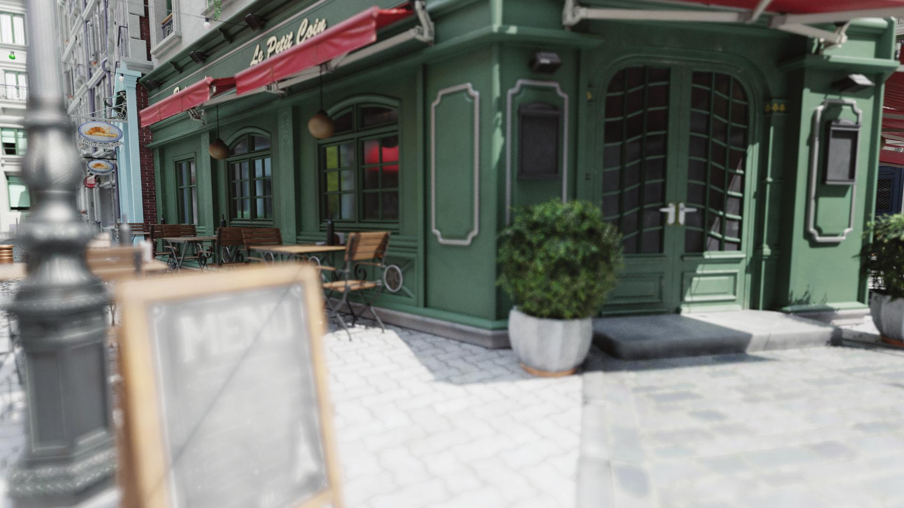 
> [Figure 26.24.](#figure_26_24)
> The bistro exterior scene, generated using a path tracer, with a depth-of-field effect,
that was implemented using <a id="index_dxr_9"></a>DXR. (*Image courtesy of NVIDIA Corporation.*)

## Further Reading and Resources

See this book’s website, https://realtimerendering.com, for the latest information and free software in this field. Shirley’s mini-books on ray tracing \[[72](#ref_72), [73](#ref_73), [74](#ref_74)\] are an excellent introduction to ray tracing in different stages, and are now free PDFs. One of the best resources for production-level ray tracing is the book “Physically Based Rendering” by Pharr et al. \[[66](#ref_66)\], also now free. Suffern’s book *Ray Tracing from the Ground Up* \[[79](#ref_79)\] is relatively old, but is wide-ranging and discusses implementation concerns. For an introduction to <a id="index_dxr_10"></a>DXR, we recommend the SIGGRAPH 2018 course by Wyman et al. \[[91](#ref_91)\] and Wyman’s <a id="index_dxr_11"></a>DXR tutorial \[[92](#ref_92)\]. To learn more about <a id="index_path_tracing_17"></a>path tracing in production rendering, see the recent SIGGRAPH courses by Fascione et al. \[[20](#ref_20), [21](#ref_21)\].
The special issue of ACM TOG \[[67](#ref_67)\] has more articles on the modern use of path tracing and other production rendering techniques. Denoising is discussed in detail in a survey by Zwicker et al. \[[97](#ref_97)\], though this resource from 2015 will not cover the latest research.

## Bibliography

(Alternative links: https://www.realtimerendering.com/refs.html#raytracing)

1. <a id="ref_1"></a> Adinets, Andy, “Adaptive Parallel Computation with CUDA Dynamic Parallelism,” NVIDIA Developer Blog, https://devblogs.nvidia.com/introduction-cuda-dynamic-parallelism/, May 6, 2014. Cited on p. 36. \[[html](https://github.com/QianMo/Real-Time-Rendering-4th-Bibliography-Collection/blob/main/Chapter%2026/%5B01%5D%20%5BNVIDIA%20Developer%20Blog%202014%5D%20Adaptive%20Parallel%20Computation%20with%20CUDA%20Dynamic%20Parallelism.html)\]
2. <a id="ref_2"></a> Áfra, Attila T., and László SzirmayKalos, “Stackless MultiBVH Traversal for CPU, MIC and GPU Ray Tracing,” Computer Graphics Forum, vol. 33, no. 1, pp. 129–140, 2014. Cited on p. 22. \[[pdf](https://github.com/QianMo/Real-Time-Rendering-4th-Bibliography-Collection/blob/main/Chapter%2026/%5B02%5D%20%5BComputer%20Graphics%20Forum%202014%5DStackless%20Multi%E2%80%90BVH%20Traversal%20for%20CPU%2C%20MIC%20and%20GPU%20Ray%20Tracing.pdf)\]
3. <a id="ref_3"></a> Áfra, Attila T., Carsten Benthin, Ingo Wald, and Jacob Munkberg, “Local Shading Coherence Extraction for SIMD-Efficient Path Tracing on CPUs,” High Performance Graphics, pp. 119–128, 2016. Cited on p. 26. \[[pdf](https://github.com/QianMo/Real-Time-Rendering-4th-Bibliography-Collection/blob/main/Chapter%2026/%5B03%5D%20%5BHPG%202016%5D%20Local%20Shading%20Coherence%20Extraction%20for%20SIMD-Efficient%20Path%20Tracing%20on%20CPUs.pdf)\]
4. <a id="ref_4"></a> Aila, Timo, and Samuli Laine, “Understanding the Efficiency of Ray Traversal on GPUs,” High Performance Graphics, pp. 145–149, 2009. Cited on p. 23. \[[pdf](https://github.com/QianMo/Real-Time-Rendering-4th-Bibliography-Collection/blob/main/Chapter%2026/%5B04%5D%20%5BHPG%202009%5D%20Understanding%20the%20Efficiency%20of%20Ray%20Traversal%20on%20GPUs-sliders.pdf)\]\[[pdf](https://github.com/QianMo/Real-Time-Rendering-4th-Bibliography-Collection/blob/main/Chapter%2026/%5B04%5D%20%5BHPG%202009%5D%20Understanding%20the%20Efficiency%20of%20Ray%20Traversal%20on%20GPUs.pdf)\]
5. <a id="ref_5"></a> Aila, Timo, Tero Karras, and Samuli Laine, “On Quality Metrics of Bounding Volume Hierarchies,” High Performance Graphics, pp. 101–107, 2013. Cited on p. 19. \[[pdf](https://github.com/QianMo/Real-Time-Rendering-4th-Bibliography-Collection/blob/main/Chapter%2026/%5B05%5D%20%5BHPG%202013%5D%20On%20Quality%20Metrics%20of%20Bounding%20Volume%20Hierarchies.pdf)\]
6. <a id="ref_6"></a> Akenine-Möller, Tomas, Jim Nilsson, Magnus Andersson, Colin Barré-Brisebois, and Robert Toth, “Texture Level-of-Detail Strategies for Real-Time Ray Tracing,” in Eric Haines and Tomas Akenine-Möller, eds., Ray Tracing Gems, http://www.raytracinggems.com (prerelease chapter), APress, 2019. Cited on p. 34. \[[pdf](https://github.com/QianMo/Real-Time-Rendering-4th-Bibliography-Collection/blob/main/Chapter%2026/%5B06%5D%20%5BRay%20Tracing%20Gems%202019%5D%20Texture%20Level-of-Detail%20Strategies%20for%20Real-Time%20Ray%20Tracing.pdf)\]
7. <a id="ref_7"></a> Amanatides, John, “Ray Tracing with Cones,” Computer Graphics (SIGGRAPH ’84 Proceedings), vol. 18, no. 3, pp. 129–135, July 1984. Cited on p. 24, 34. \[[pdf](https://github.com/QianMo/Real-Time-Rendering-4th-Bibliography-Collection/blob/main/Chapter%2026/%5B07%5D%20%5BSIGGRAPH%201984%5D%20Ray%20Tracing%20with%20Cones%2C%20Computer%20Graphics.pdf)\]
8. <a id="ref_8"></a> AMD, Radeon-Rays library, https://gpuopen.com/gaming-product/radeon-rays/, 2018. Cited on p. 16, 17. \[[pdf](https://github.com/QianMo/Real-Time-Rendering-4th-Bibliography-Collection/blob/main/Chapter%2026/%5B08%5D%20%5BAMD%202018%5D%20Radeon-Rays%20library-white%20paper.pdf)\]\[[html](https://github.com/QianMo/Real-Time-Rendering-4th-Bibliography-Collection/blob/main/Chapter%2026/%5B08%5D%20%5BAMD%202018%5D%20Radeon-Rays%20library.html)\]
9. <a id="ref_9"></a> Andersson, Johan, and Colin Barré-Brisebois, “Shiny Pixels and Beyond: Real-Time Raytracing at SEED,” Game Developers Conference, Mar. 2018. Cited on p. 9, 10, 31, 36. \[[pdf](https://github.com/QianMo/Real-Time-Rendering-4th-Bibliography-Collection/blob/main/Chapter%2026/%5B09%5D%20%5BGDC%202018%5D%20Shiny%20Pixels%20and%20Beyond%20Real-Time%20Raytracing%20at%20SEED.pdf)\]
10. <a id="ref_10"></a> Benthin, Carsten, Sven Woop, Ingo Wald, and Attila T. Áfra, “Improved Two-Level BVHs using Partial Re-Braiding,” High Performance Graphics, article no. 7, 2017. Cited on p. 21. \[[pdf](https://github.com/QianMo/Real-Time-Rendering-4th-Bibliography-Collection/blob/main/Chapter%2026/%5B10%5D%20%5BHPG%202017%5D%20Improved%20Two-Level%20BVHs%20using%20Partial%20Re-Braiding.pdf)\]
11. <a id="ref_11"></a> Binder, Nikolaus, and Alexander Keller, “Efficient Stackless Hierarchy Traversal on GPUs with Backtracking in Constant Time,” High Performance Graphics, pp. 41–50, 2016. Cited on p. 23. \[[pdf](https://github.com/QianMo/Real-Time-Rendering-4th-Bibliography-Collection/blob/main/Chapter%2026/%5B11%5D%20%5BHPG%202016%5D%20Efficient%20Stackless%20Hierarchy%20Traversal%20on%20GPUs%20with%20Backtracking%20in%20Constant%20Time.pdf)\]
12. <a id="ref_12"></a> Bitterli, Benedikt, Fabrice Rousselle, Bochang Moon, José A. Iglesias-Guitián, David Adler, Kenny Mitchell, Wojciech Jarosz, and Jan Novák, “Nonlinearly Weighted First-order Regression for Denoising Monte Carlo Renderings,” Computer Graphics Forum, vol. 35, no. 4, pp. 107–117, 2016. Cited on p. 28. \[[html](https://github.com/QianMo/Real-Time-Rendering-4th-Bibliography-Collection/blob/main/Chapter%2026/%5B12%5D%20%5BComputer%20Graphics%20Forum%202016%5D%20Nonlinearly%20Weighted%20First-order%20Regression%20for%20Denoising%20Monte%20Carlo%20Renderings.html)\]\[[pdf](https://github.com/QianMo/Real-Time-Rendering-4th-Bibliography-Collection/blob/main/Chapter%2026/%5B12%5D%20%5BComputer%20Graphics%20Forum%202016%5D%20Nonlinearly%20Weighted%20First-order%20Regression%20for%20Denoising%20Monte%20Carlo%20Renderings.pdf)\]
13. <a id="ref_13"></a> Chaitanya, Chakravarty R. Alla, Anton S. Kaplanyan, Christoph Schied, Marco Salvi, Aaron Lefohn, Derek Nowrouzezahrai, and Timo Aila, “Interactive Reconstruction of Monte Carlo Image Sequences Using a Recurrent Denoising Autoencoder,” ACM Transactions on Graphics, vol. 36, no. 4, article no. 98, pp. 2017. Cited on p. 28, 30, 33. \[[pdf](https://github.com/QianMo/Real-Time-Rendering-4th-Bibliography-Collection/blob/main/Chapter%2026/%5B13%5D%20%5BACM%202017%5D%20Interactive%20Reconstruction%20of%20Monte%20Carlo%20Image%20Sequences%20Using%20a%20Recurrent%20Denoising%20Autoencoder.pdf)\]
14. <a id="ref_14"></a> Cohen, Daniel, and Zvi Sheffer, “Proximity Clouds—An Acceleration Technique for 3D Grid Traversal,” The Visual Computer, vol. 11, no. 1, pp. 27–38, 1994. Cited on p. 15. \[[pdf](https://github.com/QianMo/Real-Time-Rendering-4th-Bibliography-Collection/blob/main/Chapter%2026/%5B14%5D%20%5BThe%20Visual%20Computer%201994%5D%20Proximity%20Clouds--An%20Acceleration%20Technique%20for%203D%20Grid%20Traversal.pdf)\]
15. <a id="ref_15"></a> Dammertz, Holger, Johannes Hanika, and Alexander Keller, “Shallow Bounding Volume Hierarchies for Fast SIMD Ray Tracing of Incoherent Rays,” Computer Graphics Forum, vol. 27, no. 4, pp. 1225–1233, 2008. Cited on p. 25. \[[pdf](https://github.com/QianMo/Real-Time-Rendering-4th-Bibliography-Collection/blob/main/Chapter%2026/%5B15%5D%20%5BComputer%20Graphics%20Forum%202008%5D%20Shallow%20Bounding%20Volume%20Hierarchies%20for%20Fast%20SIMD%20Ray%20Tracing%20of%20Incoherent%20Rays.pdf)\]
16. <a id="ref_16"></a> Dammertz, Holger, Daniel Sewtz, Johannes Hanika, and Hendrik Lensch, “Edge-Avoiding À-Trous Wavelet Transform for fast Global Illumination Filtering,” High Performance Graphics, pp. 67–75, 2010. Cited on p. 29. \[[pdf](https://github.com/QianMo/Real-Time-Rendering-4th-Bibliography-Collection/blob/main/Chapter%2026/%5B16%5D%20%5BHGP%202010%5D%20Edge-Avoiding%20%C3%80-Trous%20Wavelet%20Transform%20for%20fast%20Global%20Illumination%20Filtering.pdf)\]
17. <a id="ref_17"></a> Durand, Frédo, Nicolas Holzschuch, Cyril Soler, Eric Chan, and François X. Sillion, “A Frequency Analysis of Light Transport,” ACM Transactions on Graphics, vol. 24, no. 3, pp. 1115–1126, 2005. Cited on p. 30. \[[pdf](https://github.com/QianMo/Real-Time-Rendering-4th-Bibliography-Collection/blob/main/Chapter%2026/%5B17%5D%20%5BACM%202015%5D%20A%20Frequency%20Analysis%20of%20Light%20Transport.pdf)\]\[[ppt](https://github.com/QianMo/Real-Time-Rendering-4th-Bibliography-Collection/blob/main/Chapter%2026/%5B17%5D%20%5BACM%202015%5D%20A%20Frequency%20Analysis%20of%20Light%20Transport.ppt)\]
18. <a id="ref_18"></a> Eisenacher, Christian, Gregory Nichols, Andrew Selle, Brent Burley, “Sorted Deferred Shading for Production Path Tracing,” Computer Graphics Forum, vol. 32, no. 4, pp. 125–132, 2013. Cited on p. 26. \[[pdf](https://github.com/QianMo/Real-Time-Rendering-4th-Bibliography-Collection/blob/main/Chapter%2026/%5B18%5D%20%5BComputer%20Graphics%20Forum%202013%5D%20Sorted%20Deferred%20Shading%20for%20Production%20Path%20Tracing.pdf)\]
19. <a id="ref_19"></a> Ernst, Manfred, and Gunther Greiner, “Multi Bounding Volume Hierarchies,” 2008 IEEE Symposium on Interactive Ray Tracing, 2008. Cited on p. 25. \[[pdf](https://github.com/QianMo/Real-Time-Rendering-4th-Bibliography-Collection/blob/main/Chapter%2026/%5B19%5D%20%5BIEEE%202008%5D%20Multi%20Bounding%20Volume%20Hierarchies.pdf)\]
20. <a id="ref_20"></a> Fascione, Luca, Johannes Hanika, Marcos Fajardo, Per Christensen, Brent Burley, and Brian Green, SIGGRAPH Path Tracing in Production course, July 2017. Cited on p. 2, 38. \[[pdf](https://github.com/QianMo/Real-Time-Rendering-4th-Bibliography-Collection/blob/main/Chapter%2026/%5B20%5D%20%5BTechnical%20Report%202001%5D%20Testing%20for%20Intersection%20of%20Convex%20Objects%20The%20Method%20of%20Separating%20Axes.pdf)\]
21. <a id="ref_21"></a> Fascione, Luca, Johannes Hanika, Rob Pieké, Ryusuke Villemin, Christophe Hery, Manuel Gamito, Luke Emrose, André Mazzone, SIGGRAPH Path Tracing in Production course, August 2018. Cited on p. 17, 27, 38. \[[pdf](https://github.com/QianMo/Real-Time-Rendering-4th-Bibliography-Collection/blob/main/Chapter%2026/%5B21%5D%20%5BSIGGRAPH%202018%5D%20SIGGRAPH%20Path%20Tracing%20in%20Production.pdf)\]
22. <a id="ref_22"></a> Foley, Tim, and Jeremy Sugerman, “KD-Tree Acceleration Structures for a GPU Raytracer,” Proceedings of the ACM SIGGRAPH/EUROGRAPHICS Conference on Graphics Hardware, pp. 15–22, 2005. Cited on p. 22. \[[pdf](https://github.com/QianMo/Real-Time-Rendering-4th-Bibliography-Collection/blob/main/Chapter%2026/%5B22%5D%20%5BSIGGRAPH%202005%5D%20KD-Tree%20Acceleration%20Structures%20for%20a%20GPU%20Raytracer.pdf)\]
23. <a id="ref_23"></a> Garanzha, Kirill, Jacopo Pantaleoni, and David McAllister, “Simpler and Faster HLBVH with Work Queues,” High Performance Graphics, pp. 59–64, 2011. Cited on p. 20. \[[pdf](https://github.com/QianMo/Real-Time-Rendering-4th-Bibliography-Collection/blob/main/Chapter%2026/%5B23%5D%20%5BHPG%202011%5D%20Simpler%20and%20Faster%20HLBVH%20with%20Work%20Queues.pdf)\]
24. <a id="ref_24"></a> Glassner, Andrew, Deep Learning, Vol. 1: From Basics to Practice, Amazon Digital Services LLC, 2018. Cited on p. 33. \[[djvu](https://github.com/QianMo/Real-Time-Rendering-4th-Bibliography-Collection/blob/main/Chapter%2026/%5B24%5D%20%5BBook%202018%5D%20Deep%20Learning%2C%20Vol.%201%20From%20Basics%20to%20Practice.djvu)\]
25. <a id="ref_25"></a> Glassner, Andrew, Deep Learning, Vol. 2: From Basics to Practice, Amazon Digital Services LLC, 2018. Cited on p. 33. 
26. <a id="ref_26"></a> Gu, Yan, Yong He, and Guy E. Blelloch, “Ray Specialized Contraction on Bounding Volume Hierarchies,” Computer Graphics Forum, vol. 34, no. 7, pp. 309–311, 2015. Cited on p. 19. \[[pdf](https://github.com/QianMo/Real-Time-Rendering-4th-Bibliography-Collection/blob/main/Chapter%2026/%5B26%5D%20%5BComputer%20Graphics%20Forum%202015%5D%20Ray%20Specialized%20Contraction%20on%20Bounding%20Volume%20Hierarchies.pdf)\]
27. <a id="ref_27"></a> Haines, Eric, “Spline Surface Rendering, and What’s Wrong with Octrees,” Ray Tracing News, vol. 1, no. 2, http://raytracingnews.org/rtnews1b.html, 1988. Cited on p. 15. \[[html](https://github.com/QianMo/Real-Time-Rendering-4th-Bibliography-Collection/blob/main/Chapter%2026/%5B27%5D%20%5BWebsite%201988%5D%20Spline%20Surface%20Rendering%2C%20and%20What%27s%20Wrong%20with%20Octrees.html)\]
28. <a id="ref_28"></a> Haines, Eric, et al., Twitter thread, https://twitter.com/pointinpolygon/status/1035609566262771712, August 31, 2018. Cited on p. 17. \[[html](https://github.com/QianMo/Real-Time-Rendering-4th-Bibliography-Collection/blob/main/Chapter%2026/%5B28%5D%20%5BWebsite%202018%5D%20Twitter%20thread.html)\]
29. <a id="ref_29"></a> Hanika, Johannes, Holger Dammertz, and Hendrik Lensch, “Edge-Optimized À-Trous Wavelets for Local Contrast Enhancement with Robust Denoising,” Pacific Graphics, pp. 67–75, 2011. Cited on p. 29. \[[pdf](https://github.com/QianMo/Real-Time-Rendering-4th-Bibliography-Collection/blob/main/Chapter%2026/%5B29%5D%20%5BPaper%202011%5D%20Edge-Optimized%20%C3%80-Trous%20Wavelets%20for%20Local%20Contrast%20Enhancement%20with%20Robust%20Denoising.pdf)\]
30. <a id="ref_30"></a> Hapala, Michal, Tomáš Davidovic̆, Ingo Wald, Vlastimil Havran, and Philipp Slusallek, “Efficient Stack-less BVH Traversal for Ray Tracing,” Proceedings of the 27th Spring Conference on Computer Graphics, pp. 7–12, 2011. Cited on p. 22. \[[pdf](https://github.com/QianMo/Real-Time-Rendering-4th-Bibliography-Collection/blob/main/Chapter%2026/%5B30%5D%20%5BSCCG%202011%5D%20Efficient%20Stack-less%20BVH%20Traversal%20for%20Ray%20Tracing.pdf)\]
31. <a id="ref_31"></a> Havran, Vlastimil, Heuristic Ray Shooting Algorithms, PhD thesis, Department of Computer Science and Engineering, Czech Technical University, Prague, 2000. Cited on p. 15. \[[pdf](https://github.com/QianMo/Real-Time-Rendering-4th-Bibliography-Collection/blob/main/Chapter%2026/%5B31%5D%20%5BPhD%20thesis%202000%5D%20Heuristic%20Ray%20Shooting%20Algorithms.pdf)\]
32. <a id="ref_32"></a> Heckbert, Paul S., and Pat Hanrahan, “Beam Tracing Polygonal Objects,” Computer Graphics (SIGGRAPH ’84 Proceedings), vol. 18, no. 3, pp. 119–127, July 1984. Cited on p. 24. \[[pdf](https://github.com/QianMo/Real-Time-Rendering-4th-Bibliography-Collection/blob/main/Chapter%2026/%5B32%5D%20%5BSIGGRAPH%201984%5D%20Beam%20Tracing%20Polygonal%20Objects.pdf)\]
33. <a id="ref_33"></a> Heckbert, Paul S., “What Are the Coordinates of a Pixel?” in Andrew S. Glassner, ed., Graphics Gems, Academic Press, pp. 246–248, 1990. Cited on p. 4. \[[pdf](https://github.com/QianMo/Real-Time-Rendering-4th-Bibliography-Collection/blob/main/Chapter%2026/%5B33%5D%20%5BGraphics%20Gem%201990%5D%20What%20Are%20the%20Coordinates%20of%20a%20Pixel.pdf)\]\[[pdf](https://github.com/QianMo/Real-Time-Rendering-4th-Bibliography-Collection/blob/main/Chapter%2026/%5B33%5D%20%5BGraphics%20Gems%201990%5D%20What%20Are%20the%20Coordinates%20of%20a%20Pixel%EF%80%A5.pdf)\]
34. <a id="ref_34"></a> Heckbert, Paul S., “A Minimal Ray Tracer,” in Paul S. Heckbert, ed., Graphics Gems IV, Academic Press, pp. 375–381, 1994. Cited on p. 1. \[[pdf](https://github.com/QianMo/Real-Time-Rendering-4th-Bibliography-Collection/blob/main/Chapter%2026/%5B34%5D%20%5BGraphics%20Gems%20IV%201994%5D%20A%20Minimal%20Ray%20Tracer.pdf)\]\[[pdf](https://github.com/QianMo/Real-Time-Rendering-4th-Bibliography-Collection/blob/main/Chapter%2026/%5B34%5D%20%5BIEEE%202008%5D%20Ray%20tracing%20-%20Strengths%20and%20opportunities.pdf)\]
35. <a id="ref_35"></a> Heitz, Eric, Stephen Hill, and Morgan McGuire, “Combining Analytic Direct Illumination and Stochastic Shadows,” Symposium on Interactive 3D Graphics and Games, pp. 2:1–2:11, 2018. Cited on p. 13, 29, 30, 36. \[[html](https://github.com/QianMo/Real-Time-Rendering-4th-Bibliography-Collection/blob/main/Chapter%2026/%5B35%5D%20%5BSIGGRAPH%202018%5D%20Combining%20Analytic%20Direct%20Illumination%20and%20Stochastic%20Shadows.html)\]
36. <a id="ref_36"></a> Hillaire, Sébastien, “Real-Time Raytracing for Interactive Global Illumination Workflows in Frostbite,” Game Developers Conference, Mar. 2018. Cited on p. 31. 
37. <a id="ref_37"></a> Horn, Daniel Reiter, Jeremy Sugerman, Mike Houston, and Pat Hanrahan, “Interactive k-D tree GPU Raytracing,” Proceedings of the 2007 Symposium on Interactive 3D Graphics and Games, 2007. Cited on p. 22. \[[pdf](https://github.com/QianMo/Real-Time-Rendering-4th-Bibliography-Collection/blob/main/Chapter%2026/%5B37%5D%20%5BSIGGRAPH%202007%5D%20Interactive%20k-D%20tree%20GPU%20Raytracing.pdf)\]
38. <a id="ref_38"></a> Hunt, Warren, Michael Mara, and Alex Nankervis, “Hierarchical Visibility for Virtual Reality,” Proceedings of the ACM on Computer Graphics and Interactive Techniques, article no. 8, 2018. Cited on p. 25. \[[pdf](https://github.com/QianMo/Real-Time-Rendering-4th-Bibliography-Collection/blob/main/Chapter%2026/%5B38%5D%20%5BACM%202018%5D%20Hierarchical%20Visibility%20for%20Virtual%20Reality.pdf)\]
39. <a id="ref_39"></a> Igehy, Homan, “Tracing Ray Differentials,” in SIGGRAPH ’99: Proceedings of the 26th Annual Conference on Computer Graphics and Interactive Techniques, ACM Press/Addison-Wesley Publishing Co., pp. 179–186, Aug. 1999. Cited on p. 34. \[[pdf](https://github.com/QianMo/Real-Time-Rendering-4th-Bibliography-Collection/blob/main/Chapter%2026/%5B39%5D%20%5BSIGGRAPH%201999%5D%20Tracing%20Ray%20Differentials.pdf)\]
40. <a id="ref_40"></a> Karras, Tero, and Timo Aila, “Fast Parallel Construction of High-Quality Bounding Volume Hierarchies,” High Performance Graphics, pp. 89–99, 2013. Cited on p. 21. \[[pdf](https://github.com/QianMo/Real-Time-Rendering-4th-Bibliography-Collection/blob/main/Chapter%2026/%5B40%5D%20%5BHPG%202013%5D%20Fast%20Parallel%20Construction%20of%20High-Quality%20Bounding%20Volume%20Hierarchies.pdf)\]
41. <a id="ref_41"></a> Kajiya, James T., “The Rendering Equation,” Computer Graphics (SIGGRAPH ’86 Proceedings), vol. 20, no. 4, pp. 143–150, Aug. 1986. Cited on p. 7. \[[pdf](https://github.com/QianMo/Real-Time-Rendering-4th-Bibliography-Collection/blob/main/Chapter%2026/%5B41%5D%20%5BSIGGRAPH%201986%5D%20The%20Rendering%20Equation.pdf)\]
42. <a id="ref_42"></a> Kalojanov, Javor, Markus Billeter, and Philipp Slusallek, “Two-Level Grids for Ray Tracing on GPUs,” Computer Graphics Forum, vol. 30, no. 2, pp. 307–314, 2011. Cited on p. 15. \[[pdf](https://github.com/QianMo/Real-Time-Rendering-4th-Bibliography-Collection/blob/main/Chapter%2026/%5B42%5D%20%5BComputer%20Graphics%20Forum%202011%5D%20Two-Level%20Grids%20for%20Ray%20Tracing%20on%20GPUs.pdf)\]
43. <a id="ref_43"></a> Keller, Alexander, and Wolfgang Heidrich, “Interleaved Sampling,” Rendering Techniques 2001, Springer, pp. 269–276, 2001. Cited on p. 26. \[[pdf](https://github.com/QianMo/Real-Time-Rendering-4th-Bibliography-Collection/blob/main/Chapter%2026/%5B43%5D%20%5BRendering%20Techniques%202001%5D%20Interleaved%20Sampling.pdf)\]
44. <a id="ref_44"></a> Kopta, Daniel, Thiago Ize, Josef Spjut, Erik Brunvand, Al Davis, and Andrew Kensler, “Fast, Effective </a>BVH Updates for Animated Scenes,” Proceedings of the ACM SIGGRAPH Symposium on Interactive 3D Graphics and Games, pp. 197–204, 2012. Cited on p. 21. \[[pdf](https://github.com/QianMo/Real-Time-Rendering-4th-Bibliography-Collection/blob/main/Chapter%2026/%5B44%5D%20%5BSIGGRAPH%202012%5D%20Fast%2C%20Effective%20BVH%20Updates%20for%20Animated%20Scenes.pdf)\]
45. <a id="ref_45"></a> Laine, Samuli, “Restart Trail for Stackless BVH Traversal,” High Performance Graphics, pp. 107–111, 2010. Cited on p. 22. \[[pdf](https://github.com/QianMo/Real-Time-Rendering-4th-Bibliography-Collection/blob/main/Chapter%2026/%5B45%5D%20%5BHPG%202010%5D%20Restart%20Trail%20for%20Stackless%20BVH%20Traversal.pdf)\]
46. <a id="ref_46"></a> Laine, Samuli, Tero Karras, and Timo Aila, “Megakernels Considered Harmful: Wavefront Path Tracing on GPUs,” High Performance Graphics, pp. 137–143, 2013. Cited on p. 17, 26. \[[pdf](https://github.com/QianMo/Real-Time-Rendering-4th-Bibliography-Collection/blob/main/Chapter%2026/%5B46%5D%20%5BHPG%202013%5D%20Megakernels%20Considered%20Harmful-%20Wavefront%20Path%20Tracing%20on%20GPUs.pdf)\]
47. <a id="ref_47"></a> Lauterbach, C., M. Garland, S. Sengupta, D. Luebke, and D. Manocha, “Fast BVH Construction on GPUs,” Computer Graphics Forum, vol. 28, no. 2, pp. 375–384, 2009. Cited on p. 20. \[[pdf](https://github.com/QianMo/Real-Time-Rendering-4th-Bibliography-Collection/blob/main/Chapter%2026/%5B47%5D%20%5BComputer%20Graphics%20Forum%202009%5D%20Fast%20BVH%20Construction%20on%20GPUs.pdf)\]
48. <a id="ref_48"></a> Lee, Mark, Brian Green, Feng Xie, and Eric Tabellion, “Vectorized Production Path Tracing,” High Performance Graphics, article no. 10, 2017. Cited on p. 26. \[[pdf](https://github.com/QianMo/Real-Time-Rendering-4th-Bibliography-Collection/blob/main/Chapter%2026/%5B48%5D%20%5BHPG%202017%5D%20Vectorized%20Production%20Path%20Tracing.pdf)\]
49. <a id="ref_49"></a> Lehtinen, Jaakko, Jacob Munkberg, Jon Hasselgren, Samuli Laine, Tero Karras, Miika Aittala, and Timo Aila, “Noise2Noise: Learning Image Restoration without Clean Data,” International Conference on Machine Learning, 2018. Cited on p. 33. \[[pdf](https://github.com/QianMo/Real-Time-Rendering-4th-Bibliography-Collection/blob/main/Chapter%2026/%5B49%5D%20%5BICML%202018%5D%20Noise2Noise-%20Learning%20Image%20Restoration%20without%20Clean%20Data.pdf)\]
50. <a id="ref_50"></a> Lindqvist, Anders, “Pathtracing Coherency,” Breakin.se Blog, https://www.breakin.se/learn/pathtracing-coherency.html, Aug. 27, 2018. Cited on p. 26. \[[html](https://github.com/QianMo/Real-Time-Rendering-4th-Bibliography-Collection/blob/main/Chapter%2026/%5B50%5D%20%5BBlog%202018%5D%20Pathtracing%20Coherency.html)\]
51. <a id="ref_51"></a> Liu, Edward, “Low Sample Count Ray Tracing with NVIDIA’s Ray Tracing Denoisers,” SIGGRAPH NVIDIA Exhibitor Session: Real-Time Ray Tracing, 2018. Cited on p. 30, 36. \[[md](https://github.com/QianMo/Real-Time-Rendering-4th-Bibliography-Collection/blob/main/Chapter%2026/%5B51%5D%20%5BSIGGRAPH%202018%5D%20Low%20Sample%20Count%20Ray%20Tracing%20with%20NVIDIA%27s%20Ray%20Tracing%20Denoisers.md)\]
52. <a id="ref_52"></a> Llamas, Ignacio, and Edward Liu, “Ray Tracing in Games with NVIDIA RTX,” Game Developers Conference, Mar. 21, 2018. Cited on p. 30. \[[pdf](https://github.com/QianMo/Real-Time-Rendering-4th-Bibliography-Collection/blob/main/Chapter%2026/%5B52%5D%20%5BGDC%202018%5D%20Ray%20Tracing%20in%20Games%20with%20NVIDIA%20RTX.pdf)\]
53. <a id="ref_53"></a> MacDonald, J. David, and Kellogg S. Booth, “Heuristics for Ray Tracing Using Space Subdivision,” Visual Computer, vol. 6, no. 3, pp. 153–165, 1990. Cited on p. 18. \[[pdf](https://github.com/QianMo/Real-Time-Rendering-4th-Bibliography-Collection/blob/main/Chapter%2026/%5B53%5D%20%5BTVC%201990%5D%20Heuristics%20for%20Ray%20Tracing%20Using%20Space%20Subdivision.pdf)\]
54. <a id="ref_54"></a> Mehta, Soham Uday, Brandon Wang, and Ravi Ramamoorthi, “Axis-Aligned Filtering for Interactive Sampled Soft Shadows,” ACM Transactions on Graphics, vol. 31, no. 6, pp. 163:1–163:10, 2012. Cited on p. 30. \[[pdf](https://github.com/QianMo/Real-Time-Rendering-4th-Bibliography-Collection/blob/main/Chapter%2026/%5B54%5D%20%5BACM%202012%5D%20Axis-Aligned%20Filtering%20for%20Interactive%20Sampled%20Soft%20Shadows.pdf)\]
55. <a id="ref_55"></a> Mehta, Soham Uday, Brandon Wang, Ravi Ramamoorthi, and Fredo Durand, “Axis-Aligned Filtering for Interactive Physically-Based Diffuse Indirect Lighting,” ACM Transactions on Graphics, vol. 32, no. 4, pp. 96:1–96:12, 2013. Cited on p. 30. \[[pdf](https://github.com/QianMo/Real-Time-Rendering-4th-Bibliography-Collection/blob/main/Chapter%2026/%5B55%5D%20%5BACM%202013%5D%20Axis-Aligned%20Filtering%20for%20Interactive%20Physically-Based%20Diffuse%20Indirect%20Lighting.pdf)\]
56. <a id="ref_56"></a> Mehta, Soham Uday, JiaXian Yao, Ravi Ramamoorthi, and Fredi Durand, “Factored Axis-aligned Filtering for Rendering Multiple Distribution Effects,” ACM Transactions on Graphics, vol. 33, no. 4, pp. 57:1–57:12, 2014. Cited on p. 30. \[[pdf](https://github.com/QianMo/Real-Time-Rendering-4th-Bibliography-Collection/blob/main/Chapter%2026/%5B56%5D%20%5BACM%202014%5D%20Factored%20Axis-aligned%20Filtering%20for%20Rendering%20Multiple%20Distribution%20Effects.pdf)\]
57. <a id="ref_57"></a> Mehta, Soham Uday, Axis-aligned Filtering for Interactive Physically-based Rendering, PhD thesis, Technical Report No. UCB/EECS-2015-66, University of California, Berkeley, 2015. Cited on p. 30. \[[pdf](https://github.com/QianMo/Real-Time-Rendering-4th-Bibliography-Collection/blob/main/Chapter%2026/%5B57%5D%20%5BPhD%20thesis%202015%5D%20Axis-aligned%20Filtering%20for%20Interactive%20Physically-based%20Rendering.pdf)\]
58. <a id="ref_58"></a> Melnikov, Evgeniy, “Ray Tracing,” NVIDIA ComputeWorks site, August 14, 2018. Cited on p. 16, 17. \[[html](https://github.com/QianMo/Real-Time-Rendering-4th-Bibliography-Collection/blob/main/Chapter%2026/%5B58%5D%20%5BNVIDIA%202018%5D%20Ray%20Tracing.html)\]
59. <a id="ref_59"></a> Microsoft, D3D12 Raytracing Functional Spec, v0.09, Mar. 12, 2018. Cited on p. 8, 9, 11. \[[html](https://github.com/QianMo/Real-Time-Rendering-4th-Bibliography-Collection/blob/main/Chapter%2026/%5B59%5D%20%5BMicrosoft%202019%5D%20DirectX%20Raytracing%20%28DXR%29%20Functional%20Spec.html)\]
60. <a id="ref_60"></a> Moon, Bochang, Jose A. Iglesias-Guitian, Steven McDonagh, and Kenny Mitchell, “Noise Reduction on G-Buffers for Monte Carlo Filtering,” Computer Graphics Forum, vol. 34, no. 2, pp. 1–13, 2015. Cited on p. 33. \[[pdf](https://github.com/QianMo/Real-Time-Rendering-4th-Bibliography-Collection/blob/main/Chapter%2026/%5B60%5D%20%5BComputer%20Graphics%20Forum%202015%5D%20Noise%20Reduction%20on%20G-Buffers%20for%20Monte%20Carlo%20Filtering.pdf)\]
61. <a id="ref_61"></a> Munkberg, J., J. Hasselgren, P. Clarberg, M. Andersson, and T. Akenine-Möller, “Texture Space Caching and Reconstruction for Ray Tracing,” ACM Transactions on Graphics, vol. 35, no. 6, pp. 249:1–249:13, 2016. Cited on p. 27, 31. \[[pdf](https://github.com/QianMo/Real-Time-Rendering-4th-Bibliography-Collection/blob/main/Chapter%2026/%5B61%5D%20%5BACM%202016%5D%20Texture%20Space%20Caching%20and%20Reconstruction%20for%20Ray%20Tracing.pdf)\]
62. <a id="ref_62"></a> NVIDIA, “Ray Tracing,” NVIDIA OptiX 5.0 Programming Guide, Mar. 13, 2018. Cited on p. 16, 17, 18. \[[pdf](https://github.com/QianMo/Real-Time-Rendering-4th-Bibliography-Collection/blob/main/Chapter%2026/%5B62%5D%20%5BNVIDIA%202018%5D%20Ray%20Tracing.pdf)\]
63. <a id="ref_63"></a> Pantaleoni, Jacopo, and David Luebke, “HLBVH: Hierarchical LBVH Construction for Real-Time Ray Tracing of Dynamic Geometry,” High Performance Graphics, pp. 89–95, June 2010. Cited on p. 20. \[[pdf](https://github.com/QianMo/Real-Time-Rendering-4th-Bibliography-Collection/blob/main/Chapter%2026/%5B63%5D%20%5BHPG%202010%5D%20HLBVH-%20Hierarchical%20LBVH%20Construction%20for%20Real-Time%20Ray%20Tracing%20of%20Dynamic%20Geometry.pdf)\]
64. <a id="ref_64"></a> PérardGayot, Arsène, Javor Kalojanov, and Philipp Slusallek, “GPU Ray Tracing using Irregular Grids,” Computer Graphics Forum, vol. 36, no. 2, pp. 477–486, 2017. Cited on p. 15. \[[pdf](https://github.com/QianMo/Real-Time-Rendering-4th-Bibliography-Collection/blob/main/Chapter%2026/%5B64%5D%20%5BComputer%20Graphics%20Forum%202017%5D%20GPU%20Ray%20Tracing%20using%20Irregular%20Grids.pdf)\]
65. <a id="ref_65"></a> Pharr, Matt, Craig Kolb, Reid Gershbein, and Pat Hanrahan, “Rendering Complex Scenes with Memory-Coherent Ray Tracing,” SIGGRAPH ’97: Proceedings of the 24th Annual Conference on Computer Graphics and Interactive Techniques, ACM Press/Addison-Wesley Publishing Co., pp. 101–108, 1997. Cited on p. 25. \[[pdf](https://github.com/QianMo/Real-Time-Rendering-4th-Bibliography-Collection/blob/main/Chapter%2026/%5B65%5D%20%5BSIGGRAPH%201997%5D%20Rendering%20Complex%20Scenes%20with%20Memory-Coherent%20Ray%20Tracing.pdf)\]
66. <a id="ref_66"></a> Pharr, Matt, Wenzel Jakob, and Greg Humphreys, Physically Based Rendering: From Theory to Implementation, Third Edition, Morgan Kaufmann, 2016. Cited on p. 38. \[[pdf](https://github.com/QianMo/Real-Time-Rendering-4th-Bibliography-Collection/blob/main/Chapter%2026/%5B66%5D%20%5BBook%202016%5D%20Physically%20Based%20Rendering-%20From%20Theory%20to%20Implementation%2C%20Third%20Edition.pdf)\]
67. <a id="ref_67"></a> Pharr, Matt, section ed., “Special Issue on Production Rendering,” ACM Transactions on Graphics, vol. 37, no. 3, 2018. Cited on p. 17, 38. \[[pdf](https://github.com/QianMo/Real-Time-Rendering-4th-Bibliography-Collection/blob/main/Chapter%2026/%5B67%5D%20%5BACM%202018%5D%20Special%20Issue%20on%20Production%20Rendering.pdf)\]
68. <a id="ref_68"></a> Sadeghi, Iman, Bin Chen, and Henrik Wann Jensen, “Coherent Path Tracing,” journal of graphics tools, vol. 14, no. 2, pp. 33–43, 2011. Cited on p. 26. \[[pdf](https://github.com/QianMo/Real-Time-Rendering-4th-Bibliography-Collection/blob/main/Chapter%2026/%5B68%5D%20%5BJournal%20of%20Graphics%20Tools%202011%5D%20Coherent%20Path%20Tracing.pdf)\]
69. <a id="ref_69"></a> Schied, Christoph, Anton Kaplanyan, Chris Wyman, Anjul Patney, Chakravarty R. Alla Chaitanya, John Burgess, Shiqiu Liu, Carsten Dachsbacher, and Aaron Lefohn, “Spatiotemporal Variance-Guided Filtering: Real-Time Reconstruction for Path-Traced Global Illumination,” High Performance Graphics, pp. 2:1–2:12, July 2017. Cited on p. 28, 29, 30, 31. \[[pdf](https://github.com/QianMo/Real-Time-Rendering-4th-Bibliography-Collection/blob/main/Chapter%2026/%5B69%5D%20%5BHigh%20Performance%20Graphics%202017%5D%20Spatiotemporal%20Variance-Guided%20Filtering%20-%20Real-Time%20Reconstruction%20for%20Path-Traced%20Global%20Illumination.pdf)\]
70. <a id="ref_70"></a> Schied, Christoph, Christoph Peters, and Carsten Dachsbacher, “Gradient Estimation for Real-Time Adaptive Temporal Filtering,” High Performance Graphics, August 2018. Cited on p. 30. \[[pdf](https://github.com/QianMo/Real-Time-Rendering-4th-Bibliography-Collection/blob/main/Chapter%2026/%5B70%5D%20%5BHigh%20Performance%20Graphics%202018%5D%20Gradient%20Estimation%20for%20Real-Time%20Adaptive%20Temporal%20Filtering.pdf)\]\[[html](https://github.com/QianMo/Real-Time-Rendering-4th-Bibliography-Collection/blob/main/Chapter%2026/%5B70%5D%20%5BWebsite%202018%5D%20Gradient%20Estimation%20for%20Real-Time%20Adaptive%20Temporal%20Filtering.html)\]
71. <a id="ref_71"></a> Shinya, Mikio, Tokiichiro Takahashi, and Seiichiro Naito, “Principles and Applications of Pencil Tracing,” ACM SIGGRAPH Computer Graphics, vol. 21, no. 4, pp. 45–54, 1987. Cited on p. 24. \[[pdf](https://github.com/QianMo/Real-Time-Rendering-4th-Bibliography-Collection/blob/main/Chapter%2026/%5B71%5D%20%5BSIGGRAPH%201987%5D%20Principles%20and%20Applications%20of%20Pencil%20Tracing.pdf)\]
72. <a id="ref_72"></a> Shirley, Peter, Ray Tracing in One Weekend, Jan. 2016. Cited on p. 38. \[[html](https://github.com/QianMo/Real-Time-Rendering-4th-Bibliography-Collection/blob/main/Chapter%2026/%5B72%5D%20%5BBlog%202016%5D%20Ray%20Tracing%20in%20One%20Weekend.html)\]\[[pdf](https://github.com/QianMo/Real-Time-Rendering-4th-Bibliography-Collection/blob/main/Chapter%2026/%5B72%5D%20%5BBook%202016%5D%20Ray%20Tracing%20in%20One%20Weekend.pdf)\]
73. <a id="ref_73"></a> Shirley, Peter, Ray Tracing: the Next Week, Mar. 2016. Cited on p. 38. \[[html](https://github.com/QianMo/Real-Time-Rendering-4th-Bibliography-Collection/blob/main/Chapter%2026/%5B73%5D%20%5BBlog%202016%5D%20Ray%20Tracing%20-%20the%20Next%20Week.html)\]\[[pdf](https://github.com/QianMo/Real-Time-Rendering-4th-Bibliography-Collection/blob/main/Chapter%2026/%5B73%5D%20%5BBook%202016%5D%20Ray%20Tracing%20-%20the%20Next%20Week.pdf)\]
74. <a id="ref_74"></a> Shirley, Peter, Ray Tracing: The Rest of Your Life, Mar. 2016. Cited on p. 38. \[[html](https://github.com/QianMo/Real-Time-Rendering-4th-Bibliography-Collection/blob/main/Chapter%2026/%5B74%5D%20%5BBlog%202016%5D%20Ray%20Tracing%20-%20The%20Rest%20of%20Your%20Life.html)\]\[[pdf](https://github.com/QianMo/Real-Time-Rendering-4th-Bibliography-Collection/blob/main/Chapter%2026/%5B74%5D%20%5BBook%202016%5D%20Ray%20Tracing%20-%20The%20Rest%20of%20Your%20Life.pdf)\]
75. <a id="ref_75"></a> Stachowiak, Tomasz, “Stochastic Screen-Space Reflections,” SIGGRAPH Advances in Real-Time Rendering in Games course, Aug. 2015. Cited on p. 30. \[[pptx](https://github.com/QianMo/Real-Time-Rendering-4th-Bibliography-Collection/blob/main/Chapter%2026/%5B75%5D%20%5BSIGGRAPH%202015%5D%20Stochastic%20Screen-Space%20Reflections.pptx)\]
76. <a id="ref_76"></a> Stachowiak, Tomasz, “Stochastic All the Things: Raytracing in Hybrid Real-Time Rendering,” Digital Dragons, May 22, 2018. Cited on p. 9, 27, 28, 29, 30, 31. \[[pdf](https://github.com/QianMo/Real-Time-Rendering-4th-Bibliography-Collection/blob/main/Chapter%2026/%5B76%5D%20%5BDigital%20Dragons%202018%5D%20Stochastic%20All%20the%20Things%20-%20Raytracing%20in%20Hybrid%20Real-Time%20Rendering.pdf)\]
77. <a id="ref_77"></a> Stich, Martin, Heiko Friedrich, and Andreas Dietrich, “Spatial Splits in Bounding Volume Hierarchies,” High Performance Graphics, pp. 7–13, 2009. Cited on p. 18. \[[pdf](https://github.com/QianMo/Real-Time-Rendering-4th-Bibliography-Collection/blob/main/Chapter%2026/%5B77%5D%20%5BHigh%20Performance%20Graphics%202009%5D%20Spatial%20Splits%20in%20Bounding%20Volume%20Hierarchies%2C%20High%20Performance%20Graphics.pdf)\]
78. <a id="ref_78"></a> Stich, Martin, “Introduction to NVIDIA RTX and DirectX Ray Tracing,” NVIDIA Developer Blog, Mar. 19, 2018. Cited on p. 9. \[[html](https://github.com/QianMo/Real-Time-Rendering-4th-Bibliography-Collection/blob/main/Chapter%2026/%5B78%5D%20%5BNVIDIA%20Developer%20Blog%202018%5D%20Introduction%20to%20NVIDIA%20RTX%20and%20DirectX%20Ray%20Tracing..html)\]
79. <a id="ref_79"></a> Suffern, Kenneth, Ray Tracing from the Ground Up, A K Peters, Ltd., 2007. Cited on p. 38. \[[rar](https://github.com/QianMo/Real-Time-Rendering-4th-Bibliography-Collection/blob/main/Chapter%2026/%5B79%5D%20%5BBook%202007%5D%20Ray%20Tracing%20From%20The%20Ground%20Up.rar)\]
80. <a id="ref_80"></a> Swoboda, Matt, “Real time ray tracing part 2,” Direct To Video Blog, May. 8, 2013. Cited on p. 15. \[[html](https://github.com/QianMo/Real-Time-Rendering-4th-Bibliography-Collection/blob/main/Chapter%2026/%5B80%5D%20%5BBlog%202013%5D%20Real%20time%20ray%20tracing%20part%202%2C%20Direct%20To%20Video.html)\]
81. <a id="ref_81"></a> Tokuyoshi, Yusuke, Takashi Sekine, and Shinji Ogaki, “Fast Global Illumination Baking via Ray-Bundles,” SIGGRAPH Asia 2011 Sketches, ACM, 2011. Cited on p. 24. \[[pdf](https://github.com/QianMo/Real-Time-Rendering-4th-Bibliography-Collection/blob/main/Chapter%2026/%5B81%5D%20%5BSIGGRAPH%20Asia%202011%5D%20Fast%20Global%20Illumination%20Baking%20via%20Ray-Bundles.pdf)\]
82. <a id="ref_82"></a> Tsakok, John A., “Faster Incoherent Rays: Multi-BVH Ray Stream Tracing,” High Performance Graphics, pp. 151–158, 2009. Cited on p. 26. \[[pdf](https://github.com/QianMo/Real-Time-Rendering-4th-Bibliography-Collection/blob/main/Chapter%2026/%5B82%5D%20%5BHigh%20Performance%20Graphics%202009%5D%20Faster%20Incoherent%20Rays%20Multi-BVH%20Ray%20Stream%20Tracing.pdf)\]
83. <a id="ref_83"></a> Vinkler, Marek, Vlastimil Havran, and Jiřı́ Bittner, “Bounding Volume Hierarchies versus Kd-trees on Contemporary Many-Core Architectures,” Proceedings of the 30th Spring Conference on Computer Graphics, ACM, pp. 29–36, 2014. Cited on p. 17. \[[pdf](https://github.com/QianMo/Real-Time-Rendering-4th-Bibliography-Collection/blob/main/Chapter%2026/%5B83%5D%20%5BACM%202014%5D%20Bounding%20Volume%20Hierarchies%20versus%20Kd-trees%20on%20Contemporary%20Many-Core%20Architectures.pdf)\]
84. <a id="ref_84"></a> Wächter, Carsten, and Alexander Keller, “Instant Ray Tracing: The Bounding Interval Hierarchy,” EGSR ’06 Proceedings of the 17th Eurographics conference on Rendering Techniques, pp. 139–149, 2006. Cited on p. 16, 20. \[[pdf](https://github.com/QianMo/Real-Time-Rendering-4th-Bibliography-Collection/blob/main/Chapter%2026/%5B84%5D%20%5BEurographics%202006%5D%20Instant%20Ray%20Tracing%20The%20Bounding%20Interval%20Hierarchy.pdf)\]
85. <a id="ref_85"></a> Wald, Ingo, Philipp Slusallek, Carsten Benthin, and Markus Wagner, “Interactive Rendering with Coherent Ray Tracing,” Computer Graphics Forum, vol. 20, no. 3, pp. 153–165, 2001. Cited on p. 25. \[[pdf](https://github.com/QianMo/Real-Time-Rendering-4th-Bibliography-Collection/blob/main/Chapter%2026/%5B85%5D%20%5BComputer%20Graphics%20Forum%202001%5D%20Interactive%20Rendering%20with%20Coherent%20Ray%20Tracing.pdf)\]
86. <a id="ref_86"></a> Wald, Ingo, “On fast Construction of SAH-based Bounding Volume Hierarchies,” 2007 IEEE Symposium on Interactive Ray Tracing, Sept. 2007. Cited on p. 20. \[[pdf](https://github.com/QianMo/Real-Time-Rendering-4th-Bibliography-Collection/blob/main/Chapter%2026/%5B86%5D%20%5BIEEE%202007%5D%20On%20fast%20Construction%20of%20SAH-based%20Bounding%20Volume%20Hierarchies.pdf)\]
87. <a id="ref_87"></a> Wald, Ingo, Carsten Benthin, and Solomon Boulos, “Getting Rid of Packets—Efficient SIMD Single-Ray Traversal using Multi-branching BVHs—,” 2008 IEEE Symposium on Interactive Ray Tracing, Aug. 2008. Cited on p. 25. \[[pdf](https://github.com/QianMo/Real-Time-Rendering-4th-Bibliography-Collection/blob/main/Chapter%2026/%5B87%5D%20%5BIEEE%202008%5D%20Getting%20Rid%20of%20Packets--Efficient%20SIMD%20Single-Ray%20Traversal%20using%20Multi-branching%20BVHs--.pdf)\]
88. <a id="ref_88"></a> Wald, Ingo, Sven Woop, Carsten Benthin, Gregory S. Johnson, and Manfred Ernst, “Embree: A Kernel Framework for Efficient CPU Ray Tracing,” ACM Transactions on Graphics, vol. 33, no. 4, pp. 143:1–143:8, 2014. Cited on p. 16, 17, 25. \[[pdf](https://github.com/QianMo/Real-Time-Rendering-4th-Bibliography-Collection/blob/main/Chapter%2026/%5B88%5D%20%5BACM%202014%5D%20Embree%20A%20Kernel%20Framework%20for%20Efficient%20CPU%20Ray%20Tracing.pdf)\]
89. <a id="ref_89"></a> Whitted, Turner, “An Improved Illumination Model for Shaded Display,” Communications of the ACM, vol. 23, no. 6, pp. 343–349, 1980. Cited on p. 2, 5. \[[pdf](https://github.com/QianMo/Real-Time-Rendering-4th-Bibliography-Collection/blob/main/Chapter%2026/%5B89%5D%20%5BACM%201980%5D%20An%20Improved%20Illumination%20Model%20for%20Shaded%20Display.pdf)\]
90. <a id="ref_90"></a> Wright, Daniel, “Dynamic Occlusion with Signed Distance Fields,” SIGGRAPH Advances in Real-Time Rendering in Games course, Aug. 2015. Cited on p. 14. \[[pdf](https://github.com/QianMo/Real-Time-Rendering-4th-Bibliography-Collection/blob/main/Chapter%2026/%5B90%5D%20%5BSIGGRAPH%202015%5D%20Dynamic%20Occlusion%20with%20Signed%20Distance%20Fields.pdf)\]\[[ppt](https://github.com/QianMo/Real-Time-Rendering-4th-Bibliography-Collection/blob/main/Chapter%2026/%5B90%5D%20%5BSIGGRAPH%202015%5D%20Dynamic%20Occlusion%20with%20Signed%20Distance%20Fields.ppt)\]
91. <a id="ref_91"></a> Wyman, Chris, Shawn Hargreaves, Peter Shirley, and Colin Barré-Brisebois, SIGGRAPH Introduction to DirectX RayTracing course, August 2018. Cited on p. 8, 38. \[[html](https://github.com/QianMo/Real-Time-Rendering-4th-Bibliography-Collection/blob/main/Chapter%2026/%5B91%5D%20%5BSIGGRAPH%202018%5D%20Introduction%20to%20DirectX%20RayTracing.html)\]
92. <a id="ref_92"></a> Wyman, Chris, A Gentle Introduction To DirectX Raytracing, http://cwyman.org/code/dxrTutors/dxr_tutors.md.html, August 2018. Cited on p. 8, 38. \[[html](https://github.com/QianMo/Real-Time-Rendering-4th-Bibliography-Collection/blob/main/Chapter%2026/%5B92%5D%20A%20Gentle%20Introduction%20To%20DirectX%20Raytracing.html)\]
93. <a id="ref_93"></a> Ylitie, Henri, Tero Karras, and Samuli Laine, “Efficient Incoherent Ray Traversal on GPUs Through Compressed Wide BVHs,” High Performance Graphics, article no. 4, July 2017. Cited on p. 23. \[[pdf](https://github.com/QianMo/Real-Time-Rendering-4th-Bibliography-Collection/blob/main/Chapter%2026/%5B93%5D%20%5BHPG%202017%5D%20Efficient%20Incoherent%20Ray%20Traversal%20on%20GPUs%20Through%20Compressed%20Wide%20BVHs.pdf)\]
94. <a id="ref_94"></a> Yoon, Sung-Eui, Sean Curtis, and Dinesh Manocha, “Ray Tracing Dynamic Scenes using Selective Restructuring,” EGSR Proceedings of the 18th Eurographics Conference on Rendering Techniques, pp. 73–84, 2007. Cited on p. 21. \[[pdf](https://github.com/QianMo/Real-Time-Rendering-4th-Bibliography-Collection/blob/main/Chapter%2026/%5B94%5D%20%5BEUROGRAPHICS%202007%5D%20Ray%20Tracing%20Dynamic%20Scenes%20using%20Selective%20Restructuring.pdf)\]
95. <a id="ref_95"></a> Yue, Yonghao, Kei Iwasaki, Chen Bing-Yu, Yoshinori Dobashi, and Tomoyuki Nishita, “Unbiased, Adaptive Stochastic Sampling for Rendering Inhomogeneous Participating Media,” ACM Transactions on Graphics, vol. 29, no. 6, pp. 177:1–177:8, 2010. Cited on p. 36. \[[pdf](https://github.com/QianMo/Real-Time-Rendering-4th-Bibliography-Collection/blob/main/Chapter%2026/%5B95%5D%20%5BACM%202010%5D%20Unbiased%2C%20Adaptive%20Stochastic%20Sampling%20for%20Rendering%20Inhomogeneous%20Participating%20Media.pdf)\]
96. <a id="ref_96"></a> Zimmer, Henning, Fabrice Rousselle, Wenzel Jakob, Oliver Wang, David Adler, Wojciech Jarosz, Olga Sorkine-Hornung, and Alexander Sorkine-Hornung, “Path-space Motion Estimation and Decomposition for Robust Animation Filtering,” Computer Graphics Forum, vol. 34, no. 4, pp. 131–142, 2015. Cited on p. 28. \[[pdf](https://github.com/QianMo/Real-Time-Rendering-4th-Bibliography-Collection/blob/main/Chapter%2026/%5B96%5D%20%5BComputer%20Graphics%20Forum%202015%5D%20Path-space%20Motion%20Estimation%20and%20Decomposition%20for%20Robust%20Animation%20Filtering.pdf)\]
97. <a id="ref_97"></a> Zwicker, M., W. Jarosz, J. Lehtinen, B. Moon, R. Ramamoorthi, F. Rousselle, P. Sen, C. Soler, and S.-E. Yoon, “Recent Advances in Adaptive Sampling and Reconstruction for Monte Carlo Rendering,” Computer Graphics Forum, vol. 34, no. 2, pp. 667–681, 2015. Cited on p. 28, 38. \[[pdf](https://github.com/QianMo/Real-Time-Rendering-4th-Bibliography-Collection/blob/main/Chapter%2026/%5B97%5D%20%5BComputer%20Graphics%20Forum%202015%5D%20Recent%20Advances%20in%20Adaptive%20Sampling%20and%20Reconstruction%20for%20Monte%20Carlo%20Rendering.pdf)\]


<!-- 

1. <a id="ref_1"></a> Adinets, Andy, "Adaptive Parallel Computation with CUDA Dynamic Parallelism," _NVIDIA Developer Blog_, [https://devblogs.nvidia.com/introduction-cuda-dynamic-parallelism/](https://devblogs.nvidia.com/introduction-cuda-dynamic-parallelism/), May 6, 2014.
2. <a id="ref_2"></a> Áfra, Attila T., and László Szirmay‐Kalos, "Stackless Multi‐BVH Traversal for CPU, MIC and GPU Ray Tracing," _Computer Graphics Forum_, vol. 33, no. 1, pp. 129-140, 2014.  
    - [https://pdfs.semanticscholar.org/7e81/6b82fb92df08d7bc0d9805f8988754e0d8c1.pdf](https://pdfs.semanticscholar.org/7e81/6b82fb92df08d7bc0d9805f8988754e0d8c1.pdf)
3. <a id="ref_3"></a> Áfra, Attila T., Carsten Benthin, Ingo Wald, and Jacob Munkberg, "Local Shading Coherence Extraction for SIMD-Efficient Path Tracing on CPUs," _High Performance Graphics_, pp. 119-128, 2016.  
    - [http://www.highperformancegraphics.org/wp-content/uploads/2016/local-shading-coherence-hpg2016-slides.pdf](http://www.highperformancegraphics.org/wp-content/uploads/2016/local-shading-coherence-hpg2016-slides.pdf)
4. <a id="ref_4"></a> Aila, Timo, and Samuli Laine, "Understanding the Efficiency of Ray Traversal on GPUs," _High Performance Graphics_, pp. 145-149, 2009.  
    - [http://www.cs.cmu.edu/afs/cs/academic/class/15869-f11/www/readings/aila09\_gpu\_rt.pdf](http://www.cs.cmu.edu/afs/cs/academic/class/15869-f11/www/readings/aila09_gpu_rt.pdf)  
    - [http://highperformancegraphics.net/previous/www\_2009/presentations/aila-understanding.pdf](http://highperformancegraphics.net/previous/www_2009/presentations/aila-understanding.pdf)
5. <a id="ref_5"></a> Aila, Timo, Tero Karras, and Samuli Laine, "On Quality Metrics of Bounding Volume Hierarchies," _High Performance Graphics_, pp. 101-107, 2013.  
    - [https://users.aalto.fi/~laines9/publications/aila2013hpg\_paper.pdf](https://users.aalto.fi/~laines9/publications/aila2013hpg_paper.pdf)
6. <a id="ref_6"></a> Akenine-Möller, Tomas, Jim Nilsson, Magnus Andersson, Colin Barré-Brisebois, and Robert Toth, "Texture Level-of-Detail Strategies for Real-Time Ray Tracing," in Eric Haines and Tomas Akenine-Möller, eds., _Ray Tracing Gems_, [http://www.raytracinggems.com](http://www.raytracinggems.com) (_prerelease chapter_), APress, 2019.
7. <a id="ref_7"></a> Amanatides, John, "Ray Tracing with Cones," _Computer Graphics (SIGGRAPH '84 Proceedings)_, vol. 18, no. 3, pp. 129-135, July 1984.  
    - [http://artis.inrialpes.fr/Members/Cyril.Soler/DEA/Ombres/Papers/Amanatides.Sig84.pdf](http://artis.inrialpes.fr/Members/Cyril.Soler/DEA/Ombres/Papers/Amanatides.Sig84.pdf)
8. <a id="ref_8"></a> AMD, _Radeon-Rays library_, [https://gpuopen.com/gaming-product/radeon-rays/](https://gpuopen.com/gaming-product/radeon-rays/), 2018.
9. <a id="ref_9"></a> Andersson, Johan, and Colin Barré-Brisebois, "Shiny Pixels and Beyond: Real-Time Raytracing at SEED," _Game Developers Conference_, Mar. 2018.  
    - [https://www.ea.com/seed/news/seed-gdc-2018-presentation-slides-shiny-pixels](https://www.ea.com/seed/news/seed-gdc-2018-presentation-slides-shiny-pixels)
10. <a id="ref_10"></a> Benthin, Carsten, Sven Woop, Ingo Wald, and Attila T. Áfra, "Improved Two-Level BVHs using Partial Re-Braiding," _High Performance Graphics_, article no. 7, 2017.  
    - [http://www.sven-woop.de/papers/2017-HPG-openmerge.pdf](http://www.sven-woop.de/papers/2017-HPG-openmerge.pdf)
11. <a id="ref_11"></a> Binder, Nikolaus, and Alexander Keller, "Efficient Stackless Hierarchy Traversal on GPUs with Backtracking in Constant Time," _High Performance Graphics_, pp. 41-50, 2016.
12. <a id="ref_12"></a> Bitterli, Benedikt, Fabrice Rousselle, Bochang Moon, José A. Iglesias-Guitián, David Adler, Kenny Mitchell, Wojciech Jarosz, and Jan Novák, "Nonlinearly Weighted First-order Regression for Denoising Monte Carlo Renderings," _Computer Graphics Forum_, vol. 35, no. 4, pp. 107-117, 2016.  
    - [https://cs.dartmouth.edu/~wjarosz/publications/bitterli16nonlinearly.html](https://cs.dartmouth.edu/~wjarosz/publications/bitterli16nonlinearly.html)
13. <a id="ref_13"></a> Chaitanya, Chakravarty R. Alla, Anton S. Kaplanyan, Christoph Schied, Marco Salvi, Aaron Lefohn, Derek Nowrouzezahrai, and Timo Aila, "Interactive Reconstruction of Monte Carlo Image Sequences Using a Recurrent Denoising Autoencoder," _ACM Transactions on Graphics_, vol. 36, no. 4, article no. 98, pp. 2017.  
    - [https://www.semanticscholar.org/paper/Interactive-reconstruction-of-Monte-Carlo-image-se-Chaitanya-Kaplanyan/26cf54106c32f3007ae58816ac1a693c3262e755](https://www.semanticscholar.org/paper/Interactive-reconstruction-of-Monte-Carlo-image-se-Chaitanya-Kaplanyan/26cf54106c32f3007ae58816ac1a693c3262e755)
14. <a id="ref_14"></a> Cohen, Daniel, and Zvi Sheffer, "Proximity Clouds--An Acceleration Technique for 3D Grid Traversal," _The Visual Computer_, vol. 11, no. 1, pp. 27-38, 1994.  
    - [https://link.springer.com/article/10.1007/BF01900697](https://link.springer.com/article/10.1007/BF01900697)
15. <a id="ref_15"></a> Dammertz, Holger, Johannes Hanika, and Alexander Keller, "Shallow Bounding Volume Hierarchies for Fast SIMD Ray Tracing of Incoherent Rays," _Computer Graphics Forum_, vol. 27, no. 4, pp. 1225-1233, 2008.  
    - [http://cg.ivd.kit.edu/publications/pubhanika/2008\_qbvh.pdf](http://cg.ivd.kit.edu/publications/pubhanika/2008_qbvh.pdf)
16. <a id="ref_16"></a> Dammertz, Holger, Daniel Sewtz, Johannes Hanika, and Hendrik Lensch, "Edge-Avoiding À-Trous Wavelet Transform for fast Global Illumination Filtering," _High Performance Graphics_, pp. 67-75, 2010.  
    - [https://jo.dreggn.org/home/2010\_atrous.pdf](https://jo.dreggn.org/home/2010_atrous.pdf)
17. <a id="ref_17"></a> Durand, Frédo, Nicolas Holzschuch, Cyril Soler, Eric Chan, and François X. Sillion, "A Frequency Analysis of Light Transport," _ACM Transactions on Graphics_, vol. 24, no. 3, pp. 1115-1126, 2005.  
    - [https://people.csail.mit.edu/fredo/PUBLI/Fourier/](https://people.csail.mit.edu/fredo/PUBLI/Fourier/)
18. <a id="ref_18"></a> Eisenacher, Christian, Gregory Nichols, Andrew Selle, Brent Burley, "Sorted Deferred Shading for Production Path Tracing," _Computer Graphics Forum_, vol. 32, no. 4, pp. 125-132, 2013.  
    - [http://www.andyselle.com/papers/20/sorting-shading.pdf](http://www.andyselle.com/papers/20/sorting-shading.pdf)
19. <a id="ref_19"></a> Ernst, Manfred, and Gunther Greiner, "Multi Bounding Volume Hierarchies," _2008 IEEE Symposium on Interactive Ray Tracing_, 2008.  
    - [https://www.computer.org/csdl/proceedings/rt/2008/2741/00/04634618.pdf](https://www.computer.org/csdl/proceedings/rt/2008/2741/00/04634618.pdf)
20. <a id="ref_20"></a> Fascione, Luca, Johannes Hanika, Marcos Fajardo, Per Christensen, Brent Burley, and Brian Green, _SIGGRAPH Path Tracing in Production course_, July 2017.  
    - [https://jo.dreggn.org/path-tracing-in-production/2017/index.html](https://jo.dreggn.org/path-tracing-in-production/2017/index.html)
21. <a id="ref_21"></a> Fascione, Luca, Johannes Hanika, Rob Pieké, Ryusuke Villemin, Christophe Hery, Manuel Gamito, Luke Emrose, André Mazzone, _SIGGRAPH Path Tracing in Production course_, August 2018.  
    - [https://jo.dreggn.org/path-tracing-in-production/2018/index.html](https://jo.dreggn.org/path-tracing-in-production/2018/index.html)
22. <a id="ref_22"></a> Foley, Tim, and Jeremy Sugerman, "KD-Tree Acceleration Structures for a GPU Raytracer," _Proceedings of the ACM SIGGRAPH/EUROGRAPHICS Conference on Graphics Hardware_, pp. 15-22, 2005.  
    - [http://171.67.77.70/papers/gpu\_kdtree/kdtree.pdf](http://171.67.77.70/papers/gpu_kdtree/kdtree.pdf)
23. <a id="ref_23"></a> Garanzha, Kirill, Jacopo Pantaleoni, and David McAllister, "Simpler and Faster HLBVH with Work Queues," _High Performance Graphics_, pp. 59-64, 2011.  
    - [http://research.nvidia.com/sites/default/files/publications/main.pdf](http://research.nvidia.com/sites/default/files/publications/main.pdf)
24. <a id="ref_24"></a> Glassner, Andrew, _Deep Learning, Vol. 1: From Basics to Practice_, Amazon Digital Services LLC, 2018.  
    - [https://dlbasics.com/](https://dlbasics.com/)
25. <a id="ref_25"></a> Glassner, Andrew, _Deep Learning, Vol. 2: From Basics to Practice_, Amazon Digital Services LLC, 2018.  
    - [https://dlbasics.com/](https://dlbasics.com/)
26. <a id="ref_26"></a> Gu, Yan, Yong He, and Guy E. Blelloch, "Ray Specialized Contraction on Bounding Volume Hierarchies," _Computer Graphics Forum_, vol. 34, no. 7, pp. 309-311, 2015.  
    - [http://citeseerx.ist.psu.edu/viewdoc/download?doi=10.1.1.706.8205&rep=rep1&type=pdf](http://citeseerx.ist.psu.edu/viewdoc/download?doi=10.1.1.706.8205&rep=rep1&type=pdf)
27. <a id="ref_27"></a> Haines, Eric, "Spline Surface Rendering, and What's Wrong with Octrees," _Ray Tracing News_, vol. 1, no. 2, [http://raytracingnews.org/rtnews1b.html](http://raytracingnews.org/rtnews1b.html), 1988.
28. <a id="ref_28"></a> Haines, Eric, et al., _Twitter thread_, [https://twitter.com/pointinpolygon/status/1035609566262771712](https://twitter.com/pointinpolygon/status/1035609566262771712), August 31, 2018.
29. <a id="ref_29"></a> Hanika, Johannes, Holger Dammertz, and Hendrik Lensch, "Edge-Optimized À-Trous Wavelets for Local Contrast Enhancement with Robust Denoising," _Pacific Graphics_, pp. 67-75, 2011.  
    - [https://jo.dreggn.org/home/2011\_atrous.pdf](https://jo.dreggn.org/home/2011_atrous.pdf)
30. <a id="ref_30"></a> Hapala, Michal, Tomás Davidovič, Ingo Wald, Vlastimil Havran, and Philipp Slusallek, "Efficient Stack-less BVH Traversal for Ray Tracing," _Proceedings of the 27th Spring Conference on Computer Graphics_, pp. 7-12, 2011.  
    - [http://davidovic.cz/wiki/lib/exe/fetch.php/school/hapala\_sccg2011/hapala\_sccg2011.pdf](http://davidovic.cz/wiki/lib/exe/fetch.php/school/hapala_sccg2011/hapala_sccg2011.pdf)
31. <a id="ref_31"></a> Havran, Vlastimil, _Heuristic Ray Shooting Algorithms_, PhD thesis, Department of Computer Science and Engineering, Czech Technical University, Prague, 2000.  
    - [http://dcgi.fel.cvut.cz/home/havran/DISSVH/dissvh.pdf](http://dcgi.fel.cvut.cz/home/havran/DISSVH/dissvh.pdf)
32. <a id="ref_32"></a> Heckbert, Paul S., and Pat Hanrahan, "Beam Tracing Polygonal Objects," _Computer Graphics (SIGGRAPH '84 Proceedings)_, vol. 18, no. 3, pp. 119-127, July 1984.  
    - [https://pubweb.eng.utah.edu/~cs6965/papers/p119-heckbert.pdf](https://pubweb.eng.utah.edu/~cs6965/papers/p119-heckbert.pdf)
33. <a id="ref_33"></a> Heckbert, Paul S., "What Are the Coordinates of a Pixel?" in Andrew S. Glassner, ed., _Graphics Gems_, Academic Press, pp. 246-248, 1990.  
    - [https://smile.amazon.com/Graphics-Gems-Andrew-S-Glassner/dp/0122861663](https://smile.amazon.com/Graphics-Gems-Andrew-S-Glassner/dp/0122861663?tag=realtimerenderin)
34. <a id="ref_34"></a> Heckbert, Paul S., "A Minimal Ray Tracer," in Paul S. Heckbert, ed., _Graphics Gems IV_, Academic Press, pp. 375-381, 1994.  
    - [http://www.graphicsgems.org](http://www.graphicsgems.org)  
    - [http://www.cs.cmu.edu/~ph/](http://www.cs.cmu.edu/~ph/)  
    - [http://erich.realtimerendering.com/RT08.pdf](http://erich.realtimerendering.com/RT08.pdf)  
    - [https://smile.amazon.com/Graphics-Gems-IV-IBM-Version/dp/0123361559](https://smile.amazon.com/Graphics-Gems-IV-IBM-Version/dp/0123361559?tag=realtimerenderin)
35. <a id="ref_35"></a> Heitz, Eric, Stephen Hill, and Morgan McGuire, "Combining Analytic Direct Illumination and Stochastic Shadows," _Symposium on Interactive 3D Graphics and Games_, pp. 2:1-2:11, 2018.  
    - [http://research.nvidia.com/publication/2018-05\_Combining-Analytic-Direct](http://research.nvidia.com/publication/2018-05_Combining-Analytic-Direct)
36. <a id="ref_36"></a> Hillaire, Sébastien, "Real-Time Raytracing for Interactive Global Illumination Workflows in Frostbite," _Game Developers Conference_, Mar. 2018.  
    - [https://www.ea.com/frostbite/news/real-time-raytracing-for-interactive-global-illumination-workflows-in-frostbite](https://www.ea.com/frostbite/news/real-time-raytracing-for-interactive-global-illumination-workflows-in-frostbite)  
    - [https://www.gdcvault.com/play/1024801/](https://www.gdcvault.com/play/1024801/)
37. <a id="ref_37"></a> Horn, Daniel Reiter, Jeremy Sugerman, Mike Houston, and Pat Hanrahan, "Interactive k-D tree GPU Raytracing," _Proceedings of the 2007 Symposium on Interactive 3D Graphics and Games_, 2007.  
    - [http://movement.stanford.edu/papers/i3dkdtree/gpu-kd-i3d.pdf](http://movement.stanford.edu/papers/i3dkdtree/gpu-kd-i3d.pdf)
38. <a id="ref_38"></a> Hunt, Warren, Michael Mara, and Alex Nankervis, "Hierarchical Visibility for Virtual Reality," _Proceedings of the ACM on Computer Graphics and Interactive Techniques_, article no. 8, 2018.  
    - [https://dl.acm.org/citation.cfm?id=3203191](https://dl.acm.org/citation.cfm?id=3203191)
39. <a id="ref_39"></a> Igehy, Homan, "Tracing Ray Differentials," in _SIGGRAPH '99: Proceedings of the 26th Annual Conference on Computer Graphics and Interactive Techniques_, ACM Press/Addison-Wesley Publishing Co., pp. 179-186, Aug. 1999.  
    - [https://graphics.stanford.edu/papers/trd/](https://graphics.stanford.edu/papers/trd/)
40. <a id="ref_40"></a> Karras, Tero, and Timo Aila, "Fast Parallel Construction of High-Quality Bounding Volume Hierarchies," _High Performance Graphics_, pp. 89-99, 2013.  
    - [http://citeseerx.ist.psu.edu/viewdoc/download?doi=10.1.1.799.6702&rep=rep1&type=pdf](http://citeseerx.ist.psu.edu/viewdoc/download?doi=10.1.1.799.6702&rep=rep1&type=pdf)
41. <a id="ref_41"></a> Kajiya, James T., "The Rendering Equation," _Computer Graphics (SIGGRAPH '86 Proceedings)_, vol. 20, no. 4, pp. 143-150, Aug. 1986.  
    - [http://www.cs.brown.edu/courses/cs224/papers/kajiya.pdf](http://www.cs.brown.edu/courses/cs224/papers/kajiya.pdf)
42. <a id="ref_42"></a> Kalojanov, Javor, Markus Billeter, and Philipp Slusallek, "Two-Level Grids for Ray Tracing on GPUs," _Computer Graphics Forum_, vol. 30, no. 2, pp. 307-314, 2011.  
    - [https://www.kalojanov.com/data/two\_level\_grids.pdf](https://www.kalojanov.com/data/two_level_grids.pdf)
43. <a id="ref_43"></a> Keller, Alexander, and Wolfgang Heidrich, "Interleaved Sampling," _Rendering Techniques 2001_, Springer, pp. 269-276, 2001.  
    - [https://kluedo.ub.uni-kl.de/frontdoor/deliver/index/docId/4966/file/Keller\_Interleaved%20sampling.pdf](https://kluedo.ub.uni-kl.de/frontdoor/deliver/index/docId/4966/file/Keller_Interleaved%20sampling.pdf)
44. <a id="ref_44"></a> Kopta, Daniel, Thiago Ize, Josef Spjut, Erik Brunvand, Al Davis, and Andrew Kensler, "Fast, Effective BVH Updates for Animated Scenes," _Proceedings of the ACM SIGGRAPH Symposium on Interactive 3D Graphics and Games_, pp. 197-204, 2012.  
    - [http://www.sci.utah.edu/publications/Kop2012a/Kopta\_I3D2012.pdf](http://www.sci.utah.edu/publications/Kop2012a/Kopta_I3D2012.pdf)
45. <a id="ref_45"></a> Laine, Samuli, "Restart Trail for Stackless BVH Traversal," _High Performance Graphics_, pp. 107-111, 2010.  
    - [https://users.aalto.fi/~laines9/publications/laine2010hpg\_paper.pdf](https://users.aalto.fi/~laines9/publications/laine2010hpg_paper.pdf)
46. <a id="ref_46"></a> Laine, Samuli, Tero Karras, and Timo Aila, "Megakernels Considered Harmful: Wavefront Path Tracing on GPUs," _High Performance Graphics_, pp. 137-143, 2013.  
    - [http://www.cs.cmu.edu/afs/cs/academic/class/15869-f11/www/readings/laine13\_megakernels.pdf](http://www.cs.cmu.edu/afs/cs/academic/class/15869-f11/www/readings/laine13_megakernels.pdf)
47. <a id="ref_47"></a> Lauterbach, C., M. Garland, S. Sengupta, D. Luebke, and D. Manocha, "Fast BVH Construction on GPUs," _Computer Graphics Forum_, vol. 28, no. 2, pp. 375-384, 2009.  
    - [https://pdfs.semanticscholar.org/d16a/19f4295cff97eaf254288552a5abde5f6862.pdf](https://pdfs.semanticscholar.org/d16a/19f4295cff97eaf254288552a5abde5f6862.pdf)
48. <a id="ref_48"></a> Lee, Mark, Brian Green, Feng Xie, and Eric Tabellion, "Vectorized Production Path Tracing," _High Performance Graphics_, article no. 10, 2017.  
    - [http://www.tabellion.org/et/paper17/MoonRay.pdf](http://www.tabellion.org/et/paper17/MoonRay.pdf)
49. <a id="ref_49"></a> Lehtinen, Jaakko, Jacob Munkberg, Jon Hasselgren, Samuli Laine, Tero Karras, Miika Aittala, and Timo Aila, "Noise2Noise: Learning Image Restoration without Clean Data," _International Conference on Machine Learning_, 2018.  
    - [https://arxiv.org/abs/1803.04189](https://arxiv.org/abs/1803.04189)
50. <a id="ref_50"></a> Lindqvist, Anders, "Pathtracing Coherency," _Breakin.se Blog_, [https://www.breakin.se/learn/pathtracing-coherency.html](https://www.breakin.se/learn/pathtracing-coherency.html), Aug. 27, 2018.
51. <a id="ref_51"></a> Liu, Edward, "Low Sample Count Ray Tracing with NVIDIA's Ray Tracing Denoisers," _SIGGRAPH NVIDIA Exhibitor Session: Real-Time Ray Tracing_, 2018.
52. <a id="ref_52"></a> Llamas, Ignacio, and Edward Liu, "Ray Tracing in Games with NVIDIA RTX," _Game Developers Conference_, Mar. 21, 2018.  
    - [https://developer.nvidia.com/ray-tracing-games-nvidia-rtx-pdf](https://developer.nvidia.com/ray-tracing-games-nvidia-rtx-pdf)
53. <a id="ref_53"></a> MacDonald, J. David, and Kellogg S. Booth, "Heuristics for Ray Tracing Using Space Subdivision," _Visual Computer_, vol. 6, no. 3, pp. 153-165, 1990.  
    - [http://graphicsinterface.org/wp-content/uploads/gi1989-22.pdf](http://graphicsinterface.org/wp-content/uploads/gi1989-22.pdf)
54. <a id="ref_54"></a> Mehta, Soham Uday, Brandon Wang, and Ravi Ramamoorthi, "Axis-Aligned Filtering for Interactive Sampled Soft Shadows," _ACM Transactions on Graphics_, vol. 31, no. 6, pp. 163:1-163:10, 2012.  
    - [http://graphics.berkeley.edu/papers/UdayMehta-AAF-2012-12/](http://graphics.berkeley.edu/papers/UdayMehta-AAF-2012-12/)
55. <a id="ref_55"></a> Mehta, Soham Uday, Brandon Wang, Ravi Ramamoorthi, and Fredo Durand, "Axis-Aligned Filtering for Interactive Physically-Based Diffuse Indirect Lighting," _ACM Transactions on Graphics_, vol. 32, no. 4, pp. 96:1-96:12, 2013.  
    - [http://graphics.berkeley.edu/papers/Udaymehta-IPB-2013-07/index.html](http://graphics.berkeley.edu/papers/Udaymehta-IPB-2013-07/index.html)
56. <a id="ref_56"></a> Mehta, Soham Uday, JiaXian Yao, Ravi Ramamoorthi, and Fredi Durand, "Factored Axis-aligned Filtering for Rendering Multiple Distribution Effects," _ACM Transactions on Graphics_, vol. 33, no. 4, pp. 57:1-57:12, 2014.  
    - [https://cseweb.ucsd.edu/~ravir/aaf.pdf](https://cseweb.ucsd.edu/~ravir/aaf.pdf)
57. <a id="ref_57"></a> Mehta, Soham Uday, _Axis-aligned Filtering for Interactive Physically-based Rendering_, PhD thesis, Technical Report No. UCB/EECS-2015-66, University of California, Berkeley, 2015.  
    - [https://www2.eecs.berkeley.edu/Pubs/TechRpts/2015/EECS-2015-66.html](https://www2.eecs.berkeley.edu/Pubs/TechRpts/2015/EECS-2015-66.html)
58. <a id="ref_58"></a> Melnikov, Evgeniy, "Ray Tracing," _NVIDIA ComputeWorks site_, August 14, 2018.  
    - [https://developer.nvidia.com/discover/ray-tracing](https://developer.nvidia.com/discover/ray-tracing)  
    - [https://developer.nvidia.com/search/site/ray%20tracing](https://developer.nvidia.com/search/site/ray%20tracing)
59. <a id="ref_59"></a> Microsoft, _D3D12 Raytracing Functional Spec_, v0.09, Mar. 12, 2018.  
    - [https://onedrive.live.com/?authkey=%21AOmqJ4vut9zN3Ss&cid=95FC1A2974BC6D6B&id=95FC1A2974BC6D6B%21108&parId=root&action=locate](https://onedrive.live.com/?authkey=%21AOmqJ4vut9zN3Ss&cid=95FC1A2974BC6D6B&id=95FC1A2974BC6D6B%21108&parId=root&action=locate)
60. <a id="ref_60"></a> Moon, Bochang, Jose A. Iglesias-Guitian, Steven McDonagh, and Kenny Mitchell, "Noise Reduction on G-Buffers for Monte Carlo Filtering," _Computer Graphics Forum_, vol. 34, no. 2, pp. 1-13, 2015.  
    - [https://www.disneyresearch.com/publication/noise-reduction-g-buffers-monte-carlo-filtering/](https://www.disneyresearch.com/publication/noise-reduction-g-buffers-monte-carlo-filtering/)
61. <a id="ref_61"></a> Munkberg, J., J. Hasselgren, P. Clarberg, M. Andersson, and T. Akenine-Möller, "Texture Space Caching and Reconstruction for Ray Tracing," _ACM Transactions on Graphics_, vol. 35, no. 6, pp. 249:1-249:13, 2016.  
    - [http://fileadmin.cs.lth.se/graphics/research/papers/2016/txspace/txspace.pdf](http://fileadmin.cs.lth.se/graphics/research/papers/2016/txspace/txspace.pdf)
62. <a id="ref_62"></a> NVIDIA, "Ray Tracing," _NVIDIA OptiX 5.0 Programming Guide_, Mar. 13, 2018.  
    - [http://raytracing-docs.nvidia.com/optix/guide/nvidia\_optix\_programming\_guide.180313.A4.pdf](http://raytracing-docs.nvidia.com/optix/guide/nvidia_optix_programming_guide.180313.A4.pdf)  
    - [http://raytracing-docs.nvidia.com/](http://raytracing-docs.nvidia.com/)
63. <a id="ref_63"></a> Pantaleoni, Jacopo, and David Luebke, "HLBVH: Hierarchical LBVH Construction for Real-Time Ray Tracing of Dynamic Geometry," _High Performance Graphics_, pp. 89-95, June 2010.  
    - [http://research.nvidia.com/sites/default/files/pubs/2010-06\_HLBVH-Hierarchical-LBVH/HLBVH-final.pdf](http://research.nvidia.com/sites/default/files/pubs/2010-06_HLBVH-Hierarchical-LBVH/HLBVH-final.pdf)
64. <a id="ref_64"></a> Pérard‐Gayot, Arsène, Javor Kalojanov, and Philipp Slusallek, "GPU Ray Tracing using Irregular Grids," _Computer Graphics Forum_, vol. 36, no. 2, pp. 477-486, 2017.  
    - [https://www.kalojanov.com/data/irregular\_grid.pdf](https://www.kalojanov.com/data/irregular_grid.pdf)  
    - [https://www.kalojanov.com/data/irregular\_grid\_slides.pdf](https://www.kalojanov.com/data/irregular_grid_slides.pdf)
65. <a id="ref_65"></a> Pharr, Matt, Craig Kolb, Reid Gershbein, and Pat Hanrahan, "Rendering Complex Scenes with Memory-Coherent Ray Tracing," _SIGGRAPH '97: Proceedings of the 24th Annual Conference on Computer Graphics and Interactive Techniques_, ACM Press/Addison-Wesley Publishing Co., pp. 101-108, 1997.  
    - [http://www.cs.cmu.edu/afs/cs.cmu.edu/academic/class/15869-f11/www/readings/pharr97\_coherent\_rt.pdf](http://www.cs.cmu.edu/afs/cs.cmu.edu/academic/class/15869-f11/www/readings/pharr97_coherent_rt.pdf)
66. <a id="ref_66"></a> Pharr, Matt, Wenzel Jakob, and Greg Humphreys, _Physically Based Rendering: From Theory to Implementation_, Third Edition, Morgan Kaufmann, 2016.  
    - [http://www.pbrt.org](http://www.pbrt.org)
67. <a id="ref_67"></a> Pharr, Matt, section ed., "Special Issue on Production Rendering," _ACM Transactions on Graphics_, vol. 37, no. 3, 2018.  
    - [https://dl.acm.org/citation.cfm?id=3243123](https://dl.acm.org/citation.cfm?id=3243123)
68. <a id="ref_68"></a> Sadeghi, Iman, Bin Chen, and Henrik Wann Jensen, "Coherent Path Tracing," _journal of graphics tools_, vol. 14, no. 2, pp. 33-43, 2011.  
    - [http://graphics.ucsd.edu/~henrik/papers/coherent\_path\_tracing.pdf](http://graphics.ucsd.edu/~henrik/papers/coherent_path_tracing.pdf)
69. <a id="ref_69"></a> Schied, Christoph, Anton Kaplanyan, Chris Wyman, Anjul Patney, Chakravarty R. Alla Chaitanya, John Burgess, Shiqiu Liu, Carsten Dachsbacher, and Aaron Lefohn, "Spatiotemporal Variance-Guided Filtering: Real-Time Reconstruction for Path-Traced Global Illumination," _High Performance Graphics_, pp. 2:1-2:12, July 2017.  
    - [https://pdfs.semanticscholar.org/05c4/9b29a7ff5abb0c3e4917e1206f3542f46512.pdf](https://pdfs.semanticscholar.org/05c4/9b29a7ff5abb0c3e4917e1206f3542f46512.pdf)
70. <a id="ref_70"></a> Schied, Christoph, Christoph Peters, and Carsten Dachsbacher, "Gradient Estimation for Real-Time Adaptive Temporal Filtering," _High Performance Graphics_, August 2018.  
    - [http://cg.ivd.kit.edu/atf.php](http://cg.ivd.kit.edu/atf.php)  
    - [https://www.highperformancegraphics.org/2018/program/](https://www.highperformancegraphics.org/2018/program/)
71. <a id="ref_71"></a> Shinya, Mikio, Tokiichiro Takahashi, and Seiichiro Naito, "Principles and Applications of Pencil Tracing," _ACM SIGGRAPH Computer Graphics_, vol. 21, no. 4, pp. 45-54, 1987.  
    - [http://www.cg.is.sci.toho-u.ac.jp/publications/sig87\_bw.pdf](http://www.cg.is.sci.toho-u.ac.jp/publications/sig87_bw.pdf)
72. <a id="ref_72"></a> Shirley, Peter, _Ray Tracing in One Weekend_, Jan. 2016.  
    - [https://drive.google.com/drive/u/0/folders/14yayBb9XiL16lmuhbYhhvea8mKUUK77W](https://drive.google.com/drive/u/0/folders/14yayBb9XiL16lmuhbYhhvea8mKUUK77W)  
    - [https://twitter.com/Peter\_shirley/status/1029342221139509249](https://twitter.com/Peter_shirley/status/1029342221139509249)  
    - [http://in1weekend.blogspot.com/2016/01/ray-tracing-in-one-weekend.html](http://in1weekend.blogspot.com/2016/01/ray-tracing-in-one-weekend.html)
73. <a id="ref_73"></a> Shirley, Peter, _Ray Tracing: the Next Week_, Mar. 2016.  
    - [https://drive.google.com/drive/u/0/folders/14yayBb9XiL16lmuhbYhhvea8mKUUK77W](https://drive.google.com/drive/u/0/folders/14yayBb9XiL16lmuhbYhhvea8mKUUK77W)  
    - [https://twitter.com/Peter\_shirley/status/1029342221139509249](https://twitter.com/Peter_shirley/status/1029342221139509249)  
    - [http://in1weekend.blogspot.com/2016/01/ray-tracing-second-weekend.html](http://in1weekend.blogspot.com/2016/01/ray-tracing-second-weekend.html)
74. <a id="ref_74"></a> Shirley, Peter, _Ray Tracing: The Rest of Your Life_, Mar. 2016.  
    - [https://drive.google.com/drive/u/0/folders/14yayBb9XiL16lmuhbYhhvea8mKUUK77W](https://drive.google.com/drive/u/0/folders/14yayBb9XiL16lmuhbYhhvea8mKUUK77W)  
    - [https://twitter.com/Peter\_shirley/status/1029342221139509249](https://twitter.com/Peter_shirley/status/1029342221139509249)  
    - [http://in1weekend.blogspot.com/2016/03/ray-tracing-rest-of-your-life.html](http://in1weekend.blogspot.com/2016/03/ray-tracing-rest-of-your-life.html)
75. <a id="ref_75"></a> Stachowiak, Tomasz, "Stochastic Screen-Space Reflections," _SIGGRAPH Advances in Real-Time Rendering in Games course_, Aug. 2015.  
    - [http://advances.realtimerendering.com/s2015/index.html](http://advances.realtimerendering.com/s2015/index.html)
76. <a id="ref_76"></a> Stachowiak, Tomasz, "Stochastic All the Things: Raytracing in Hybrid Real-Time Rendering," _Digital Dragons_, May 22, 2018.  
    - [https://www.ea.com/seed/news/seed-dd18-presentation-slides-raytracing](https://www.ea.com/seed/news/seed-dd18-presentation-slides-raytracing)
77. <a id="ref_77"></a> Stich, Martin, Heiko Friedrich, and Andreas Dietrich, "Spatial Splits in Bounding Volume Hierarchies," _High Performance Graphics_, pp. 7-13, 2009.  
    - [http://citeseerx.ist.psu.edu/viewdoc/download?doi=10.1.1.550.6560&rep=rep1&type=pdf](http://citeseerx.ist.psu.edu/viewdoc/download?doi=10.1.1.550.6560&rep=rep1&type=pdf)
78. <a id="ref_78"></a> Stich, Martin, "Introduction to NVIDIA RTX and DirectX Ray Tracing," _NVIDIA Developer Blog_, Mar. 19, 2018.  
    - [https://devblogs.nvidia.com/introduction-nvidia-rtx-directx-ray-tracing/](https://devblogs.nvidia.com/introduction-nvidia-rtx-directx-ray-tracing/)
79. <a id="ref_79"></a> Suffern, Kenneth, _Ray Tracing from the Ground Up_, A K Peters, Ltd., 2007.  
    - [http://www.raytracegroundup.com/](http://www.raytracegroundup.com/)  
    - [https://smile.amazon.com/Ray-Tracing-Ground-Kevin-Suffern-ebook/dp/B01E6SGV8Q](https://smile.amazon.com/Ray-Tracing-Ground-Kevin-Suffern-ebook/dp/B01E6SGV8Q?tag=realtimerenderin)
80. <a id="ref_80"></a> Swoboda, Matt, "Real time ray tracing part 2," _Direct To Video Blog_, May. 8, 2013.  
    - [https://directtovideo.wordpress.com/2013/05/08/real-time-ray-tracing-part-2/](https://directtovideo.wordpress.com/2013/05/08/real-time-ray-tracing-part-2/)
81. <a id="ref_81"></a> Tokuyoshi, Yusuke, Takashi Sekine, and Shinji Ogaki, "Fast Global Illumination Baking via Ray-Bundles," _SIGGRAPH Asia 2011 Sketches_, ACM, 2011.  
    - [https://pdfs.semanticscholar.org/7970/af3ce40d5db10afe86db1beeb0fe61a2400d.pdf](https://pdfs.semanticscholar.org/7970/af3ce40d5db10afe86db1beeb0fe61a2400d.pdf)
82. <a id="ref_82"></a> Tsakok, John A., "Faster Incoherent Rays: Multi-BVH Ray Stream Tracing," _High Performance Graphics_, pp. 151-158, 2009.  
    - [http://citeseerx.ist.psu.edu/viewdoc/download?doi=10.1.1.152.1714&rep=rep1&type=pdf](http://citeseerx.ist.psu.edu/viewdoc/download?doi=10.1.1.152.1714&rep=rep1&type=pdf)
83. <a id="ref_83"></a> Vinkler, Marek, Vlastimil Havran, and Jirí Bittner, "Bounding Volume Hierarchies versus Kd-trees on Contemporary Many-Core Architectures," _Proceedings of the 30th Spring Conference on Computer Graphics_, ACM, pp. 29-36, 2014.  
    - [http://citeseerx.ist.psu.edu/viewdoc/download?doi=10.1.1.727.5415&rep=rep1&type=pdf](http://citeseerx.ist.psu.edu/viewdoc/download?doi=10.1.1.727.5415&rep=rep1&type=pdf)
84. <a id="ref_84"></a> Wächter, Carsten, and Alexander Keller, "Instant Ray Tracing: The Bounding Interval Hierarchy," _EGSR '06 Proceedings of the 17th Eurographics conference on Rendering Techniques_, pp. 139-149, 2006.  
    - [http://electronic-blue.wdfiles.com/local--files/research:gpurt/WK06.pdf](http://electronic-blue.wdfiles.com/local--files/research:gpurt/WK06.pdf)
85. <a id="ref_85"></a> Wald, Ingo, Philipp Slusallek, Carsten Benthin, and Markus Wagner, "Interactive Rendering with Coherent Ray Tracing," _Computer Graphics Forum_, vol. 20, no. 3, pp. 153-165, 2001.  
    - [http://hodad.bioen.utah.edu/~wald/Publications/2001/CRT/CRT.pdf](http://hodad.bioen.utah.edu/~wald/Publications/2001/CRT/CRT.pdf)
86. <a id="ref_86"></a> Wald, Ingo, "On fast Construction of SAH-based Bounding Volume Hierarchies," _2007 IEEE Symposium on Interactive Ray Tracing_, Sept. 2007.  
    - [http://www.sci.utah.edu/~wald/Publications/2007/ParallelBVHBuild/fastbuild.pdf](http://www.sci.utah.edu/~wald/Publications/2007/ParallelBVHBuild/fastbuild.pdf)
87. <a id="ref_87"></a> Wald, Ingo, Carsten Benthin, and Solomon Boulos, "Getting Rid of Packets--Efficient SIMD Single-Ray Traversal using Multi-branching BVHs--," _2008 IEEE Symposium on Interactive Ray Tracing_, Aug. 2008.  
    - [https://graphics.stanford.edu/~boulos/papers/multi\_rt08.pdf](https://graphics.stanford.edu/~boulos/papers/multi_rt08.pdf)
88. <a id="ref_88"></a> Wald, Ingo, Sven Woop, Carsten Benthin, Gregory S. Johnson, and Manfred Ernst, "Embree: A Kernel Framework for Efficient CPU Ray Tracing," _ACM Transactions on Graphics_, vol. 33, no. 4, pp. 143:1-143:8, 2014.  
    - [http://citeseerx.ist.psu.edu/viewdoc/download?doi=10.1.1.686.4595&rep=rep1&type=pdf](http://citeseerx.ist.psu.edu/viewdoc/download?doi=10.1.1.686.4595&rep=rep1&type=pdf)
89. <a id="ref_89"></a> Whitted, Turner, "An Improved Illumination Model for Shaded Display," _Communications of the ACM_, vol. 23, no. 6, pp. 343-349, 1980.  
    - [https://www.cs.drexel.edu/~david/Classes/CS586/Papers/p343-whitted.pdf](https://www.cs.drexel.edu/~david/Classes/CS586/Papers/p343-whitted.pdf)  
    - [http://citeseerx.ist.psu.edu/viewdoc/download?doi=10.1.1.107.3997&rep=rep1&type=pdf](http://citeseerx.ist.psu.edu/viewdoc/download?doi=10.1.1.107.3997&rep=rep1&type=pdf)
90. <a id="ref_90"></a> Wright, Daniel, "Dynamic Occlusion with Signed Distance Fields," _SIGGRAPH Advances in Real-Time Rendering in Games course_, Aug. 2015.  
    - [http://advances.realtimerendering.com/s2015/index.html](http://advances.realtimerendering.com/s2015/index.html)
91. <a id="ref_91"></a> Wyman, Chris, Shawn Hargreaves, Peter Shirley, and Colin Barré-Brisebois, _SIGGRAPH Introduction to DirectX RayTracing course_, August 2018.  
    - [http://intro-to-dxr.cwyman.org/](http://intro-to-dxr.cwyman.org/)
92. <a id="ref_92"></a> Wyman, Chris, _A Gentle Introduction To DirectX Raytracing_, [http://cwyman.org/code/dxrTutors/dxr\_tutors.md.html](http://cwyman.org/code/dxrTutors/dxr_tutors.md.html), August 2018.
93. <a id="ref_93"></a> Ylitie, Henri, Tero Karras, and Samuli Laine, "Efficient Incoherent Ray Traversal on GPUs Through Compressed Wide BVHs," _High Performance Graphics_, article no. 4, July 2017.  
    - [https://dl.acm.org/citation.cfm?id=3105773](https://dl.acm.org/citation.cfm?id=3105773)
94. <a id="ref_94"></a> Yoon, Sung-Eui, Sean Curtis, and Dinesh Manocha, "Ray Tracing Dynamic Scenes using Selective Restructuring," _EGSR Proceedings of the 18th Eurographics Conference on Rendering Techniques_, pp. 73-84, 2007.  
    - [http://koasas.kaist.ac.kr/bitstream/10203/24301/1/Selective.pdf](http://koasas.kaist.ac.kr/bitstream/10203/24301/1/Selective.pdf)
95. <a id="ref_95"></a> Yue, Yonghao, Kei Iwasaki, Chen Bing-Yu, Yoshinori Dobashi, and Tomoyuki Nishita, "Unbiased, Adaptive Stochastic Sampling for Rendering Inhomogeneous Participating Media," _ACM Transactions on Graphics_, vol. 29, no. 6, pp. 177:1-177:8, 2010.  
    - [http://www.cs.columbia.edu/~yonghao/siga10/yue-adapted-free-path-sampling.pdf](http://www.cs.columbia.edu/~yonghao/siga10/yue-adapted-free-path-sampling.pdf)
96. <a id="ref_96"></a> Zimmer, Henning, Fabrice Rousselle, Wenzel Jakob, Oliver Wang, David Adler, Wojciech Jarosz, Olga Sorkine-Hornung, and Alexander Sorkine-Hornung, "Path-space Motion Estimation and Decomposition for Robust Animation Filtering," _Computer Graphics Forum_, vol. 34, no. 4, pp. 131-142, 2015.  
    - [https://www.disneyresearch.com/publication/pathspace-decomposition/](https://www.disneyresearch.com/publication/pathspace-decomposition/)
97. <a id="ref_97"></a> Zwicker, M., W. Jarosz, J. Lehtinen, B. Moon, R. Ramamoorthi, F. Rousselle, P. Sen, C. Soler, and S.-E. Yoon, "Recent Advances in Adaptive Sampling and Reconstruction for Monte Carlo Rendering," _Computer Graphics Forum_, vol. 34, no. 2, pp. 667-681, 2015.
    - [https://cs.dartmouth.edu/~wjarosz/publications/zwicker15star.html](https://cs.dartmouth.edu/~wjarosz/publications/zwicker15star.html)


-->

## Index

- *acceleration structure* :
    - *bottom level (BLAS)* : [1](#index_blas_1) [2](#index_blas_2) [3](#index_blas_3) [4](#index_blas_4) [5](#index_blas_5) [6](#index_blas_6) [7](#index_blas_7) [8](#index_blas_8) [9](#index_blas_9) [10](#index_blas_10) [11](#index_blas_11)
    - *top level (TLAS)* : [1](#index_tlas_1) [2](#index_tlas_2) [3](#index_tlas_3) [4](#index_tlas_4) [5](#index_tlas_5)
- *ambient occlusion* : [1](#index_ambient_occlusion_1) [2](#index_ambient_occlusion_2) [3](#index_ambient_occlusion_3) [4](#index_ambient_occlusion_4) [5](#index_ambient_occlusion_5) [6](#index_ambient_occlusion_6) [7](#index_ambient_occlusion_7) [8](#index_ambient_occlusion_8) [9](#index_ambient_occlusion_9) [10](#index_ambient_occlusion_10) [11](#index_ambient_occlusion_11)
- *billboard* : [1](#index_billboard_1)
- *binning* : [1](#index_binning_1)
- *volume hierarchy* :
    - *bounding volume hierarchy* : [1](#index_bounding_volume_hierarchy_1) [2](#index_bounding_volume_hierarchy_2) [3](#index_bounding_volume_hierarchy_3)
    - *BVH* : [1](#index_bvh_1) [2](#index_bvh_2) [3](#index_bvh_3) [4](#index_bvh_4) [5](#index_bvh_5) [6](#index_bvh_6) [7](#index_bvh_7) [8](#index_bvh_8) [9](#index_bvh_9) [10](#index_bvh_10) [11](#index_bvh_11) [12](#index_bvh_12) [13](#index_bvh_13) [14](#index_bvh_14) [15](#index_bvh_15) [16](#index_bvh_16) [17](#index_bvh_17) [18](#index_bvh_18) [19](#index_bvh_19) [20](#index_bvh_20) [21](#index_bvh_21) [22](#index_bvh_22) [23](#index_bvh_23) [24](#index_bvh_24) [25](#index_bvh_25) [26](#index_bvh_26) [27](#index_bvh_27) [28](#index_bvh_28) [29](#index_bvh_29) [30](#index_bvh_30) [31](#index_bvh_31) [32](#index_bvh_32) [33](#index_bvh_33) [34](#index_bvh_34) [35](#index_bvh_35)
    - *HLBVH* : [1](#index_hlbvh_1) [2](#index_hlbvh_2)
    - *multi-\** : [1](#index_multi-bounding_volume_hierarchy_1)
    - *MBVH* : [1](#index_mbvh_1)
- *cone tracing* : [1](#index_cone_tracing_1)
- *deep learning* : [1](#index_deep_learning_1)
- *deferred shading* : [1](#index_deferred_shading_1)
- *denoising* : [1](#index_denoising_1) [2](#index_denoising_2) [3](#index_denoising_3) [4](#index_denoising_4) [5](#index_denoising_5) [6](#index_denoising_6) [7](#index_denoising_7) [8](#index_denoising_8) [9](#index_denoising_9) [10](#index_denoising_10) [11](#index_denoising_11) [12](#index_denoising_12) [13](#index_denoising_13) [14](#index_denoising_14) [15](#index_denoising_15) [16](#index_denoising_16) [17](#index_denoising_17) [18](#index_denoising_18) [19](#index_denoising_19) [20](#index_denoising_20) [21](#index_denoising_21) [22](#index_denoising_22) [23](#index_denoising_23) [24](#index_denoising_24) [25](#index_denoising_25) [26](#index_denoising_26) [27](#index_denoising_27) [28](#index_denoising_28) [29](#index_denoising_29)
- *DXR* : [1](#index_dxr_1) [2](#index_dxr_2) [3](#index_dxr_3) [4](#index_dxr_4) [5](#index_dxr_5) [6](#index_dxr_6) [7](#index_dxr_7) [8](#index_dxr_8) [9](#index_dxr_9) [10](#index_dxr_10) [11](#index_dxr_11)
- *eye ray* : [1](#index_eye_ray_1) [2](#index_eye_ray_2) [3](#index_eye_ray_3) [4](#index_eye_ray_4) [5](#index_eye_ray_5) [6](#index_eye_ray_6) [7](#index_eye_ray_7)
- *irregular grids* : [1](#index_irregular_grids_1)
- *noise* : [1](#index_noise_1) [2](#index_noise_2) [3](#index_noise_3) [4](#index_noise_4) [5](#index_noise_5)
- *packet tracing* : [1](#index_packet_tracing_1) [2](#index_packet_tracing_2)
- *particle* : [1](#index_particle_1) [2](#index_particle_2)
- *path tracing* : [1](#index_path_tracing_1) [2](#index_path_tracing_2) [3](#index_path_tracing_3) [4](#index_path_tracing_4) [5](#index_path_tracing_5) [6](#index_path_tracing_6) [7](#index_path_tracing_7) [8](#index_path_tracing_8) [9](#index_path_tracing_9) [10](#index_path_tracing_10) [11](#index_path_tracing_11) [12](#index_path_tracing_12) [13](#index_path_tracing_13) [14](#index_path_tracing_14) [15](#index_path_tracing_15) [16](#index_path_tracing_16) [17](#index_path_tracing_17)
- *payload* : [1](#index_payload_1) [2](#index_payload_2) [3](#index_payload_3) [4](#index_payload_4) [5](#index_payload_5) [6](#index_payload_6)
- *pencil tracing* : [1](#index_pencil_tracing_1)
- *proximity clouds* : [1](#index_proximity_clouds_1)
- *rasterization* : [1](#index_rasterization_1) [2](#index_rasterization_2) [3](#index_rasterization_3) [4](#index_rasterization_4) [5](#index_rasterization_5) [6](#index_rasterization_6) [7](#index_rasterization_7) [8](#index_rasterization_8) [9](#index_rasterization_9) [10](#index_rasterization_10) [11](#index_rasterization_11) [12](#index_rasterization_12) [13](#index_rasterization_13) [14](#index_rasterization_14) [15](#index_rasterization_15) [16](#index_rasterization_16) [17](#index_rasterization_17) [18](#index_rasterization_18) [19](#index_rasterization_19) [20](#index_rasterization_20) [21](#index_rasterization_21) [22](#index_rasterization_22) [23](#index_rasterization_23)
- *ratio estimator* : [1](#index_ratio_estimator_1) [2](#index_ratio_estimator_2)
- $rayTraceImage()$ : [1](#index_$raytraceimage()$_1)
- *ray* :
    - *ray casting* : [1](#index_ray_casting_1)
    - *ray cones* : [1](#index_ray_cones_1) [2](#index_ray_cones_2) [3](#index_ray_cones_3) [4](#index_ray_cones_4)
    - *ray depth* : [1](#index_ray_depth_1) [2](#index_ray_depth_2) [3](#index_ray_depth_3) [4](#index_ray_depth_4) [5](#index_ray_depth_5)
    - *ray differentials* : [1](#index_ray_differentials_1) [2](#index_ray_differentials_2) [3](#index_ray_differentials_3) [4](#index_ray_differentials_4)
    - *ray generation shader* : [1](#index_ray_generation_shader_1) [2](#index_ray_generation_shader_2) [3](#index_ray_generation_shader_3) [4](#index_ray_generation_shader_4) [5](#index_ray_generation_shader_5) [6](#index_ray_generation_shader_1) [7](#index_ray_generation_shader_2) [8](#index_ray_generation_shader_3) [9](#index_ray_generation_shader_4) [10](#index_ray_generation_shader_5)
    - *ray reordering* : [1](#index_ray_reordering_1)
    - *ray shortening* : [1](#index_ray_shortening_1)
    - *ray stream tracing* : [1](#index_ray_stream_tracing_1)
- *ray tracing* : 
    - *deferred ray tracing* : [1](#index_deferred_ray_tracing_1)
- *reflections* : [1](#index_reflections_1) [2](#index_reflections_2) [3](#index_reflections_3) [4](#index_reflections_4) [5](#index_reflections_5) [6](#index_reflections_6) [7](#index_reflections_7) [8](#index_reflections_8) [9](#index_reflections_9) [10](#index_reflections_10) [11](#index_reflections_11) [12](#index_reflections_12) [13](#index_reflections_13) [14](#index_reflections_14) [15](#index_reflections_15) [16](#index_reflections_16)
- *rendering equation* : [1](#index_rendering_equation_1) [2](#index_rendering_equation_2) [3](#index_rendering_equation_3) [4](#index_rendering_equation_4) [5](#index_rendering_equation_5) [6](#index_rendering_equation_6)
- *ropes* : [1](#index_ropes_1)
- *shadow ray* : [1](#index_shadow_ray_1) [2](#index_shadow_ray_2)
- *shader* :
    - *any hit shader* : [1](#index_any_hit_shader_1) [2](#index_any_hit_shader_2) [3](#index_any_hit_shader_3)
    - *callable shader* : [1](#index_callable_shader_1) [2](#index_callable_shader_2)
    - *closest hit shader* : [1](#index_closest_hit_shader_1) [2](#index_closest_hit_shader_2)
    - *intersection shader* : [1](#index_intersection_shader_1) [2](#index_intersection_shader_2) [3](#index_intersection_shader_3)
    - *miss shader* : [1](#index_miss_shader_1) [2](#index_miss_shader_2)
- $shade()$ : [1](#index_$shade()$_1) [2](#index_$shade()$_2) [3](#index_$shade()$_3) [4](#index_$shade()$_4) [5](#index_$shade()$_5) [6](#index_$shade()$_6) [7](#index_$shade()$_7) [8](#index_$shade()$_8) [9](#index_$shade()$_9) [10](#index_$shade()$_10) [11](#index_$shade()$_11)
- *soft shadows* : [1](#index_soft_shadows_1)
- *spatial data structure* : [1](#index_spatial_data_structure_1) [2](#index_spatial_data_structure_2) [3](#index_spatial_data_structure_3) [4](#index_spatial_data_structure_4) [5](#index_spatial_data_structure_5) [6](#index_spatial_data_structure_6) [7](#index_spatial_data_structure_7) [8](#index_spatial_data_structure_8) [9](#index_spatial_data_structure_9)
    - *BSP tree* : [1](#index_bsp_tree_1)
    - $k$*-d tree* : [1](#index_$k$-d_tree_1) [2](#index_$k$-d_tree_2) [3](#index_$k$-d_tree_3) [4](#index_$k$-d_tree_4) [5](#index_$k$-d_tree_5) [6](#index_$k$-d_tree_6) [7](#index_$k$-d_tree_7) [8](#index_$k$-d_tree_8) [9](#index_$k$-d_tree_9) [10](#index_$k$-d_tree_10)
    - *octree* : [1](#index_octree_1)
- *subsurface scattering* : [1](#index_subsurface_scattering_1)
- *surface area heuristic (SAH)* : [1](#index_sah_1) [2](#index_sah_2) [3](#index_sah_3) [4](#index_sah_4) [5](#index_sah_5) [6](#index_sah_6) [7](#index_sah_7)
- $trace()$ : [1](#index_$trace()$_1) [2](#index_$trace()$_2) [3](#index_$trace()$_3) [4](#index_$trace()$_4) [5](#index_$trace()$_5) [6](#index_$trace()$_6) [7](#index_$trace()$_7) [8](#index_$trace()$_8) [9](#index_$trace()$_9) [10](#index_$trace()$_10) [11](#index_$trace()$_11) [12](#index_$trace()$_12) [13](#index_$trace()$_13)
- $TraceRay()$ : [1](#index_$traceray()$_1) [2](#index_$traceray()$_2) [3](#index_$traceray()$_3) [4](#index_$traceray()$_4) [5](#index_$traceray()$_5) [6](#index_$traceray()$_6)
- *treelets* : [1](#index_treelets_1)
- *untextured illumination* : [1](#index_untextured_illumination_1) [2](#index_untextured_illumination_2) [3](#index_untextured_illumination_3)
- *variance* : [1](#index_variance_1) [2](#index_variance_2) [3](#index_variance_3) [4](#index_variance_4) [5](#index_variance_5) [6](#index_variance_6) [7](#index_variance_7) [8](#index_variance_8) [9](#index_variance_9) [10](#index_variance_10) [11](#index_variance_11)
- *Whitted ray tracing* : [1](#index_whitted_ray_tracing_1) [2](#index_whitted_ray_tracing_2)
